# Tokenomics as Systems Engineering: Protocols, Labor, and the Design of Autonomous Economies

**Zach Zukowski**

---

## 1. Abstract

The token economy has produced thousands of projects but no coherent design discipline. Most token models are assembled from precedent and pattern-matching, mechanism design is treated as a marketing exercise rather than an engineering problem, and failures are attributed to "market conditions" rather than to predictable flaws in incentive architecture. Token design sits at the intersection of economics, game theory, political philosophy, organizational behavior, control theory, and constitutional design, disciplines that have never shared a problem class, until now. We argue that the resulting practice is systems engineering: coordinating autonomous agents under uncertainty while distributing ownership to the people who create value, without relying on centralized authority to enforce the rules. It is not a subcategory of finance, marketing, or software engineering. Treating it as one is the source of most design failures.

Two central claims emerge. First, that protocols represent a structurally novel form of productive organization. Every major framework from Smith's market allocation (1776) through Piketty's empirical demonstration that capital concentration is the default trajectory of rivalrous-asset economies (2014) assumes physical, finite, excludable productive assets. The protocol layer dissolves that precondition: when the means of production are non-rivalrous, labor generates ownership as a byproduct of contribution, mediated by protocol rules rather than organizational hierarchy. Second, that designing such systems rigorously requires a professional discipline with its own frameworks, simulation tools, threat models, and peer review processes. This discipline does not yet exist in formalized form but is emerging from the practice of the most rigorous projects in the space.

We develop these claims through MeshNet, a fictional but empirically parameterized decentralized wireless protocol. MeshNet specifies five integrated mechanisms: productive staking with slashing, reputation-weighted governance, burn-mint value capture, tiered constitutional governance, and adaptive emissions controlled by a PID feedback loop (a controller that automatically adjusts token distribution rates based on the gap between actual and target network size). A 5-year agent-based simulation stress-tests these mechanisms across four macroeconomic scenarios.

Three findings emerge. First, adaptive emissions function as insurance: the PID controller does not improve average network size, but compresses worst-case outcomes by 6×. Under competitor shock, the worst 5% of simulation paths retain 8,880 nodes with adaptive emissions versus 1,049 with static scheduling; the difference between a functioning network and collapse. Second, emission model choice compresses the range of outcomes rather than improving their average: under moderate stress, slashing dominates both models' supply trajectories, but PID tightens the coefficient of variation (CV, standard deviation divided by mean) from 0.544 to 0.087 under competitor shock at the cost of median node count, while diverging sharply under sustained demand contraction, where the controller's attempt to help triggers a dilution feedback loop that accelerates the decline it is trying to reverse. Third, during bootstrapping, slashing dominates burns as the primary supply-reduction mechanism; fee-funded burns remain negligible (peak BME 0.0061) until the protocol approaches fee-dominance. Adversarial analysis (200-run Monte Carlo wash trading, Sybil cost-benefit, governance capture scenarios) confirms that proof-of-coverage reduces fraudulent reward capture from 3.0% to 0.09% of emissions.

MeshNet is fictional; results demonstrate mechanism behavior under stated assumptions, not deployment forecasts.

---

## Table of Contents

| | |
|:---|:---|
| | **Part I — Theory and Design** |
| **1.** | **Abstract** |
| | **Reader Guide** |
| |  Who This Is For |
| |  How to Read This Paper |
| |  Scope of Claims |
| | **Notation** |
| | **Definitions** |
| **2.** | **The Problem: Coordination Under Uncertainty** |
| **3.** | **Protocols as a New Form of Productive Organization** |
| |  The Three Inputs |
| |  Marx’s Diagnosis |
| |  The Protocol Breaks the Pattern |
| |  Protocol-Mediated Ownership |
| |  The Owner-User Synergy Principle |
| |  Implications and Limits |
| **4.** | **Introducing MeshNet: A Design Laboratory** |
| |  MeshNet Spec Sheet |
| |  Parameter Calibration |
| **5.** | **Token Utility Architecture** |
| |  Staking as Productive Commitment |
| |  Reputation and Earned Access |
| |  Burn-Mint Equilibrium |
| |  Dynamic Fee Adjustment |
| **6.** | **Token Distribution as Incentive Engineering** |
| |  Emission Schedule as Control System |
| |  Retroactive Rewards |
| |  Airdrop Design |
| |  Market Maker Allocation |
| **7.** | **Governance as Constitutional Design** |
| |  The Constitution |
| |  Tiered Quorum |
| |  Conviction Voting |
| |  Veto Rights and Power Balance |
| | **Part II — Simulation and Analysis** |
| **8.** | **What Simulation Reveals** |
| |  8.1 PID as Monetary Policy Insurance |
| |  8.2 The Dilution Feedback Loop |
| |  8.3 Bootstrapping Reality |
| |  8.4 Mechanism Interaction |
| **9.** | **Design Ethics: The Categorical Imperative Test** |
| **10.** | **Token Design as an Emerging Discipline** |
| |  The Synthesis Problem |
| |  Owner-User Synergy Scorecard |
| |  What Formalization Looks Like |
| |  The Structural Advantage of New Teams |
| **11.** | **Limitations** |
| |  Simulation Boundaries |
| |  Behavioral Framework Boundaries |
| |  Open Extensions |
| **12.** | **Conclusion: Building at the Frontier** |
| **13.** | **References** |
| | **Appendices** |
| **A.** | **Full Simulation Methodology and Results** |
| |  A.1 PID Controller Model |
| |  A.2 Chaotic Systems and Forecast Horizons |
| |  A.3 Parameter Provenance and Calibration |
| |  A.4 Full Economy Simulation |
| |  A.5–A.8 Sensitivity Analyses |
| |  A.9–A.13 Adversarial Analysis and Treasury Dynamics |
| **B.** | **MeshNet Agent-Based Simulation** |
| |  Model Architecture |
| |  Simulation Code |
| |  Calibration Parameters |
| |  Validation Results |
| **C.** | **Mechanism Interface Sketches** |

## List of Exhibits

| | Location |
|---|---:|
| Exhibit 1. Interdisciplinary Foundations of Token Design | |
| Exhibit 2. Coordination Technology Timeline | |
| Exhibit 3. Value Flow Comparison: Traditional Firm vs. Protocol | |
| Exhibit 4. Historical Private Currency Issuance, 1790-1870 | |
| Exhibit 5. MeshNet System Architecture | |
| Exhibit 6. Governance Concentration: Token-Weighted vs. Reputation-Weighted | |
| Exhibit 7. Voting Power Function V(i) = τ(i) × (1 + R(i))² | |
| Exhibit 8. Helium BME Ratio (May 2023 to February 2026) | |
| Exhibit 9. Helium BME Trailing 12-Month Decomposition (February 2025 to February 2026) | |
| Exhibit 10. Burn-Mint Equilibrium Under Three Adoption Scenarios | |
| Exhibit 11. Dynamic Fee Curves by Coverage Zone | |
| Exhibit 12. MeshNet Token Allocation | |
| Exhibit 13. Emission Rate vs. Fee Revenue (Bull Scenario, PID) | |
| Exhibit 14. Airdrop Sizing Sensitivity Analysis | |
| Exhibit 15. Conviction Voting: Accumulated Weight Over Time | |
| Exhibit 16. Governance Decision Tree | |
| Exhibit 17. PID Controller Decomposition and Integral Wind-Up | |
| Exhibit 18. Emission Rate: PID Controller vs. Static Schedule | |
| Exhibit 19. Node Count Stability: PID vs. Static Across Scenarios | |
| Exhibit 20. Ensemble Node Count Distributions: 30 Seeds per Configuration | |
| Exhibit 21. $MESH Price Trajectories Under Scenario Analysis | Appendix A |
| Exhibit 22. Ensemble Price Distributions: 30 Seeds per Configuration | Appendix A |
| Exhibit 23. PID Gain Sensitivity: Robustness Across Parameterizations | Appendix A |
| Exhibit 24. Slashing Parameter Sensitivity: Supply Impact Across Scenarios | Appendix A |
| Exhibit 25. Wash Trading Defense: Impact of Proof-of-Coverage | Appendix A |

*Exhibits 1-21 appear in the body text. Exhibits 22-26 appear in Appendix A.*

---

## Reader Guide

### Who This Is For

The intended audience includes founders designing token economies, token engineers building mechanism specifications, investors evaluating token models, and researchers studying decentralized coordination. The treatment assumes familiarity with basic blockchain concepts but not with control theory, game theory, or political philosophy; each is introduced as needed.

### How to Read This Paper

At roughly 20,000 words in the body with three appendices, this paper is not designed to be read linearly by every reader. The table below maps four reading paths to the questions each audience is most likely to bring.

| If you are... | Start here | Then | What you walk away with |
|---|---|---|---|
| **A founder or investor** evaluating a token model | Abstract → §4 (MeshNet spec) → §8 (simulation findings) → §11 (limitations) | §5-6 for mechanisms you want to benchmark against | A calibrated sense of what "good" looks like, which findings transfer to your protocol, and where the model's assumptions break |
| **A token engineer** building mechanism specs | §5 (utility) → §6 (distribution) → §7 (governance) → Appendix C (interface sketches) | §8 for emission control; Appendix A.9-A.12 for adversarial stress tests | Reusable mechanism patterns with behavioral foundations, failure modes, and implementation sketches you can adapt |
| **A researcher** studying decentralized coordination | §2-3 (theory) → §8 (simulation findings) → Appendix A (full methodology) → §10 (discipline) → Appendix B (code) | §11 for limitations and open questions | The labor-ownership thesis, the case for tokenomics as a formal discipline, and a reproducible simulation you can extend |
| **Everyone** (or unsure where to start) | Read straight through; skim the "Beyond MeshNet" boxes for generalization to other protocols | Skip Appendix B code unless you plan to run the simulation | The complete argument: why token design is systems engineering, how to do it, and what breaks when you stress-test it |

### Scope of Claims

This paper advances claims at four levels of evidentiary strength. Readers and reviewers should hold each claim to the standard appropriate to its tier.

**(i) Structural claims** hold by construction, independent of parameterization. Examples: the supply conservation identities S(t+1) = S(t) + E(t) − B(t) for total supply (only burns destroy tokens) and C(t+1) = C(t) + E(t) − B(t) − Slash(t) + TreasuryRelease(t) for circulating supply (slashing transfers tokens to the treasury, not out of existence); staking as simultaneous collateral, governance weight, and supply lock; reputation decay creating a treadmill that requires continuous contribution. These are design properties, not empirical findings.

**(ii) Robust claims** hold across all tested configurations in the simulation ensemble (240 runs, 30 seeds × 8 configurations, plus 344 sensitivity sweep runs). Examples: slashing dominates burns as the primary supply-reduction mechanism during bootstrapping; PID-controlled emissions compress node-count variance relative to static emissions under supply-side shocks (CV from 0.544 to 0.087); no tested parameterization produces a death spiral in any scenario.

**(iii) Regime-dependent claims** hold under MeshNet's calibrated parameters and specific macroeconomic scenarios but may not generalize. Examples: deflationary supply bias in 3 of 4 scenarios; the 21-day cadence achieving 15.5% mean deviation from target versus 22.0% for the 14-day default; specific BME trajectory milestones. These findings are bounded by the sample period (May 2023–February 2026), the Ornstein-Uhlenbeck price process, and the four-scenario stress test design (Appendix A).

**(iv) Hypothetical claims** are theoretically motivated but not yet simulated. Examples: demand-side control loops, anti-windup clamping with regime-change detection, adaptive attacker models, governance simulation with coalition dynamics. These are identified as engineering targets in §11 (Limitations) and the SE lifecycle table.


**What this paper does not do.** The simulation uses an aggregate demand model, not individual user agents; the Ornstein-Uhlenbeck price process underestimates tail risk in both directions; and every organizational behavior citation originates from laboratory or field studies on identifiable individuals, none validated in pseudonymous, token-incentivized contexts. Several headline findings are conditional on the parameter regime tested and would narrow or reverse under different assumptions (§11 maps the specific reversal conditions). These boundaries are load-bearing: readers should treat the quantitative results as mechanism demonstrations within stated assumptions, not deployment forecasts.

---

## Notation

The following symbols are used in the technical sections (5–9) and the simulation (Appendix A):

| Symbol | Meaning |
|---|---|
| S(t) | Total token supply at time t |
| C(t) | Circulating supply at time t |
| E(t) | Emission rate at time t (tokens per epoch) |
| B(t) | Burn rate at time t (tokens per epoch) |
| BME | Burn-Mint Equilibrium ratio: B(t)/E(t) |
| N(t) | Active node count at time t |
| N* | Target node count (PID setpoint) |
| R(i) | Reputation score of agent i |
| V(i) | Voting power of agent i |
| τ(i) | Token balance of agent i |
| σ(i) | Stake of agent i (not to be confused with σ in the Ornstein-Uhlenbeck (OU) price process) |
| P(t) | Token price at time t |
| F(t) | Total fee revenue at time t; F(i, t) = fee revenue generated by operator i |
| T(t) | Treasury balance at time t |
| w(i, t) | Emission weight of operator i (function of coverage, uptime, demand served) |
| Kp, Ki, Kd | PID controller gains (proportional, integral, derivative), normalized to base emission |
| e_norm(t) | Normalized error signal: (N* − N(t)) / N* |
| α | Reputation decay rate per season |
| β | Conviction accumulation rate |
| γ | Slashing penalty coefficient |
| κ | OU mean-reversion speed (price process) |
| σ | OU volatility parameter (price process); context distinguishes from σ(i) stake |
| protocol_fee | Fraction of fee revenue directed to buy-and-burn (initially 0.30) |
| Conv(i, p, t) | Conviction weight of holder i on proposal p at time t |

---

## Token Design as Systems Engineering: Definitions

This paper claims that token design is systems engineering. To make that claim falsifiable, we define what systems engineering means in this context and map the artifacts this paper provides to a standard systems engineering (SE) lifecycle.

The International Council on Systems Engineering defines systems engineering as "an interdisciplinary approach and means to enable the realization of successful systems" that integrates "all the disciplines and specialty groups into a team effort forming a structured development process that proceeds from concept to production to operation" (INCOSE Systems Engineering Handbook, 5th ed., 2023, §1.3). The handbook specifies six core SE activities: stakeholder needs definition, requirements analysis, architecture design, implementation, integration and verification, and validation and transition. We adopt these as the standard against which MeshNet's artifacts are evaluated.

Systems engineering, applied to token design, is the disciplined process of translating stakeholder needs into a working system through a defined sequence: requirements specification (what the system must achieve), architecture design (how components interact), trade studies (why one design was chosen over alternatives), control design (how the system responds to disturbance), verification and validation (does the system meet its requirements under stress), threat modeling (what adversaries can exploit), and operating envelope definition (under what conditions the design holds). The discipline's value lies in end-to-end traceability from requirement to validated implementation, not in any single phase.

The following table maps MeshNet's artifacts to this lifecycle. Not every phase is fully developed; gaps are noted and addressed in §11 (Limitations).

| SE Phase | MeshNet Artifact | Section | Status |
|---|---|---|---|
| Requirements / KPIs | Coverage target N*=10,000; BME health metric; operator yield floor | §4, §5 | Specified |
| Architecture | 5-mechanism stack: staking, reputation, burn-mint, governance, PID | §5–§7 | Specified |
| Trade studies | Quadratic vs. linear reputation; PID vs. static emissions; cadence selection | §7, §8 | Partial: PID vs. static comparison complete (240-run ensemble); P-only ablation achievable at zero cost (Ki=0, Kd=0); full alternatives analysis (bang-bang, rule-based) scoped for V&V Phase 2 |
| Control design | PID controller with bounded automation (0.25×–3× base, 14-day cadence) | §8 | Specified + simulated |
| Verification / validation | 4-scenario stress test (single-seed trajectories + 240-run ensemble, 30 seeds × 8 configs) + sensitivity sweeps (60 PID gains, 40 slashing, 4 cadence configurations) + 150-run Ki non-monotonicity test + 100-run Ki×Kd interaction sweep (5×5 grid) | §8, Appendix A, B | Multi-seed ensemble complete; Ki×Kd interaction coverage partial (5×5 grid, single scenario); remaining gap: full factorial (gains × slashing × cadence × seed) |
| Threat model | 4 attack vectors + monitoring signals + detection thresholds + Monte Carlo wash-trading analysis (200 runs) | §9 | Specified and simulated; composed multi-vector attacks not yet tested |
| Implementation sketch | Solidity-like interface specifications + reproducible simulation | Appendix A, B, C | Specification-level; production gaps noted |

The relationship between systems engineering and mechanism design (Hurwicz, 1972; Myerson, 1981) is complementary, not competitive. Mechanism design asks whether an individual mechanism is incentive-compatible: will rational agents behave as intended? Systems engineering asks whether multiple mechanisms, each potentially incentive-compatible in isolation, remain so when integrated into a single system under adversarial conditions and uncertainty. MeshNet's staking mechanism is incentive-compatible under standard assumptions, but its interaction with the PID emission controller under bear-market integral wind-up produces a dilution feedback loop that neither mechanism's individual analysis would predict (Appendix A.4). The SE contribution is not the design of any single mechanism but the verification that the integrated system behaves as intended across the operating envelope, and the identification of failure modes that emerge only from mechanism interaction. Section 8.4 documents three such compound findings beyond the dilution feedback loop, each invisible to single-mechanism analysis.

**Empirical anchoring.** This paper contains three categories of evidence, and readers should hold each to the appropriate standard.

*Empirical:* governance concentration cross-section (Exhibit 6, 12 protocols, Dune Analytics and Cosmos LCD snapshots), Helium burn-to-issuance trajectory with three-way decomposition (Exhibits 8 and 9; 34 months on-chain data; 12-month trailing attribution, January 2025 to January 2026: fee growth 58%, price decline 25%, emission reduction 17%), Ornstein-Uhlenbeck price process parameters (fitted to HNT daily returns, May 2023 to February 2026), and operator churn profiles (calibrated to Helium hotspot attrition patterns).

*Simulated:* all MeshNet outcomes (Exhibits 11-26), including the 240-run ensemble, sensitivity sweeps (PID gains, slashing penalties, evaluation cadence, exponent alternatives), and the 200-run Monte Carlo wash-trading analysis (Exhibit 25). MeshNet is fictional; its parameterization is empirically anchored but results demonstrate mechanism behavior under stated assumptions, not deployment forecasts.

*Normative:* the Kantian categorical imperative test (§9), institutional legitimacy criteria (§3), the SE lifecycle mapping (§2, Exhibit 4), and the Owner-User Synergy Principle (§3). These are evaluative frameworks, not empirical claims.

The remainder of this paper walks through each phase applied to MeshNet, beginning with the coordination problem that token systems exist to solve.

---

## 2. The Problem: Coordination Under Uncertainty

Human civilization is, at its core, a coordination problem. Every institution we have built exists because groups of people needed to align their behavior toward outcomes that no individual could achieve alone. Markets, governments, corporations, and platforms each solved a specific coordination problem while introducing its own failure mode: each coordination technology in history has concentrated value in a new intermediary class.

Markets coordinate efficiently but concentrate wealth through surplus extraction. Governments coordinate at scale but concentrate power through regulatory capture (Stigler, 1971). Corporations coordinate productive activity but create principal-agent misalignment (Jensen & Meckling, 1976). Platforms reduced coordination costs by orders of magnitude but captured the value of that coordination through data monopoly and network effects.

**The Coordination-Capture Tradeoff.** This is the structural pattern:

| Technology | Coordination Mechanism | Value Capture | Characteristic Failure Mode |
|---|---|---|---|
| **Markets** | Price signals | Capital owners via surplus extraction | Wealth concentration → oligopoly |
| **Governments** | Constitutions, law | Officeholders via taxation and regulation | Power concentration → regulatory capture |
| **Corporations** | Org hierarchy, contracts | Shareholders via equity | Wealth + power concentration → principal-agent misalignment |
| **Platforms** | Network effects, APIs | Platform operators via data and fees | Data + attention concentration → monopoly rents |
| **Protocols** | Transparent rules, token incentives | Distributed to participants via token emissions | *Design-dependent (the remainder of this paper is the attempt)* |

The protocol row is deliberately incomplete. Whether crypto breaks the coordination-capture tradeoff or simply reproduces it with new labels depends entirely on how the token economy is designed. The technology enables distributed coordination. Whether the implementations deliver it is a design problem, not a technology problem.

Most token projects to date have not achieved this. Many have recreated the same concentration dynamics: replacing corporate equity with token allocations that vest to insiders, replacing board governance with whale-dominated voting, replacing platform fees with protocol fees that flow to the same small set of large holders. The gap between potential and reality is not a missing technology. It is a missing design discipline.

How do you construct incentive structures, governance mechanisms, and economic feedback loops that coordinate autonomous agents under genuine uncertainty (where you cannot predict how participants will behave, where the environment changes faster than governance can adapt, and where adversarial actors will exploit every weakness in the mechanism) without concentrating power in the hands of the designers themselves?

This is the problem that token design exists to solve. And it is harder than most practitioners recognize, because it sits at the intersection of disciplines that rarely talk to each other: economics (how do agents respond to incentives?), game theory (how do strategic actors exploit systems?), political philosophy (what makes governance legitimate?), organizational behavior (how do participants coordinate, free-ride, and form coalitions?), control theory (how do feedback systems maintain stability?), and constitutional design (how do you constrain power while enabling collective action?).

No single one of these disciplines provides a complete answer. An economist can model incentive responses but not governance legitimacy. A control engineer can design a stable feedback loop but not determine what the loop should optimize for. The gaps between disciplines are where token designs fail.

Exhibit 1 maps these foundations. Economics (mechanism design, monetary theory), engineering (control systems, systems engineering), computer science (distributed systems, smart contracts), and political philosophy (governance, collective action) each contribute necessary but insufficient tools. The discipline of tokenomics as systems engineering sits at their intersection; the remainder of this paper demonstrates what integrated practice looks like.

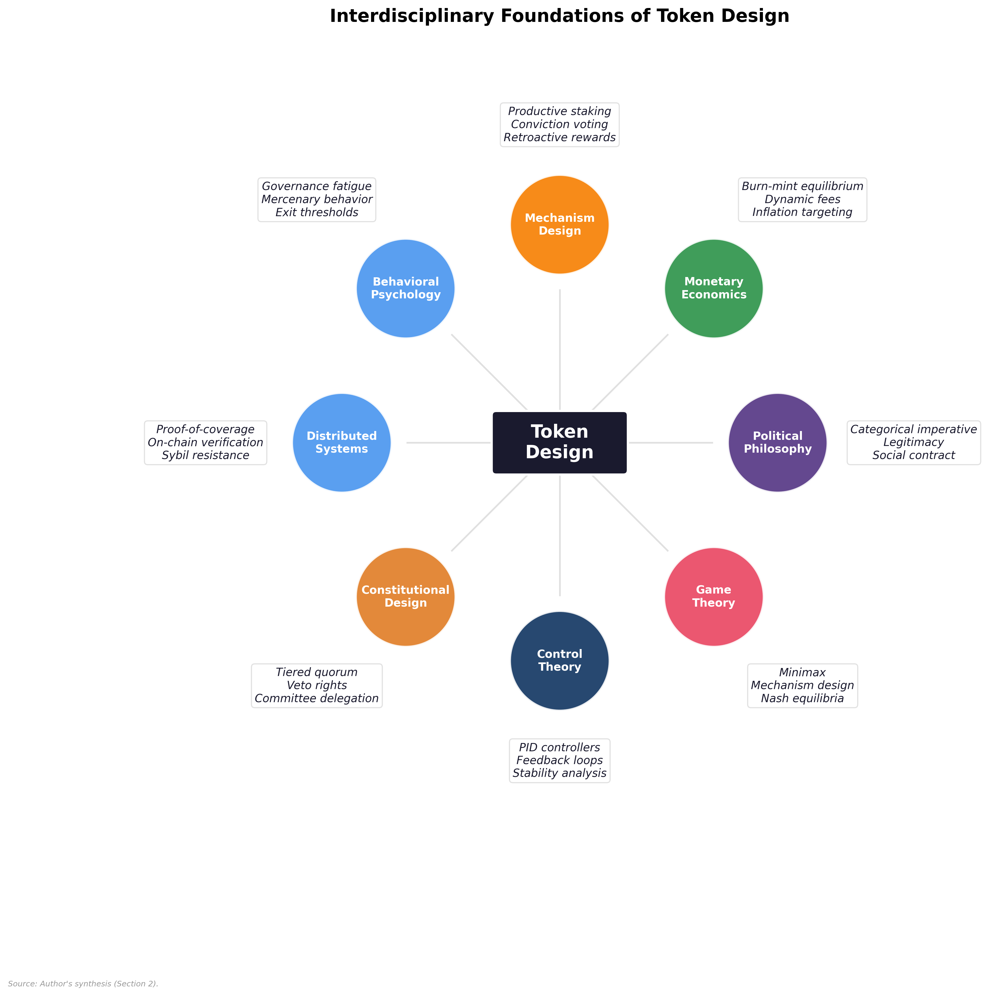

The following analysis illustrates what integrated practice looks like when applied rigorously to a single protocol from first principles. The appropriate framing draws on Williamson's (1985) institutional economics and Lessig's (2006) insight that code itself regulates: the encoding of governance, rights, duties, distributive choices, and legitimacy constraints into programmable rule systems. Political-philosophical traditions (Kantian publicity (Kant, 1785), Rawlsian fairness (Rawls, 1971), republican non-domination, Ostromian polycentricity (Ostrom, 1990), Hayekian knowledge-use (Hayek, 1945)) provide evaluable criteria for assessing whether a token system's rules are legitimate and sustainable. The analysis operationalizes those criteria through systems engineering: mechanism specification, simulation under adversarial conditions, and sensitivity analysis that tests whether theoretical designs survive contact with agent behavior.

**Design implications of the Coordination-Capture Tradeoff:**

- **Design target:** Coordinate without capture. Build systems where the act of coordination does not create positions from which value can be extracted by non-contributors.
- **Design constraints:** Transparent rules, permissionless participation, credible neutrality.
- **Design failure modes to watch for:** Insider token allocations that replicate equity concentration, mercenary emissions that reward extraction over contribution, governance structures that centralize control in whales or founding teams.

Exhibit 2 traces this progression from firms through platforms to protocols, mapping where token design emerges as the coordination technology for autonomous economies.

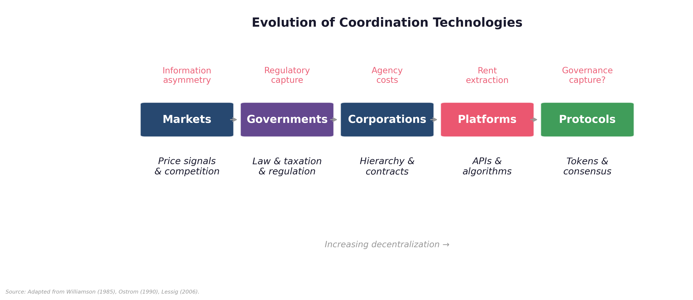

---

## 3. Protocols as a New Form of Productive Organization

### The Three Inputs

Classical economics identifies three inputs to production: land, labor, and capital. The relationship between these three inputs (who owns what, who pays whom, and who captures the surplus) is the central question of political economy. Every major economic system in history has been, at its core, an answer to this question.

In the mercantilist economies that preceded modern capitalism, the answer was simple: the crown owns the land, grants monopolies to favored merchants, and labor serves at the pleasure of both. Adam Smith's contribution in *The Wealth of Nations* was to argue that this arrangement was not only unjust but inefficient, and that free markets, governed by the "invisible hand" of price signals, would allocate land, labor, and capital more productively than any central planner could. Smith's model placed the market at the center: capital hires labor, labor works the land, and the surplus is distributed through competition. The owner of capital bears the risk and therefore earns the profit.

This framework (capital hires labor, captures surplus, bears risk) has been the operating system of Western economies for 250 years. It has produced extraordinary wealth. It has also produced extraordinary concentration of that wealth, which is precisely the tension that Karl Marx (1867), writing nearly a century after Smith, set out to analyze.

### Marx's Diagnosis

Marx's central insight was that labor creates value but does not capture it. A factory worker produces goods worth more than their wage. The difference is what Marx called surplus value, and it flows to the owner of capital. This is not a bug in capitalism; it is the mechanism. The owner of the factory purchased the worker's labor power at market rate. That this labor power produces more value than it costs is the entire reason capital is invested in the first place.

Marx argued that this relationship is inherently exploitative, not because individual capitalists are malicious, but because the structure of the system ensures that the people who create value are systematically excluded from owning the full product of their work. The worker cannot choose to keep the surplus; the worker does not own the means of production. This structural exclusion, Marx contended, would eventually become intolerable, leading to revolution and the collective ownership of productive infrastructure.

The diagnosis was precise. The prescription was catastrophic. Every twentieth-century attempt to implement collective ownership administered by the state concentrated power in bureaucracies as self-serving as any capitalist, destroyed productive dynamism by suppressing individual initiative, and failed to replace the distributed information that markets provide.

This is the impasse that political economy has occupied for over a century: Smith's model produces wealth but concentrates it. Marx's model distributes ownership but requires centralized authority that corrupts. Neither resolves the fundamental tension between the efficiency of markets and the justice of distributed ownership.

### The Protocol Breaks the Pattern

A protocol is not a firm. It has no CEO, no board, no shareholders in the traditional sense. It is a set of rules, encoded in software, that defines how participants interact, how value flows, and how decisions are made. When a protocol distributes tokens to participants in exchange for productive activity (running nodes, providing liquidity, creating content, securing the network), it is doing something that has no clean precedent in the history of economic organization.

It is not paying workers. Payment implies an employer who retains ownership and compensates labor at a rate less than the value produced, the surplus extraction Marx identified. A protocol that distributes tokens is distributing ownership of the productive system itself to the people who operate it. The node operator who earns tokens does not just receive compensation for their work; they receive a share of the economy they are helping to build, including governance rights over how that economy operates.

The arrangement is structurally novel, though it reintroduces tensions familiar from earlier organizational forms. Once deployed, the protocol distributes ownership in exchange for labor according to rules that are transparent, auditable, and, within the bounds of governance, immutable. The caveat is significant: founding teams and their investors design those initial rules, set the emission schedules, and typically retain substantial token allocations. The structural novelty is that the distribution mechanism, once live, operates without ongoing discretionary authority. The degree to which this differs from traditional capital allocation depends entirely on how much control founders retain post-launch and how quickly governance genuinely decentralizes.

The distinction from historical precedents matters. During the 1800s in the United States, over 8,000 private currencies were in circulation by 1860, issued by railroads, textile companies, and banks. These were firm-issued tokens, created to serve firm interests: reducing transaction costs, locking in customers, extending corporate power into monetary policy. The National Banking Act of 1863 effectively ended this era by establishing a centralized currency system. But those private currencies were instruments of firm power, issued by capital to serve capital.

Protocol tokens operate on a different logic. They are issued by rules to serve an ecosystem. The protocol does not benefit from hoarding tokens the way a firm benefits from hoarding scrip. The protocol benefits from distributing tokens to the participants whose activity makes the network valuable. This is not altruism encoded in software; it is mechanism design. A protocol that fails to distribute ownership to its contributors will lose those contributors to protocols that do.

### Protocol-Mediated Ownership

What happens when productive assets are not scarce?

Every major framework in political economy assumes that the means of production are physical, finite, and owned by someone to the exclusion of everyone else. Smith (1776) built his model on land, labor, and capital as rivalrous inputs allocated by markets. Marx (1867) accepted the same material premise but argued that whoever owns the rivalrous assets captures the surplus that labor produces. Piketty (2014), working with two centuries of tax data, demonstrated the empirical consequence: returns on capital consistently exceed economic growth (*r* > *g*), meaning capital concentration is not an aberration but the default trajectory of systems built on rivalrous assets. The analysis sharpened over 240 years; the underlying assumption never changed.

That assumption carried a structural consequence. A factory exists in one place. Someone must pay for it. Whoever pays, owns. Whoever owns, captures surplus. You cannot split a factory into 10,000 proportional ownership shares and redistribute them continuously in proportion to each worker's daily contribution; the transaction costs are prohibitive. Coase (1937) explained why firms exist precisely because of this: the overhead of continuously negotiating ownership through markets exceeds the cost of hierarchical command. Given rivalrous assets, only two redistribution mechanisms were available: centralized authority (Marx's prescription, with its well-documented failure modes) or democratic cooperatives (which do not scale past a few hundred members because voting on every operational decision collapses under its own weight).

Protocols break the pattern by dissolving the assumption itself. The means of production in a protocol (the code, the rules, the network state) are non-rivalrous. The software runs for every participant simultaneously. There is no factory to own or not own. The scarce asset, the token, is designed to be distributed to contributors as a function of measured contribution, automatically, continuously, at zero marginal administrative cost. The preceding subsection described *what* protocols do differently; non-rivalry explains *why* it is possible.

A caveat: the non-rivalry claim applies to the protocol layer, not the physical infrastructure beneath it. In DePIN networks like MeshNet, operators must still purchase and deploy hardware (routers, antennas, relay devices), a rivalrous, capital-intensive investment. The hardware substrate reintroduces the very concentration dynamics that non-rivalrous protocol infrastructure was designed to dissolve. MeshNet's mitigation is reputation-weighted governance (§5), which compresses the influence gap between well-funded operators with large node fleets and smaller operators who contribute reliably. But the tension between non-rivalrous protocol rules and rivalrous physical deployment is structural, not fully resolved by mechanism design.

A subtler form of rivalry emerges through the token itself. MeshNet requires a minimum stake of 10,000 $MESH to operate a node. When $MESH trades at $0.03, the dollar cost of participation is $300; when it trades at $3.00, the same stake costs $30,000. The protocol layer remains non-rivalrous, but the token-price mechanism reintroduces capital-gated access at the participation layer, and the barrier increases with network success. This is the protocol model's bootstrapping paradox: the same token appreciation that rewards early operators prices out later entrants, recreating the capital concentration the structure was designed to dissolve. Governance-adjustable minimum stake thresholds denominated in dollar equivalents rather than fixed token counts are one mitigation; reputation-weighted governance (§5) is another, ensuring that capital barriers to node operation do not translate into proportional governance barriers. But the tension is structural: any fixed-denomination staking requirement in a volatile asset reintroduces rivalry through the price channel.

What protocols enable is therefore neither capitalism (no capital-labor hierarchy), nor socialism (no central planner), nor cooperativism (no membership votes on every operational decision). It is a fourth model: labor generating ownership as a byproduct of productive activity, mediated by protocol rules rather than organizational hierarchy. The intermediary is not absent; it is replaced by transparent, auditable code.

Two technical properties make this possible. Programmable scarcity means that a digital token can be genuinely scarce (limited in supply, verifiable in ownership, impossible to counterfeit) without a physical substrate, making distributed ownership possible at marginal cost. Distributing shares in a factory requires legal infrastructure, paperwork, regulatory compliance, and prohibitive transaction costs. Distributing tokens in a protocol requires a wallet address. Transparent execution means that the rules governing distribution, governance, and value capture are visible to every participant and enforced by code rather than by courts, making distributed ownership credible. A corporate board can promise equity to employees and then dilute it through subsequent funding rounds. A protocol's emission schedule is public, and any change to it must pass through governance mechanisms that are themselves transparent. Trust is placed in verifiable code, not in the goodwill of those in power.

But these are the implementation, not the insight. The insight is that when the means of production are non-rivalrous, the zero-sum framing of labor-versus-capital dissolves. Distributing ownership no longer requires taking it from someone else. The surplus is not extracted by capital; it is generated by the network and allocated by rules that every participant can inspect. The reason Marx could not have anticipated this is not that he lacked blockchain technology. It is that he could not conceive of means of production that are non-rivalrous, because no such thing existed until software networks became productive infrastructure.

### The Owner-User Synergy Principle

Non-rivalry also reframes how we think about the relationship between ownership and use. In a system built on rivalrous assets, "owner" and "user" are structurally distinct roles: the factory owner is not the factory worker, and aligning their interests requires contracts, regulations, or collective bargaining. In a protocol built on non-rivalrous infrastructure, the distinction is artificial. The node operator who earns tokens by providing coverage is simultaneously a laborer (contributing productive work), an owner (holding a governance stake), and a user (benefiting from the network they help operate). Owner-user alignment is the default state; misalignment is the deviation that requires explanation.

This yields a design principle that will recur throughout:

**The Owner-User Synergy Principle:** The strongest protocols maximize the overlap between token holders and product users. When holders are also active users, three feedback loops activate simultaneously. First, governance quality improves because voters have direct experience with the product they are governing. Second, token value becomes grounded in usage rather than speculation because the holders benefit from the protocol's utility, not just its price. Third, network effects compound because each new user-holder has both an economic incentive (token appreciation) and a practical incentive (better product) to recruit others.

The inverse is also instructive. When holders and users are disjoint populations (tokens held by speculators who never use the product, product used by customers who never hold the token), the protocol reintroduces the very separation between capital and labor that its structure was designed to dissolve. Governance decisions are made by people with no operational knowledge. Token price decouples from usage fundamentals. The protocol becomes vulnerable to the same principal-agent misalignment that plagues traditional corporations, just with different labels.

Designing for owner-user synergy is not merely a best practice; it is maintaining the structural property that makes the protocol model distinct. Every choice in token utility, distribution, and governance should be evaluated against this criterion, as we will illustrate through MeshNet.

### Implications and Limits

The protocol model, ownership distribution through programmable rules, is not a utopia. It introduces new tensions that do not exist in traditional systems.

If laborers are also owners, they can vote to increase their own compensation at the expense of protocol sustainability. This is governance capture from the labor side, an echo of Marx's critique applied symmetrically: self-interest corrupts regardless of whether it flows from capital or from labor. The mechanism design must constrain it from both directions.

Infrastructure providers control the means of production in a protocol economy. Node operators, validators, and liquidity providers are the equivalent of factory owners in Marx's framework, except that they earned their position through productive contribution rather than capital accumulation. This gives them legitimate leverage, but leverage can be abused. A cartel of validators can extract rents from users just as effectively as a cartel of corporations can. The governance architecture must account for this.

The timescale of transition is generational, not cyclical. The shift from centralized to community-governed systems requires a population comfortable with active governance participation, a population that, at present, does not exist at scale. Most people are accustomed to being consumers of systems, not governors of them. Social identity theory (Tajfel & Turner, 1979) suggests that this transition depends not just on skill acquisition but on identity formation: participants who come to see "protocol operator" or "network governor" as part of their self-concept tend to exhibit loyalty behaviors that rational economic models do not predict: staying during bear markets, contributing to governance despite low expected value, defending the community against external criticism.

But social identity is dual-edged. The same identity dynamics that create resilience also create tribalism, maximalism, and resistance to valid criticism. Bitcoin maximalism is social identity theory in action: community cohesion and community blindness in a single package. Token design must facilitate identity formation (productive staking, reputation, governance voice) while building in mechanisms that counteract groupthink: constitutional review processes, external audit provisions, and governance structures that institutionalize dissent rather than suppressing it.

Two to three generations of increasing participation in decentralized governance will likely be needed before the full potential of protocol-mediated ownership can be realized. The implication for founders: you are likely building infrastructure for a transition you will not see completed. Ship imperfect governance knowing that progressive decentralization is the point: teams retain early control to navigate technical decisions, then systematically transfer authority as community capacity grows.

The current landscape: most token projects do not yet achieve genuine labor-ownership distribution. Many launch with tokens concentrated among founding teams, venture capital firms, and early speculators, with a stated plan to progressively decentralize governance over 2-3 years as community token distribution broadens. The industry standard of progressive decentralization acknowledges that founding teams typically retain governance control during early protocol development, gradually ceding authority as the community accumulates enough tokens and governance experience to outvote team-aligned holders. Whether this transition actually completes, or whether it stalls at a comfortable equilibrium for insiders, is the central empirical question. The protocol model is a structural possibility, not yet an industry norm. The gap between theory and practice is wide, and closing it is the purpose of the design framework that follows.

The timing dimension determines viability: mechanisms that create owner-user alignment (reputation accumulation, productive staking history, burn-mint value capture) compound over years, while the mechanisms that undermine alignment (insider allocations, vesting cliffs, low governance participation) are strongest at launch. The protocol model describes a destination; the journey passes through a period where the system structurally resembles the capital-dominated organizations it aims to supersede. Section 8 quantifies this: MeshNet's burn-mint equilibrium remains negligible for the entire 5-year simulation window, meaning the primary long-run value-capture mechanism, the one that would ground token value in usage rather than speculation, does not activate during the phase that determines whether the network survives. The system partially compensates through slashing, which activates during bootstrapping as a substitute supply-reduction mechanism (§8.3), but the full alignment stack does not reach operating strength until the network matures.

Kant's categorical imperative provides the design test we will use throughout the remaining sections: act only according to rules that you would want every participant to follow. If every token holder voted to maximize their own short-term payout, would the protocol survive? If not, the mechanism design is incomplete. This bridges Marx's diagnosis (that self-interest corrupts) with an engineering solution: constrain self-interest through transparent, automatically enforced rules that make defection unprofitable.

Exhibit 3 contrasts the resulting value flow architectures: in the traditional firm, surplus flows upward to equity holders; in the protocol, transparent rules distribute value to contributors in proportion to measured participation.

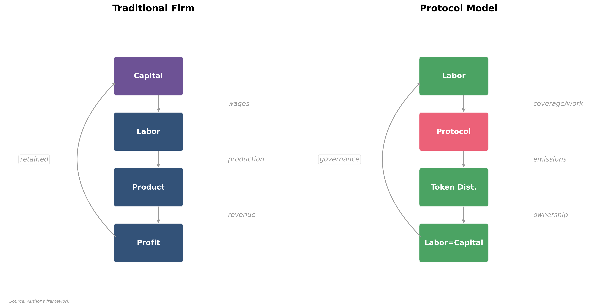

Exhibit 4 provides the historical precedent: private currency issuance in the United States between 1790 and 1870 peaked at over 8,000 distinct note-issuing banks, demonstrating that monetary plurality is not novel; what is novel is programmable enforcement of issuance rules.

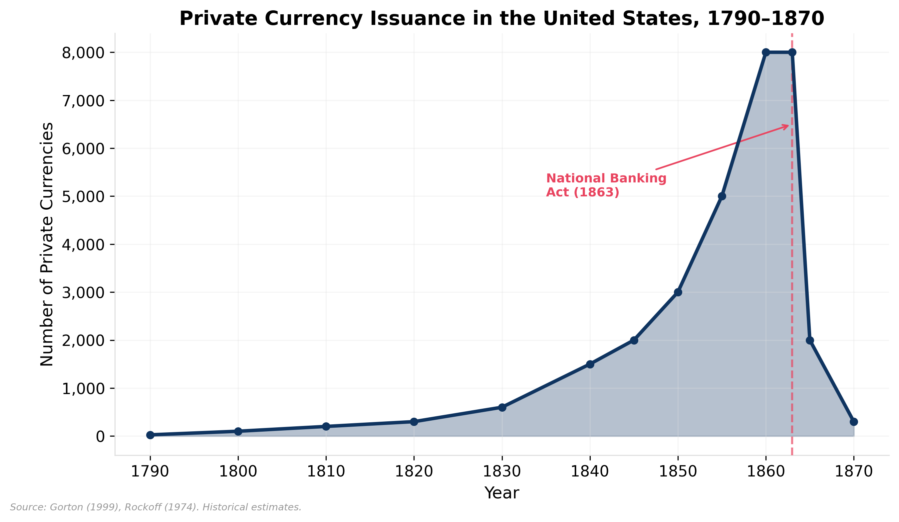

---

## 4. Introducing MeshNet: A Design Laboratory

MeshNet is a fictional decentralized wireless infrastructure protocol. Node operators deploy hardware (routers, antennas, relay devices) to provide wireless coverage in their area. Users connect to the MeshNet network and pay for connectivity. The protocol coordinates coverage deployment, manages payments, and distributes ownership through a native governance token, $MESH.

MeshNet is deliberately modeled to resemble real decentralized physical infrastructure networks (DePIN), including Helium's Internet of Things (IoT) and mobile networks, XNET's 5G deployment, WiFiDabba's connectivity in India, and World Mobile's connectivity in underserved regions, while remaining fictional. This gives us the freedom to make design decisions from first principles, unconstrained by the legacy architecture, governance compromises, and investor obligations that shape live protocols. Where a real protocol must work around existing token distributions and community expectations, MeshNet can be designed as it should be, providing a benchmark against which real-world compromises can be measured.

The protocol must solve five design problems simultaneously:

**1. Geographic incentive alignment.** Node operators will naturally deploy hardware in dense, profitable urban areas where user demand is highest. But the network's value proposition, ubiquitous wireless coverage, depends on deployment in underserved and rural areas where per-node revenue is lower. The token economy must make it economically rational to deploy where coverage is needed, not just where it is profitable.

**2. Labor-ownership distribution.** Consistent with the thesis of Section 3, MeshNet must distribute meaningful ownership to the operators who build and maintain the network. This means the token allocation cannot be dominated by insiders, investors, or early speculators. The people running nodes should hold an increasing share of the protocol's governance power.

**3. Economically productive emission.** Many infrastructure protocols emit tokens that subsidize operator participation without generating proportional network value. When emission rates inevitably decline (through halvings, governance, or supply caps), operators whose participation depended on subsidy rather than genuine economic returns leave, coverage degrades, users churn, and the network enters a contraction. The failure mode is not perpetual emission per se; Ethereum and Bitcoin operate sustainably with ongoing issuance. The failure mode is emission that does not produce commensurate network utility. MeshNet must ensure that each unit of emission generates measurable coverage and fee revenue, and design the transition toward fee-dominance explicitly, while acknowledging that empirical precedent from networks like Helium suggests this transition takes years, not quarters, and that protocols must maintain fiscal viability throughout the interim.

**4. Governance over economic parameters.** Coverage priorities, fee structures, emission schedules, and treasury allocation are not technical decisions. They are political decisions with asymmetric impacts across stakeholder groups. MeshNet must provide governance mechanisms that are legitimate (reflecting the informed consent of participants), efficient (not requiring every holder to vote on every decision), and capture-resistant (preventing any single stakeholder class from dominating).

**5. Adversarial resilience.** The system will be attacked. Operators will submit false coverage claims. Speculators will attempt to capture governance for treasury extraction. Sybil attackers will create fake node identities to farm emissions. The token economy must make these attacks economically irrational by design, not by policy.

These five problems are not independent. Geographic incentive alignment depends on the emission schedule (problem 3) and governance decisions about coverage priorities (problem 4). Labor-ownership distribution (problem 2) is undermined if governance is captured (problem 5). Economic sustainability (problem 3) requires that the fee structure set by governance (problem 4) generates sufficient revenue. The token economy is a system, and the design problems are coupled.

### MeshNet Spec Sheet

The following reference table summarizes MeshNet's core parameters. Each is explained in the section indicated; readers unfamiliar with terms like "PID gains" or "conviction voting" can skip them here and return to this table after reading the relevant section.

| Parameter | Value | Section |
|---|---|---|
| **Token** | $MESH (ERC-20 governance token) | |
| **Total supply** | 1,000,000,000 $MESH | |
| **Allocation** | | |
|   Node operator rewards | 40% (emitted over 10 years via PID controller) | 6, 8 |
|   Retroactive public goods | 15% (governed by grants committee) | |
|   Treasury reserve | 15% (governed by token holder vote) | |
|   Team and contributors | 15% (4-year vest, 1-year cliff) | |
|   Airdrop | 8% (25% at token generation event (TGE), 75% vests over 12 months) | |
|   Market makers | 1.5% (quarterly KPI gates, clawback) | |
|   Ecosystem development | 5.5% (committee-allocated) | |
| **Emission control** | PID controller targeting N* = 10,000 active nodes | |
|   PID gains (initial, normalized) | Kp = 0.8, Ki = 0.15, Kd = 0.2 (expressed as fraction of base emission per unit of normalized error) | |
|   Evaluation cadence | Every 14 days (governable) | |
|   Emission bounds | Floor: 0.25× base rate; Ceiling: 3× base rate | |
|   Treasury yield stabilization | Floor at 50% of operator opportunity cost; capped at 1% of treasury per day | |
| **Staking** | Required to operate a node; slashable for downtime or false coverage | |
|   Minimum stake | 10,000 $MESH per node | |
|   Slashing penalty | γ × σ(i) where γ = 0.10 for downtime, 1.00 for fraud | |
| **Reputation** | Soulbound token, earned through verified uptime and coverage quality | |
|   Decay rate | α = 0.15 per season (quarterly) | |
|   Voting power multiplier | V(i) = τ(i) × (1 + R(i))² | |
| **Value capture** | Fee revenue → buy $MESH → burn | |
|   Fee model | Dynamic: congestion-adjusted, subsidized in underserved areas | |
| **Governance** | | |
|   Critical quorum | >66% of voting power (constitutional changes, treasury dissolution) | |
|   Major quorum | 33–50% (fee changes, staking parameters, committee budgets) | |
|   Minor quorum | 10–20% (community grants, regional priorities) | |
|   Conviction voting | β = 0.05 accumulation per day, 78% weight at 30 days | |
|   Operator veto | >75% of active operators can suspend emission changes for 90 days | |

Exhibit 5 maps these parameters into MeshNet's system architecture, showing how the utility layer (§5), distribution layer (§6), governance layer (§7), and control layer (§8) interact as subsystems of a single feedback-driven design.

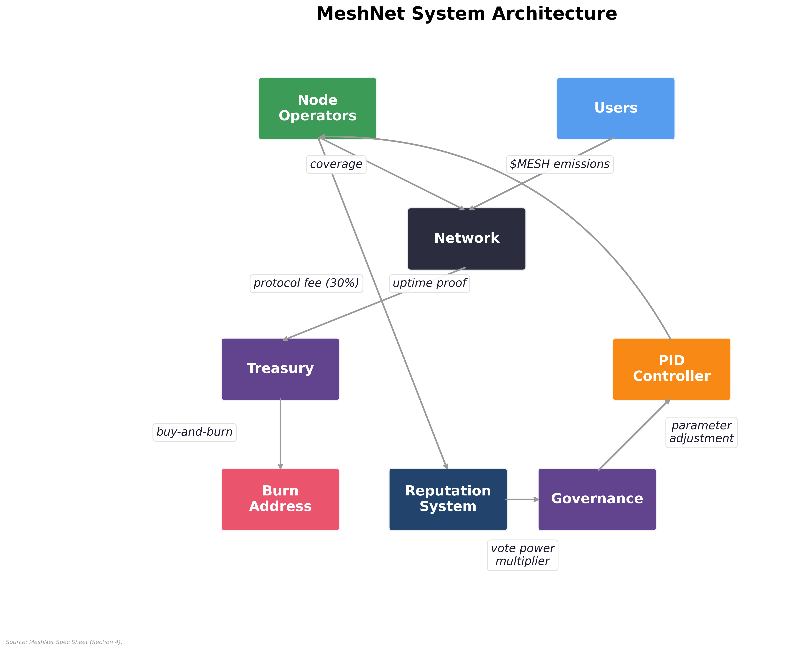

### Parameter Calibration: MeshNet vs. Real DePIN Networks

MeshNet is fictional, but its parameterization is not arbitrary. The following table maps MeshNet's key parameters to observed ranges from operational DePIN networks, establishing that the simulation operates within the plausible design space rather than in an ad hoc regime tuned to produce favorable results.

| Parameter | MeshNet | Helium (observed) | Filecoin (observed) | Source |
|---|---|---|---|---|
| Hardware capital expenditure (CAPEX) per node | $300-500 | $400-600 (hotspot) | $5K-50K (sealing rig) | Manufacturer pricing, 2025 |
| Network contraction | Modeled via behavioral exit probabilities | ~76% decline from peak (Q1 2023–late 2025; mix of voluntary exit, denylisting, migration disruption) | ~8-15% annual storage provider attrition (estimated) | Messari quarterly reports; ByteTree 2025 |
| Fee revenue / emission value | <1% (bootstrap) | <5% (2024-2025) | ~10-30% (2025) | Protocol dashboards |
| Governance participation | Modeled via reputation | ~2-5% of HNT holders vote on HIPs | ~1-3% of FIL holders participate | Governance portal data |
| Slashing frequency | γ=0.10/1.00 per event | Denylist + witness challenges | Sector faults + termination fees | Protocol documentation |
| Token concentration (Gini) | 0.89 (token-weighted) | 0.91 (HNT top-holder analysis) | 0.88 (FIL) | Dune Analytics, Jan 2026 |

MeshNet's parameterization falls within observed DePIN ranges for hardware economics, network contraction patterns, and governance concentration. The specific parameter combination has not been validated against a live protocol's trajectory; results should be read as "plausible within the DePIN design space" rather than "predicted for any specific network." The OU price process parameters (κ=2.82, σ=0.049) are calibrated directly from Helium Network Token (HNT) daily returns (see Appendix B calibration table). Filecoin token (FIL) data is used for cross-validation of concentration metrics.

---

## 5. Token Utility Architecture

What does the token actually *do*? Not in the speculative sense of "what value does the token provide to holders," but in the engineering sense of "what behaviors does the token enable, incentivize, and constrain within the system?" A token without functional utility reduces to a speculative asset whose value depends entirely on narrative momentum. A token with well-designed utility is an economic primitive that aligns individual incentives with collective outcomes.

MeshNet's $MESH token has four interlocking utility functions: productive staking, reputation-weighted governance, burn-mint value capture, and dynamic fee adjustment. Each is designed to reinforce the others, creating a system where the token is not merely held but actively used, and where the act of using it strengthens the network.

### Staking as Productive Commitment

In most protocols, staking is passive yield farming. You lock tokens in a contract, earn rewards proportional to your stake, and contribute nothing to the network's productive capacity. The tokens sit idle. The yield comes from inflation: new tokens minted and distributed to stakers, diluting non-stakers. This is not an incentive mechanism; it is a tax on non-participation, and it creates no value for the token economy.

MeshNet's staking model is structurally different. To operate a node on the MeshNet network, an operator must stake a minimum of 10,000 $MESH. This stake serves three functions simultaneously: it is collateral (slashable if the operator fails to meet performance requirements), it is a commitment signal (demonstrating economic alignment with the network's success), and it is a governance weight (contributing to the operator's voting power). This triple function is possible because the infrastructure being secured is non-rivalrous: the staker is not posting collateral to an owner who captures the surplus, but securing a network where they are simultaneously worker, owner, and beneficiary. In a firm, collateral flows to the firm; in a protocol, collateral secures the commons.

The behavioral distinction matters. Self-determination theory (Deci & Ryan, 2000) and motivation crowding research (Frey & Jegen, 2001) show that participation-contingent rewards (earned by mere presence, as in passive staking) crowd out intrinsic motivation most aggressively, because the operator's contribution is irrelevant to their return. Performance-contingent rewards (tied to verifiable output) preserve intrinsic motivation because the operator retains autonomy over how they contribute. MeshNet's productive staking is performance-contingent by design.

The stake is not idle. It backs a node that provides real wireless coverage to real users. The yield an operator earns is not inflation-funded; it comes from a combination of emission rewards (which taper over time) and a share of the fees generated by users connecting through their node. The more users an operator serves, the more they earn, directly linking staking returns to productive output.

Slashing creates the accountability that passive staking lacks. An operator whose node goes offline for more than 24 consecutive hours loses γ × σ(i) of their stake, where γ = 0.10 for downtime. An operator who submits false coverage claims (reporting connectivity in areas where no hardware is deployed) faces γ = 1.00, losing their entire stake. The asymmetry is deliberate: downtime may reflect hardware failure or connectivity issues (operational risk that honest operators accept), while false coverage is intentional deception with no innocent explanation. Full forfeiture makes the expected-value calculation for fraud decisively negative at any detection rate above the trivial, consistent with Helium's denylist approach (permanent removal) and Filecoin's sector termination fees (which can approach full collateral for proven faults). Slashed tokens flow to the treasury, funding retroactive rewards and ecosystem development.

The behavioral impact of slashing exceeds its nominal magnitude. Prospect theory (Kahneman & Tversky, 1979) predicts that losses are experienced approximately twice as intensely as equivalent gains, which means a 10% slashing penalty has roughly the deterrent force of a 20% reward bonus. Crypto-native DePIN operators plausibly have compressed loss aversion relative to the general population (they self-selected into a volatile asset class), which suggests the penalty is calibrated for the marginal operator most at risk of exit, the less risk-tolerant participant deciding whether to stay or power down, rather than the committed core who would tolerate harsher penalties. This is the right behavioral target: retention at the margin determines network coverage.

Full forfeiture for fraud (γ=1.00) is calibrated for maximum deterrence where no behavioral nuance is needed. Equity theory (Adams, 1965) adds a second constraint: operators compare their penalty-to-contribution ratio against peers, and perceived inequity in enforcement can drive exit faster than the absolute penalty level. Uniform, transparent slashing rules enforced by on-chain verification, not discretionary committee decisions, are essential for maintaining perceived fairness across the operator population.

Productive staking, reputation, and slashing form a layered defense. Proof-of-coverage provides the *signal* (is the node doing real work?), reputation provides the *governance consequence* (fraudulent nodes lose influence over time), and slashing provides the *economic consequence* (fraudulent nodes lose capital immediately). Remove any leg and the others degrade: without proof-of-coverage, slashing is based on self-reports; without reputation, honest and fraudulent operators have equal governance voice; without slashing, reputation carries no economic teeth. The adversarial analysis (§9, Appendix A.11) attributes the reduction in fraudulent reward capture from 3.0% to 0.09% to the complete verification stack, though the mechanisms are structurally coupled (slashing follows from PoC detection, reputation updates follow from slashing history), making independent ablation of each layer's marginal contribution an open question.

The staking yield for operator i at time t can be expressed as:

> Yield(i, t) = [E(t) × w(i, t) / Σw(j, t)] + [F(i, t) × (1 − protocol_fee)]

Where w(i, t) is the operator's emission weight (a function of coverage area, uptime, and user demand served), E(t) is the total emission rate at time t, F(i, t) is the fee revenue generated by users of operator i's node, and protocol_fee is the percentage of fees directed to the buy-and-burn mechanism.

The critical test for any staking model: if your token's staking can be replicated by a stock with a loyalty program, you have not found your utility. Ford gives shareholders a discount on cars if they hold 100 shares for six months. That is a passive perk attached to a passive asset. MeshNet's staking requires running infrastructure, meeting performance standards, and risking capital through slashing. It is productive commitment, not financial parking.

### Reputation and Earned Access

One-token-one-vote governance creates plutocracy, governance by the wealthy. A whale who acquires 15% of $MESH supply through market purchases has 15 times the voting power of an operator who earned 1% through years of reliable service. The whale may never have run a node, may have no understanding of coverage economics, and may have no interest in the network's long-term health. Under pure token-weighted governance, their vote counts more than the person who built the network.

This is not a hypothetical risk. Our cross-sectional analysis of governance token distributions across 12 DePIN and decentralized finance (DeFi) protocols with sufficient on-chain holder data reveals that DePIN governance concentration (mean Herfindahl-Hirschman Index, or HHI, 0.19; range 0.037-0.388) materially exceeds DeFi benchmarks (mean HHI 0.09; range 0.028-0.174), with token inequality Gini coefficients of 0.67-0.98 near-universal across the sample (see Exhibit 6). The concentration gap reflects DePIN's hardware capital barrier: earning tokens requires purchasing and deploying physical infrastructure, which concentrates emission rewards among well-funded operators who can scale node fleets, while DeFi tokens flow through more diverse acquisition paths (liquidity provision, trading, airdrops) that distribute holdings more broadly. The pattern is not DePIN-specific. In stablecoin gateway markets, total dollar volume doubled between 2023 and 2025 while unique counterparties declined 25% and cross-gateway bridging entities halved; a single market-making firm's share of total counterparty volume rose from 1.4% to 19.9% while its primary competitor declined 96% (Author, 2026a, 2026b). Concentration appears to be a general property of maturing token ecosystems: throughput scales while participant diversity contracts, and the remaining intermediaries become increasingly load-bearing.

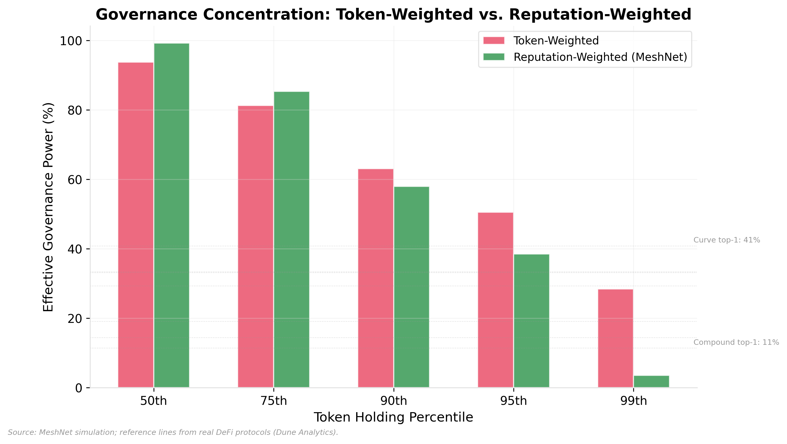

MeshNet's reputation-weighted governance is a direct design response to this empirical finding: a reputation system implemented as non-transferable soulbound tokens. Reputation cannot be bought. It can only be earned through sustained, verified contribution to the network: maintaining high uptime, providing coverage in underserved areas, participating in governance, contributing to ecosystem tooling.

Each operator's reputation score R(i) is updated seasonally (quarterly). Reputation decays universally at rate α = 0.15 per season for all operators, active or inactive, preventing permanent entrenchment from any source. The decay rate is a governance-tunable parameter chosen to ensure meaningful turnover in governance influence without punishing brief interruptions. As a reference point, Helium's IoT network declined from approximately 1M hotspots at its Q1 2023 peak to roughly 236K active by late 2025, a 76% contraction driven by a mix of voluntary exit (declining rewards), denylisting (gaming detection removed ~157K hotspots), the Solana migration disruption, and the Helium Improvement Proposal (HIP)-20 emission halving. This network-level decline is not a clean per-operator attrition rate, but it establishes that DePIN operator populations can contract by 76% within a few quarters when economics shift.

The 15% quarterly decay is calibrated to be meaningful enough that inactive operators lose governance relevance within 4-6 quarters, but shallow enough that a single missed season does not catastrophically penalize an otherwise reliable operator. Active operators with 99%+ uptime earn +1.0 reputation per season, more than offsetting the decay and producing net accumulation. Operators who go inactive earn nothing and lose 15% of their accumulated reputation each quarter; after four quarters of inactivity, reputation approaches zero. The universal decay creates a treadmill: even the most established operators must continue contributing to maintain their governance influence. This is the **Earned Access Over Purchased Access** principle: the moment you stop contributing, your influence decays.

Voting power combines token balance and reputation:

> V(i) = τ(i) × (1 + R(i))²

The quadratic relationship means reputation has an outsized effect. An operator with 10,000 $MESH and a reputation score of 2.0 has a voting power of 90,000, nine times their raw token weight. A whale with 100,000 $MESH and zero reputation has a voting power of 100,000. The active operator with one-tenth the tokens commands nearly equivalent governance influence.

This does not eliminate wealth-based influence. A whale with both tokens and reputation will be the dominant voice. But it compresses the gap between pure capital holders and active contributors, creating a governance environment where operational experience carries real weight.

The quadratic exponent (p=2) in the reputation multiplier reflects a deliberate design tradeoff, not an analytically derived optimum. Linear weighting (p=1) provides insufficient compression: a whale with 10× the tokens still dominates even against high-reputation operators. Cubic weighting (p=3) over-corrects, creating scenarios where small-stake operators with modest reputation accumulation can outvote large-balance stakeholders, weakening the skin-in-the-game constraint. Logarithmic weighting (V(i) = τ(i) × (1 + log(1 + R(i)))) compresses too aggressively at low reputation scores, reducing differentiation between new and established operators. The quadratic sits in a defensible middle: it rewards sustained contribution without disconnecting governance power from economic stake. The sensitivity is non-trivial: the Gini compression from 0.91 (token-weighted) to 0.67 (reputation-weighted) reported in Exhibit 6 is specific to p=2 and MeshNet's simulated operator population. Small changes in p shift the effective governance regime qualitatively (from plutocracy at p≤1 to meritocracy at p≥3), making this parameter one of the highest-leverage governance design choices. An exponent sweep comparing Gini, HHI, and top-k effective power across p = [0.5, 1, 2, 3] is a recommended sensitivity test for implementation; the simulation's adversarial analysis (Appendix A) provides the operator population against which this sweep can be run.

Exhibit 7 visualizes the resulting voting power surface: at quadratic weighting (p=2), a whale with high stake but zero reputation has less governance influence than an operator with moderate stake and maximum reputation, compressing the Gini coefficient of effective voting power from 0.91 (token-weighted) toward 0.67 (reputation-weighted).


### Burn-Mint Equilibrium

Users pay connectivity fees when they access the MeshNet network. These fees are collected in stablecoins or ETH, not in $MESH, because requiring users to acquire a governance token before using the product creates unnecessary friction and violates the principle that utility should precede speculation.

A percentage of fee revenue (the protocol_fee, initially set at 30% and governable) is used to purchase $MESH on the open market and burn it, permanently removing those tokens from circulation. This is the burn-mint equilibrium: the protocol mints tokens through emissions (distributing ownership to operators) and burns tokens through fee revenue (tightening supply as usage grows).

The dynamics create a direct, mechanistic link between network usage and token value. As more users pay for connectivity, more $MESH is bought and burned. If usage grows faster than emissions, the token becomes deflationary: circulating supply contracts, and each remaining token represents a larger share of the network's economic activity.

The comparison to stock buybacks is instructive but imprecise. A stock buyback is discretionary: a board of directors decides to buy back shares, typically when they believe the stock is undervalued or when they want to boost earnings-per-share metrics for executive compensation. The decision is made by humans with their own incentive misalignments. A protocol burn is autonomous: it executes automatically when fees are collected, with no human deciding whether, when, or how much to burn. This removes the discretionary element that makes stock buybacks vulnerable to manipulation.

But burn mechanisms can mask unsustainable economics. If fee revenue is low but emissions are high, the protocol is subsidizing usage through inflation while burning a thin stream of fees to create the appearance of value capture. The true test of a burn-mint model is whether burns persist, and grow, after emissions taper. A protocol where emissions consistently exceed burns is experiencing net supply expansion regardless of what the burn mechanism signals; the burn creates an appearance of value capture while the net economics remain inflationary. The simulation (§8, Appendix A.4) models this dynamic explicitly, and the results support this concern: MeshNet's burns remain negligible relative to emissions across all scenarios within the 5-year simulation window.

The token supply trajectory under burn-mint:

> S(t+1) = S(t) + E(t) − B(t)

Where B(t) = protocol_fee × F(t) / P(t), the number of tokens burned equals the dollar value of fees allocated to burning divided by the current token price. (We use weekly average spot price for P(t). Burn-weighted price typically runs 1-7% below the weekly average, with outliers in June 2025 at +19.2% during a large burn spike and February 2026 at -16.9% from partial-week distortion. The decomposition's qualitative conclusions are invariant to this substitution.) When E(t) > B(t), supply expands. When B(t) > E(t), supply contracts. The ratio B(t)/E(t), known as Burn-Mint Equilibrium (BME), is the primary health metric for any burn-mint system. A rising BME indicates that the protocol is transitioning from emission-subsidized bootstrapping toward fee-dominance. Helium's on-chain data shows this trajectory empirically: BME rose from 0.013 in mid-2023 to above parity by late 2025, crossing 1.0 in October following the August 2025 emission halving (see Exhibits 8 and 9; calibration details in Appendix A).

The simulation reveals an uncomfortable truth: under MeshNet's bootstrapping parameterization (protocol_fee=0.30, fee revenue <1% of issuance value), burns contribute less than 0.05% of supply dynamics over the 5-year horizon. BME peaks at 0.0061, meaning burns equal just 0.6% of emissions even under bull-case assumptions. The dominant supply-side force is slashing (269-354M tokens transferred to treasury across scenarios at default penalty values), not burns; sensitivity analysis is consistent with slashing dominance across the tested penalty range (Appendix A.7). This dominance is conditional on the bootstrapping regime: as fee revenue grows toward emission value (BME → 1), burns would overtake slashing as the primary supply lever. The simulation does not reach this transition within its 5-year horizon; the phase boundary at which burns dominate is an open question mapped in §11.

This ratio would narrow toward parity in a fee-dominant regime where daily fee revenue exceeds approximately 10% of daily issuance value. Helium's empirical trajectory shows a comparable bootstrapping phase: BME required 6+ years of network operation to cross fiscal parity (BME = 1.0 in October 2025, reaching 2.06 by mid-February 2026, complete weeks only; Exhibit 8), enabled by demand concentration where the top-5 Data Credit signers account for approximately 90% of total burns, a single-buyer fragility that aggregate BME metrics mask. The burn-mint equilibrium remains the correct long-term model, but it does not govern supply trajectory during bootstrapping.

Exhibit 8 plots the full 34-month BME trajectory. The shape is characteristic of network-effect adoption: near-zero for over two years, then a rapid inflection as fee revenue compounds against declining emissions. This nonlinear pattern is what the simulation's logistic BME curve is calibrated to reproduce (Appendix A, Table A1).


Decomposing Helium's 12-month BME improvement (January 2025 to January 2026, from 0.006 to 1.103) reveals that fee revenue growth, not the emission halving, drove the transition to fiscal parity. Weekly Data Credit burns surged 20-fold, from $10,700 to $217,000. Emissions only halved. The price decline contributed by mechanically increasing how many tokens each dollar of revenue burns (through the B(t) = F(t)/P(t) denominator). Counterfactual analysis indicates that all three factors were necessary but none sufficient alone: holding emissions at pre-halving levels, BME would reach only 0.446 (42% of actual); fee growth alone would not cross parity without the halving's supply compression.

A formal log-difference attribution using per-week-normalized rates assigns 58% of the improvement to fee growth, 25% to HNT price decline, and 17% to the August 2025 emission halving (transition week of July 28, stable at 155,000 HNT/wk by August 4; weekly issuance dropped from 375,000 to 155,000 HNT, a 58% absolute reduction, but a smaller share of the log-decomposition because a 2.4× emission change contributes less than a 20× fee change to a 172× ratio improvement). The Jan-to-Jan window, which avoids partial-month contamination on both endpoints, produces a BME definition gap of just 0.5% between on-chain (HNT burned / HNT issued) and USD-denominated (DC revenue / emission value) measures, confirming clean decomposition arithmetic. Exhibit 9 makes the relative magnitudes visually unambiguous: the indexed component trajectories show fee revenue's order-of-magnitude surge dwarfing the 2–4× movements in emission and price channels, explaining why fee growth dominates the log-decomposition despite the halving being the most visible policy intervention.

![Exhibit 9, Helium BME Trailing 12-Month Analysis (February 2025 to February 2026). Panel A: monthly BME ratio crossing parity in October 2025 after the August emission halving, reaching 2.06 by February 2026. Panel B: component trajectories indexed to February 2025 baselines showing 20× fee growth, 2.4× emission reduction, and 75% price decline. Panel C: month-over-month attribution confirming fee growth as the dominant channel (58% of cumulative improvement), with price decline (25%) and emission reduction (17%) as necessary but insufficient accelerants. Source: Dune Analytics (weekly HNT burns, issuance, and spot price).](exhibits/exhibit_09_bme_12month_decomposition.png)
This is not a deficiency in Helium's trajectory; the three channels reinforce each other by design (rising fees, falling price, and declining emissions all push BME upward simultaneously). But the decomposition means that Helium's fiscal parity should not be read as evidence that organic fee revenue alone can sustain a DePIN token economy. MeshNet's conservative BME projections (peak 0.0061 over the 5-year simulation window) reflect a bootstrapping regime where none of these three accelerants is assumed, making the simulation's findings a lower bound on realistic BME trajectories for networks that experience at least one emission halving.

### Dynamic Fee Adjustment

MeshNet's connectivity fees are not fixed. In high-demand urban areas where coverage is dense, fees rise, reflecting the scarcity of bandwidth relative to demand. In underserved rural areas where coverage is sparse, fees are subsidized from treasury funds, reflecting the network's strategic priority of expanding coverage rather than maximizing short-term revenue. Urban zones generate above-cost fees; rural zones charge below-cost fees; the treasury bridges the gap. This is a common pattern in telecommunications, now encoded in protocol logic rather than regulatory mandate.

The fees adjust algorithmically based on two variables: network congestion (demand relative to available capacity in a given area) and coverage density (the number of active nodes relative to the area's coverage target). The fee function for coverage zone z at time t (Exhibit 11):

> Fee(z, t) = base_fee × congestion_multiplier(z, t) × coverage_subsidy(z, t)

Where congestion_multiplier scales fees upward when demand exceeds capacity, and coverage_subsidy scales fees downward (below 1.0) in zones where the network wants to attract users to incentivize further node deployment. The treasury pays the difference between the subsidized fee and the full cost, funded primarily by slashing revenue (Appendix A.13).

This is monetary policy for a micro-economy. Just as a central bank adjusts interest rates to balance inflation and employment, MeshNet adjusts connectivity fees to balance network revenue and coverage expansion. The difference is transparency: a central bank's rate decisions happen behind closed doors, influenced by political pressure and institutional incentive structures. MeshNet's fee adjustment algorithm is public, deterministic, and auditable. Any change to the algorithm itself must pass a governance vote, but the algorithm's execution within its parameters is automatic.

Exhibit 10 projects these burn-mint dynamics across three adoption scenarios, revealing a counterintuitive relationship between adoption speed and token supply contraction during bootstrapping.

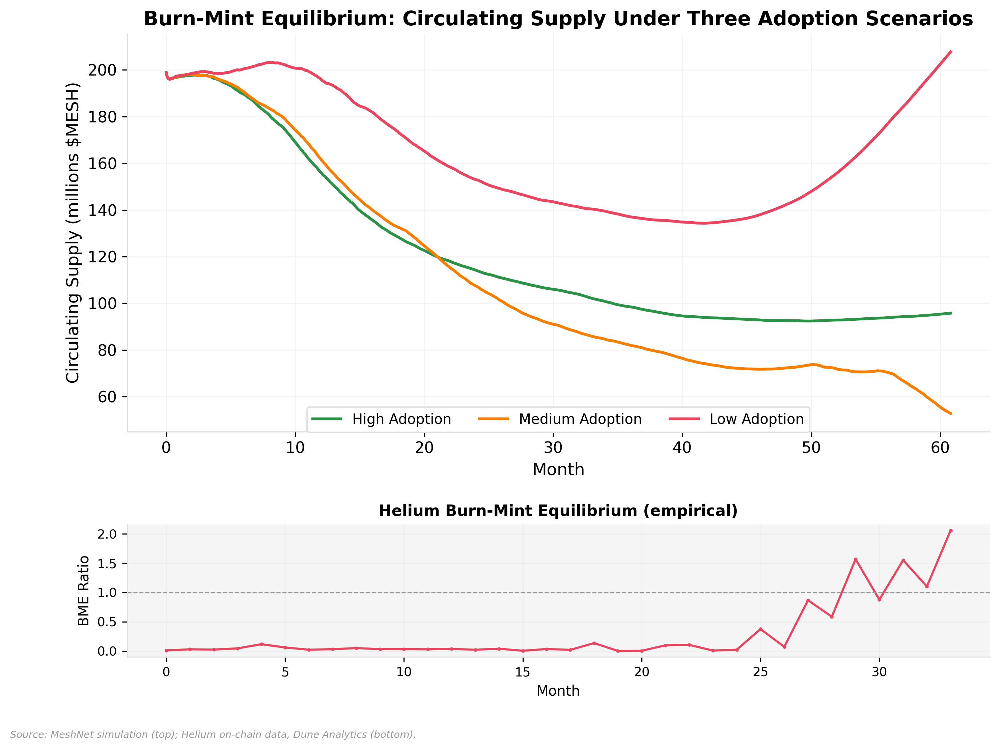

The counterintuitive pattern: the medium adoption scenario burns more tokens than high adoption. The mechanism is the price denominator in the burn formula B(t) = protocol_fee × F(t) / P(t). High adoption drives both fee revenue F(t) and token price P(t) upward, but during bootstrapping the price rises faster than fees: speculative premia and network-effect expectations inflate the denominator ahead of fundamentals. Each dollar of fee revenue therefore buys and burns fewer tokens when the price is high. Medium adoption generates less fee revenue in absolute terms but operates at a lower token price, so each dollar removes more tokens from circulation.

The implication for protocol designers: BME can decline even as adoption grows during the bootstrapping phase. Protocols experiencing rapid price appreciation may see BME *decline* even as usage grows, because the denominator is outrunning the numerator. This resolves only when fee revenue eventually catches up to market expectations, the same transition Helium took 6+ years to complete. Dynamic fee adjustment (below) may compound the denominator effect: higher fees in successful zones raise both fee revenue F(t) and token price P(t), but during bootstrapping the price channel dominates, meaning the mechanism designed to optimize short-run revenue extraction may paradoxically decelerate the long-run transition to fee-dominance.

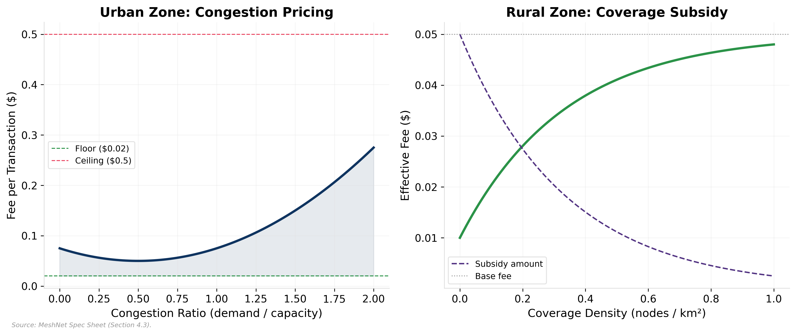

> **Beyond MeshNet: Token Utility Across Protocol Types**
>
> These patterns generalize because DeFi, gaming, and social protocols also operate on non-rivalrous infrastructure, and the same structural property (that labor can generate ownership through protocol rules rather than organizational hierarchy) applies across verticals. In DeFi, productive staking means providing liquidity or securing oracle feeds, not passive yield. In gaming, reputation could track player contribution to world-building or community moderation, gating access to governance over game economy parameters. In social protocols, burn-mint equilibrium maps to content monetization: user attention generates fees, fees buy and burn governance tokens, creators who also hold tokens benefit from the ecosystem they grow. The core principle is universal: utility must create a feedback loop between participation and value. If usage grows and token value doesn't respond, the utility architecture is decorative regardless of the vertical.
>
> *Anchored by: §5 staking yield formula, §5 BME simulation disclosure (peak BME = 0.0061), Exhibit 10 burn-mint trajectory.*
>
> | Pattern | Use When | Fails When | Measure | Default Guardrails |
> |---|---|---|---|---|
> | **Productive staking** | Token lockup should correspond to real infrastructure or service provision | Staking yields come purely from inflation with no productive output | Yield source ratio (fee-funded vs. emission-funded) | Slashing for underperformance; minimum service requirements |
> | **Reputation-weighted governance** | Governance capture by passive capital holders is a risk | Reputation criteria are gameable or participation costs are prohibitive | Effective voting power Gini coefficient | Seasonal decay; non-transferability; multiple reputation dimensions |
> | **Burn-mint equilibrium** | Protocol generates real fee revenue from genuine usage | Fee revenue is subsidized by emissions (circular value), or burns are negligible relative to other supply forces (slashing, emission) during the bootstrapping phase | BME trajectory (B(t)/E(t) trend over time); burn share of total supply change | Monitor BME trend; alert if ratio declines for >2 consecutive epochs; track slashing-to-burn ratio as a maturity indicator |
> | **Dynamic fee adjustment** | Demand and supply vary across segments, geographies, or time | Fee sensitivity drives users away faster than it captures value | User retention by fee tier; revenue per coverage zone | Floor and ceiling on fee multipliers; governance override for emergency adjustment |
>
> **Preconditions:** Verifiable on-chain measurement of the productive output being staked against (coverage, liquidity, compute). Without oracle infrastructure that can attest to real-world service delivery, productive staking degrades to passive staking with extra steps. **Anti-pattern:** Applying burn-mint equilibrium to protocols with no organic fee revenue; the burn side of the equation is zero, and the mechanism provides no price support regardless of how elegantly it is specified.

---

## 6. Token Distribution as Incentive Engineering

A pie chart in a pitch deck is not a distribution strategy. Distribution is an ongoing economic policy: a system for directing value to the participants whose behavior makes the protocol more successful, calibrated over time in response to measured outcomes. The distinction between "allocation" and "distribution" matters: allocation is the static decision of how many tokens go to which bucket; distribution is the dynamic process of when, why, and under what conditions those tokens actually reach participants.

Most token projects design allocation once (during fundraising) and distribution passively (through linear vesting schedules). This is the equivalent of a government setting its annual budget in 1950 and never adjusting it. The economy changes. The needs change. The participants change. A distribution strategy that cannot adapt is a distribution strategy that will fail, overpaying some participants, underpaying others, and misallocating resources relative to what the protocol actually needs at each stage of its development.

### Emission Schedule as Control System

MeshNet's largest allocation, 40% of total supply, goes to node operator rewards, distributed over 10 years. But the rate of distribution is not fixed. It is controlled by a feedback loop that adjusts emission rates based on the network's primary KPI: active nodes providing verified coverage. This is the non-rivalry property of §3 made operational: emissions distribute ownership of non-rivalrous infrastructure at zero marginal administrative cost, continuously, to every qualifying participant simultaneously. The equivalent corporate action (issuing equity grants to workers proportional to daily output) would require board approval, legal filings, and dilution negotiation for each issuance. In a protocol, the code does it every epoch.

The protocol measures how many active, verified nodes are online, compares this count to the target (N* = 10,000), and adjusts emissions accordingly. If the network has fewer nodes than the target, emissions increase, making it more economically attractive to deploy hardware. If the network exceeds the target, emissions decrease. Bitcoin's difficulty adjustment is the canonical precedent: a proportional control loop that adjusts mining difficulty every 2,016 blocks to maintain the 10-minute block target. MeshNet's emission controller extends this pattern with integral and derivative components that prevent steady-state error and oscillation (§8, Appendix A.1).

The goal state is a transition toward fee-dominance, where fee revenue funds an increasing share of operator economics, analogous to a startup achieving positive unit economics. This does not require zero emission: a protocol with low, predictable inflation and growing real usage can operate sustainably indefinitely. The risk is emission that outpaces value creation. The simulation shows this transition takes longer than five years under realistic demand assumptions (§5 quantifies the gap; §8 reports the stress-test findings), and the bootstrapping phase, where burn-mint equilibrium contributes negligibly to supply dynamics (peak BME ratio: 0.0061) and slashing is the de facto monetary policy, lasts longer than most token models assume.

### Retroactive Rewards

Automated incentives (emission schedules, staking rewards, fee distributions) optimize quantitative KPIs: node count, uptime, transaction volume. They are poor at recognizing qualitative contribution: a developer who builds ecosystem tooling, a community organizer who onboards operators, a researcher who patches a vulnerability.

MeshNet allocates 15% of total supply to a retroactive public goods fund, governed by a grants committee that evaluates proposals quarterly based on demonstrated impact rather than promised outcomes. The design draws from Optimism's retroactive public goods funding.

The risk is governance capture: committee members funding their own projects or those of allies. MeshNet mitigates this through three mechanisms: committee rotation (no member serves more than four consecutive quarters), conflict-of-interest disclosure (members must recuse themselves from votes on proposals they have a financial interest in), and community veto (any retroactive allocation above 0.5% of total supply is subject to a 14-day community review period during which token holders can veto with a 20% quorum).

### Airdrop Design

Airdrops bootstrap initial token distribution, creating a distributed holder base and generating initial network effects. The failure mode: if the airdrop is too large relative to circulating supply, recipients with no long-term commitment sell immediately, creating overwhelming sell pressure before the network has generated enough value to absorb it.

MeshNet's airdrop rules:

**Size constraint:** The airdrop (8% of total supply) must not exceed 40% of expected day-one circulating supply. With team tokens locked behind a one-year cliff, market maker tokens gated by KPIs, and emission rewards just beginning to flow, the day-one float is approximately 20% of total supply. The airdrop at 8% represents 40% of that float, at the boundary of our constraint.

**Recipient targeting:** Airdrop eligibility is weighted by historical testnet participation, not wallet age, transaction count, or other Sybil-friendly criteria. Operators who ran testnet nodes for extended periods receive the largest allocations. Users who connected to the testnet and provided coverage feedback receive smaller but meaningful amounts. The goal is to seed ownership among people who have already demonstrated commitment to the network.

**Vesting with clawback:** Only 25% of each recipient's airdrop unlocks at token generation. The remaining 75% vests linearly over 12 months, with a clawback provision: if the recipient does not stake tokens or operate a node during any quarter, their unvested allocation is returned to the treasury. This filters long-term participants from short-term extractors.

### Market Maker Allocation

Market makers are necessary for a functional token market. They provide liquidity on exchanges, maintain tight spreads, and ensure that buyers and sellers can transact without excessive slippage. In exchange, they demand token allocations, typically 1 to 3 percent of total supply, often with favorable terms.

Without KPI-based accountability, a market maker allocation is a gift. The market maker receives tokens, provides liquidity for a contractual period, and then sells their allocation when the lockup expires. The protocol gets a few months of tight spreads and then a large sell event.

MeshNet allocates 1.5% of total supply to market makers, structured around quarterly KPI gates:

**Spread tightness:** The primary trading pair must maintain a spread of ≤0.5% during market hours for ≥95% of the evaluation period.

**Liquidity depth:** At least $500,000 of order book depth must exist within 2% of the midpoint on each side.

**Uptime:** The market maker's quoting systems must be operational ≥99.5% of the time.

**Clawback:** Failure to meet any KPI in a given quarter triggers clawback of that quarter's unvested allocation. The tokens return to the treasury.

This reflects the contextual value principle identified in the analysis of Binance and Hyperliquid's fee discount models: allocations and discounts are only sustainable when the recipient creates secondary value that exceeds the cost. A market maker who provides $500K of liquidity depth and tight spreads creates real value for every other participant. Traders get better execution, the token has a more credible market, and price discovery improves. That value exceeds the cost of the allocation. A market maker who takes 2% of supply and provides minimal liquidity is extracting value from the protocol.

Exhibits 13 through 15 summarize the allocation structure, the projected emission-to-fee revenue crossover, and the airdrop sizing sensitivity analysis that informed the 5% community allocation. Exhibit 12 breaks down the full token allocation: 50% to operator emissions, 20% to treasury, 15% to founding team (4-year vest), 10% to ecosystem development, and 5% to the community airdrop.


Exhibit 13 shows the emission-to-fee revenue crossover trajectory under the bull scenario: fee revenue remains below 3% of emission value at year 5, confirming that MeshNet's bootstrapping phase extends beyond the simulation horizon (see Appendix A.6 for implications).

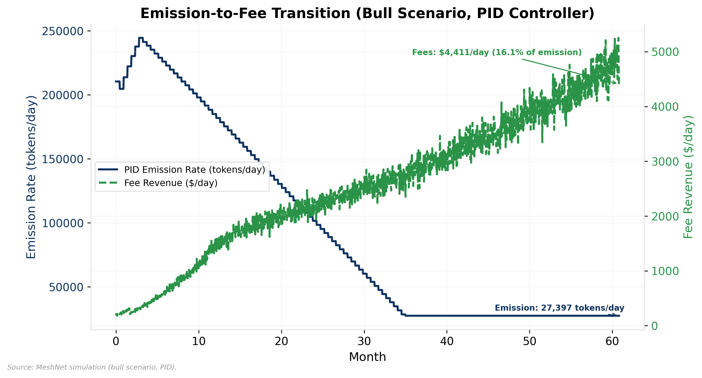

Exhibit 14 shows how the community airdrop percentage affects early circulating supply and treasury reserves, confirming that the 5% allocation balances initial distribution breadth against dilution pressure.

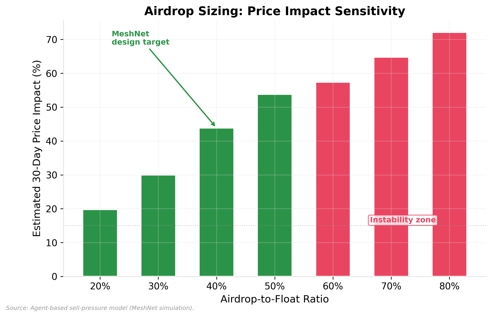

> **Beyond MeshNet: Distribution Strategy Across Protocol Types**
>
> Because protocol infrastructure is non-rivalrous, emission distribution faces no physical constraint on how many participants receive ownership simultaneously; the only constraint is ensuring each recipient's contribution is genuine. In DeFi, emission KPIs target total value locked (TVL) or borrowing demand rather than node count, but the control loop logic is identical: measure, compare to target, adjust rewards. Gaming protocols can use seasonal emission schedules aligned with content drops, concentrating incentives when new players are most needed. Social protocols face unique Sybil risks on airdrops because account creation is cheap; weighting distribution by verified social graph connections (not just activity volume) reduces mercenary farming. The contextual value principle applies everywhere: any allocation (to market makers, influencers, or launch partners) must be justified by secondary value created, not relationship leverage.
>
> *Anchored by: §6 allocation design, §8 PID emission results (Exhibits 19-20), §6 airdrop vesting analysis (Exhibit 14).*
>
> | Pattern | Use When | Fails When | Measure | Default Guardrails |
> |---|---|---|---|---|
> | **Adaptive emissions (control loop)** | Protocol has a measurable KPI that token incentives can influence | KPI is gameable or not causally linked to emission rewards | KPI convergence rate; emission-to-revenue ratio over time | Floor and ceiling on emission rate; governance override for parameter changes |
> | **Retroactive rewards** | Quality of contribution matters more than quantity | Committee governance is captured or evaluation criteria are subjective to the point of corruption | Grant impact score; ecosystem growth attributable to funded projects | Committee rotation; conflict-of-interest disclosure; community veto above threshold |
> | **Vesting with clawback** | Recipients may be mercenary; long-term alignment is the design goal | Clawback criteria are too strict and punish legitimate holders during market downturns | Recipient retention rate; sell-through rate vs. comparable airdrops | Clear, objective clawback triggers; grace period before forfeiture |
> | **KPI-gated market maker allocation** | Protocol needs professional liquidity but wants accountability | Market conditions make KPIs unreachable (e.g., extreme volatility collapses spread targets) | Spread, depth, uptime vs. targets; cost-of-liquidity per dollar of allocation | Quarterly evaluation; force-majeure clauses for extraordinary market conditions |
>
> **Preconditions:** A measurable, non-gameable KPI that emission incentives can causally influence. If the KPI (e.g., node count, TVL, active users) can be inflated through Sybil attacks or wash trading without corresponding real activity, adaptive emissions reward manipulation rather than contribution. **Anti-pattern:** Copying another protocol's emission curve without recalibrating to your network's growth stage; a 10-year halving schedule designed for a mature network will under-incentivize bootstrapping in a new one.

---

## 7. Governance as Constitutional Design

Governance is where most token projects stop trying. Teams that spend months optimizing emission curves and staking yields will deploy governance as an afterthought: a Snapshot vote with one-token-one-vote mechanics and no quorum requirements. The participation rates tell the story: 2-5% of HNT holders vote on Helium Improvement Proposals; 1-3% of FIL holders participate in Filecoin governance. The result is predictable: low turnout, whale domination, governance fatigue, and eventually a community that stops participating because participation feels pointless. This is the structural failure Buterin (2021) identified in coin voting governance, where governance power correlates with capital rather than contribution.

The failure is in the design, not in the community. If most people don't vote, the governance mechanism is not providing sufficient reason to vote. If whales dominate, the governance mechanism is not distributing power broadly enough. If governance captures the treasury, the mechanism did not constrain self-interest. Governance must be designed with the same rigor as any other system component, which means treating it as institutional design, and specifically as constitutional design, not as a feature checkbox.

### The Constitution

Every protocol needs a constitution: a foundational document that defines the values of the organization, the rights of different stakeholder classes, and the procedures by which those rights can be modified. Without a constitution, governance drifts. Proposals are evaluated ad hoc, precedents shift with each vote, and stakeholders have no stable expectations about how the system will treat them.

MeshNet's constitution establishes four foundational commitments:

**Node operators' right to earn emissions proportional to verified coverage.** No governance proposal can eliminate operator rewards entirely or redirect emission allocations to non-infrastructure purposes without triggering the constitutional amendment process (requiring >66% quorum).

**Users' right to transparent fee structures.** The fee adjustment algorithm is public and deterministic. Governance can change the algorithm's parameters but cannot introduce opaque or discretionary pricing.

**Governance participants' right to propose and vote on changes.** Any holder of $MESH above a minimum threshold can submit a governance proposal. No gatekeeper can prevent a proposal from being submitted, though quorum requirements determine whether it passes.

**Treasury's obligation to fund retroactive public goods.** The 15% retroactive allocation is constitutionally protected. Governance can change how it is distributed but cannot redirect it to non-public-goods purposes without a constitutional amendment.

The constitution is the social contract; governance is the legislature operating within constitutional bounds. Some decisions are governable by simple majority, others require supermajority amendments, and the foundational commitments are designed to be extremely difficult to change, providing the stability that long-term participants need to make investment decisions.

The behavioral foundation for this architecture is procedural justice: decades of organizational research (Leventhal, 1980; Lind & Tyler, 1988) show that people accept unfavorable outcomes when they believe the process that produced them was fair. Leventhal's six criteria (consistency, bias suppression, accuracy, correctability, representativeness, and ethicality) become design requirements for token governance. Consistency demands that equivalent decisions follow equivalent rules, which motivates tiered governance structures. Representativeness requires that affected stakeholders have structured voice in decisions that impact them. Bias suppression means capital alone should not determine outcomes. Correctability requires that decisions be reversible through defined amendment processes.

The structural weakness is accuracy: governance voters often lack the technical expertise to evaluate complex proposals about emission curves, PID parameters, or slashing thresholds, and on-chain voting provides no mechanism to ensure decisions are informed. Delegating technical decisions to domain-expert committees (§7, Tiered Quorum) is the design response. In pseudonymous systems where participants cannot rely on social reputation or personal trust, procedural fairness encoded in mechanism design is the only available basis for governance legitimacy.

### Tiered Quorum

Not all decisions are equal. Dissolving the protocol and distributing the entire treasury to token holders is a fundamentally different kind of decision than approving a $5,000 community grant for a regional meetup. They should not have the same governance requirements.

MeshNet implements three governance tiers, each with different quorum and approval thresholds:

**Critical decisions (>66% of voting power required):** Constitutional amendments, treasury dissolution, changes to emission caps, modification of the burn mechanism, and changes to the staking/slashing parameters. These decisions affect the architecture of the protocol and are designed to be difficult to execute, requiring broad consensus, not just a motivated minority.

**Major decisions (33–50% of voting power required):** Fee structure changes, new staking parameter adjustments, committee budget allocation, and changes to the airdrop or market maker terms. These are policy decisions that affect multiple stakeholder classes but do not alter the protocol's foundational architecture.

**Minor decisions (10–20% of voting power required):** Community grants, regional coverage priorities, tooling bounties, and operational decisions within committee budgets. These are routine decisions that should be executable without mobilizing the entire token holder base.

This tiered structure is supplemented by delegated committees. MeshNet establishes four standing committees (coverage, grants, finance, and rewards), each with an autonomous budget allocated through a major governance vote. Within their budgets, committees operate independently, making minor decisions without full-protocol votes. This mirrors how functional organizations actually work: the marketing team does not vote on the product roadmap, and the product developers do not vote on the marketing budget. Delegation makes governance scalable.

Together, tiered quorum and delegated committees compress the governance attack surface. A capital-based attacker seeking to capture the protocol must clear a >66% supermajority for constitutional changes, not simply outspend the median voter. Technical decisions about emission parameters or slashing thresholds are delegated to domain-expert committees rather than resolved through capital-weighted votes, removing them from the attack surface entirely. Conviction voting (below) further raises the cost of flash attacks by requiring sustained commitment rather than momentary capital deployment.

### Conviction Voting

Traditional governance requires synchronous participation: showing up at the right time, evaluating a proposal, casting a vote before the deadline. For most token holders, the expected value of any individual vote is near zero: their vote is unlikely to be decisive, the topic may be outside their expertise, and the time cost of evaluation exceeds any personal benefit from the outcome. Low turnout is not laziness; it is rational behavior under these conditions. Olson (1965) established that rational actors under-provide public goods when individual contributions are non-decisive, and token governance is a second-order case: good governance benefits every participant, but contributing to governance is individually costly and non-decisive, so rational agents free-ride on others' participation.

Organizational behavior research adds a layer beyond rational choice: diffusion of responsibility (Darley & Latané, 1968) shows that even people who want to act feel less obligation when many others could act instead, a finding from emergency intervention research that maps onto governance contexts where individual contributions are similarly non-decisive. In a 100,000-holder governance system, each holder assumes someone else will evaluate the proposal. The result is that increasing the number of eligible voters can paradoxically decrease participation rates, a dynamic that purely economic models of governance do not predict.

Conviction voting (Zargham et al., 2019), pioneered by the Common Stack and BlockScience, restructures the voting mechanism to be asynchronous and continuous. Instead of casting discrete votes on individual proposals, token holders signal support by allocating tokens to proposals they endorse. The voting weight of those tokens starts low and accumulates over time at rate β = 0.05 per day, reaching 78% of maximum weight at 30 days and 95% at 60 days.

This design has three properties:

**Protection against flash attacks.** A whale who acquires tokens the day before a vote cannot immediately deploy full voting power. Conviction must be built over time, making last-minute vote buying expensive and ineffective.

**Reduced governance fatigue.** Holders set their convictions once and adjust only when their preferences change. They do not need to monitor a governance calendar, evaluate every proposal individually, or show up for deadlines.

**Signal quality over signal quantity.** A small number of tokens held with conviction for months outweigh a large number of tokens allocated momentarily. This rewards sustained commitment to a position over raw capital deployed.

Together, these properties partially address both the Olson and Darley & Latané problems identified above. By lowering the cost of sustained participation (set it and forget it), conviction voting reduces the individual cost that drives Olson's free-riding. By self-selecting a smaller population of committed participants (those who actively allocate conviction rather than passively holding tokens), it creates governance groups where each participant's contribution is more visibly consequential, reducing the diffusion of responsibility that plagues large-electorate voting systems.

Applied to MeshNet, conviction voting governs regional coverage priorities. Node operators signal which geographic regions should receive bonus emissions. Conviction accumulates over weeks, meaning that sustained community demand for coverage in a specific area carries more weight than a one-time campaign. The conviction function for holder i on proposal p at time t:

> Conv(i, p, t) = τ_allocated(i, p) × (1 − e^(−β × t_held))

Where τ_allocated is the tokens allocated to proposal p and t_held is the duration of continuous allocation.

Exhibit 15 shows the resulting accumulation dynamics: at the default decay rate (β = 0.05), conviction reaches 78% of maximum weight after 30 days of continuous allocation, creating a natural filter against impulsive governance actions.

An illustrative example clarifies the compound effect of quadratic reputation and conviction weighting. An operator with 10,000 tokens, R=2.0, and 60 days of sustained conviction has effective governance power of approximately 85,500 (10,000 × 9 × 0.95). A passive holder with 100,000 tokens, no reputation, and one day of conviction has effective power of approximately 4,900 (100,000 × 1 × 0.049). The committed operator commands 17 times the governance influence with one-tenth the capital. This ratio is arithmetic, not a simulation output; the simulation models reputation weighting (producing the Gini compression from 0.89 to 0.72 in Exhibit 6) but does not model conviction duration. The intended design consequence is that operational knowledge outweighs financial capital in governance. The compound Gini under both reputation and conviction weighting remains an open empirical question whose answer depends on the operator population's conviction duration distribution.

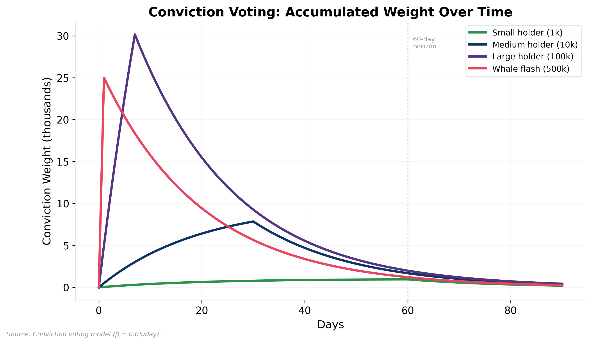

### Veto Rights and Power Balance

The labor-ownership thesis of Section 3 argues that protocols distribute ownership to the people who create value. But ownership creates governance power, and governance power can be used against the interests of other stakeholder classes. Specifically, token holders who do not operate infrastructure can vote to reduce operator emissions, effectively cutting the compensation of the people who make the network functional.

MeshNet addresses this through a conditional veto. If more than 75% of active node operators (measured by verified uptime in the preceding 30 days) signal opposition to a governance proposal that modifies emission parameters, the proposal is suspended for 90 days. During the suspension, a supermajority of >80% of voting power is required to override the veto and implement the change.

The structure mirrors the balance of powers in constitutional democracies. The US president can veto legislation; Congress can override with a two-thirds majority. The judicial system can declare laws unconstitutional. No single branch holds absolute power. In MeshNet, token holders are the legislature, operators are the executive (they execute the network's mission), and the constitution is the judiciary (it constrains what governance can do).

The veto is deliberately narrow: it applies only to emission parameter changes, not to all governance decisions. Operators cannot veto fee structure changes, committee appointments, or treasury allocations. This is designed to prevent the veto from becoming a general-purpose obstruction tool while protecting the specific interest most directly tied to operator participation: their compensation.

The veto's design follows Hirschman's Exit-Voice-Loyalty framework (1970), adapted for a structural asymmetry specific to DePIN. In traditional firms, exit is expensive (switching costs, job search, relocation) and voice is cheap (talk to your manager, file a grievance). In DePIN protocols, the relationship inverts: exit is cheap (power off the node, sell tokens) and voice is expensive (coordinate pseudonymous participants to draft a proposal, build conviction, pass a vote). This asymmetry means DePIN protocols default to exit dynamics: operators leave silently, coverage degrades, and governance never receives the signal that something was wrong. The operator veto makes voice cheap and exit unnecessary for the highest-stakes decisions. Hirschman's further insight is that loyalty is what delays exit long enough for voice to work. In DePIN, loyalty has two sources: sunk hardware costs (continuance commitment; the equipment is already purchased and deployed) and community identity (discussed in Section 3). The veto converts loyalty from passive inertia into active governance participation.

Beyond economic structure, operators form implicit expectations about the protocol's commitments (fair rewards, stable rules, advance notice of changes) that psychological contract theory (Rousseau, 1995) predicts will trigger disproportionate behavioral responses when violated. Operators who perceive arbitrary rule changes do not simply recalculate expected value; they feel betrayed, become vocal detractors, and accelerate others' exit decisions. The 90-day veto suspension period is, in behavioral terms, a psychological contract management tool: it provides advance notice and structured contestation before any change to operator compensation, preventing the perception of arbitrary governance that triggers cascading attrition.

The design acknowledges a fundamental tension: the same people who create value (operators) must be protected from the people who govern value distribution (token holders), even though both classes overlap by design. The veto is the safety valve that maintains the labor-ownership alignment described in Section 3, ensuring that distributed ownership does not degrade into distributed exploitation.

Exhibit 16 maps the complete governance decision tree from proposal submission through conviction accumulation, operator veto windows, and execution, showing how each governance tier (routine, major, constitutional) routes through different approval thresholds and delay periods.

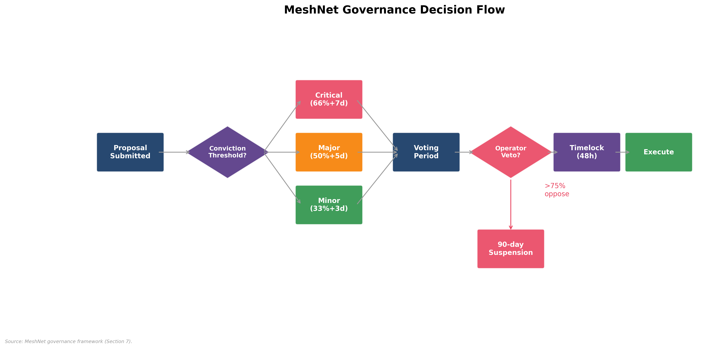

> **Beyond MeshNet: Governance Design Across Protocol Types**
>
> The governance challenge is the same across verticals: when every participant is simultaneously owner and user of non-rivalrous infrastructure, governance must prevent any stakeholder class from extracting value at others' expense. DeFi protocols face the sharpest governance capture risk because governance decisions directly affect financial flows. Tiered quorum is essential here, with the highest thresholds on treasury and emission changes. Gaming decentralized autonomous organizations (DAOs) benefit most from committee structures: a lore committee, an economy committee, and a community committee can each govern their domain without every player voting on every balance patch. Social protocols could consider conviction voting for content moderation policy, where sustained community consensus is a better signal than a one-time majority vote. Veto rights generalize to any protocol where one stakeholder class bears disproportionate risk from decisions made by another.
>
> *Anchored by: §7 tiered governance design, §7 whale governance analysis (Exhibit 6, Gini 0.89→0.72), §5 reputation-weighted voting formula.*
>
> | Pattern | Use When | Fails When | Measure | Default Guardrails |
> |---|---|---|---|---|
> | **Tiered quorum** | Governance decisions vary in severity and scope | Tier boundaries are ambiguous or easily circumvented by splitting proposals | Turnout by tier; proposal passage rate; time-to-decision | Clear constitutional definitions of each tier; escalation procedure for edge cases |
> | **Conviction voting** | Governance fatigue is high; flash attacks or vote buying are risks | Conviction accumulation period is too long, making governance unresponsive to urgent issues | Average conviction duration; proposal throughput; participation rate over time | Emergency fast-track lane for security-critical proposals (bypasses conviction with supermajority) |
> | **Delegated committees** | Decision volume exceeds what full-protocol votes can handle | Committees become entrenched or self-dealing | Committee output quality; budget utilization; community satisfaction surveys | Term limits; rotation; transparent budgets; community recall mechanism |
> | **Conditional veto** | One stakeholder class bears disproportionate risk from another class's decisions | Veto is too broad and obstructs routine governance | Veto invocation frequency; override rate; operator retention around veto events | Narrow scope (specific parameter types only); time-limited suspension; supermajority override |
>
> **Preconditions:** Sufficient token distribution that governance participation is not limited to insiders. Reputation-weighted governance requires an oracle or attestation system that can measure contribution quality; without it, reputation reduces to token age or self-reported metrics. **Anti-pattern:** Deploying tiered governance with constitutional protections before the community is large enough to sustain meaningful quorums; the result is governance that technically exists but functionally operates as founder dictatorship behind a democratic facade.

---

## 8. What Simulation Reveals

Token emission schedules are monetary policy, and monetary policy requires feedback loops. Most token models deploy static emission schedules: a fixed vesting curve set before launch and never adjusted. No central bank sets interest rates once and walks away. Token economies need the same adaptive capacity, but automated and transparent. MeshNet implements a PID (Proportional-Integral-Derivative) controller that adjusts emission rates based on the gap between actual and target node counts, bounded to 0.25x-3x of the base rate and evaluated every 14 days (Exhibit 17). Full controller specification, parameter provenance, and sensitivity analysis are in Appendix A. The design philosophy is iterative adjustment, not fixed trajectories: the 14-day cadence, bounded automation range, and governable parameters are all chosen so that the system can be tuned in response to measured outcomes rather than locked to pre-launch assumptions.

![Exhibit 17, PID Controller Decomposition and Integral Wind-Up. Panel A decomposes the proportional, integral, and derivative channels with MeshNet-specific parameters (Kp = 0.8, Ki = 0.15, Kd = 0.2), the 0.25x-3.0x output clamp, and the 14-day evaluation cadence. Panel B traces the four-phase progression from normal operation through demand shock, integral accumulation, and the dilution feedback loop, identifying the channel mismatch (supply-side lever applied to demand-side constraint) as the root cause of controller failure under sustained demand contraction.](exhibits/exhibit_17_pid_block_diagram.png)

The question for the conceptual framework is not how the controller works (Appendix A), but what happens when it interacts with the rest of the mechanism stack under stress. A 5-year agent-based simulation stress-tests MeshNet's complete economy across four macroeconomic scenarios (bull, bear, competitor entry, regulatory shock), comparing PID-controlled emissions against a static exponential decay baseline. The simulation uses a 240-run ensemble (30 seeds x 8 configurations) plus sensitivity sweeps totaling 584 runs. Four findings emerged that matter for the framework developed in Sections 2-7.

### 8.1 PID as Monetary Policy Insurance

Adaptive emission's primary value is not better average outcomes; it is tighter confidence intervals. Single-seed results mask distributional divergence. Under seed=42, PID and static emission produce similar node counts across all scenarios, but the 240-run ensemble reveals that PID compresses node-count variance by 6x under supply-side shocks: coefficient of variation drops from 0.544 (static) to 0.087 (PID) under competitor stress. The practical consequence: PID's 5th-percentile outcome is 8,880 viable nodes, while static's 5th-percentile is 1,049 (effective collapse). Static emission's seed=42 result of 11,934 nodes is an optimistic outlier from a distribution with a mean of 8,610 and standard deviation of 4,684.

Exhibit 18 compares the emission rate trajectories under PID and static schedules across all four scenarios, showing PID's dynamic response to changing network conditions versus static's predetermined taper.

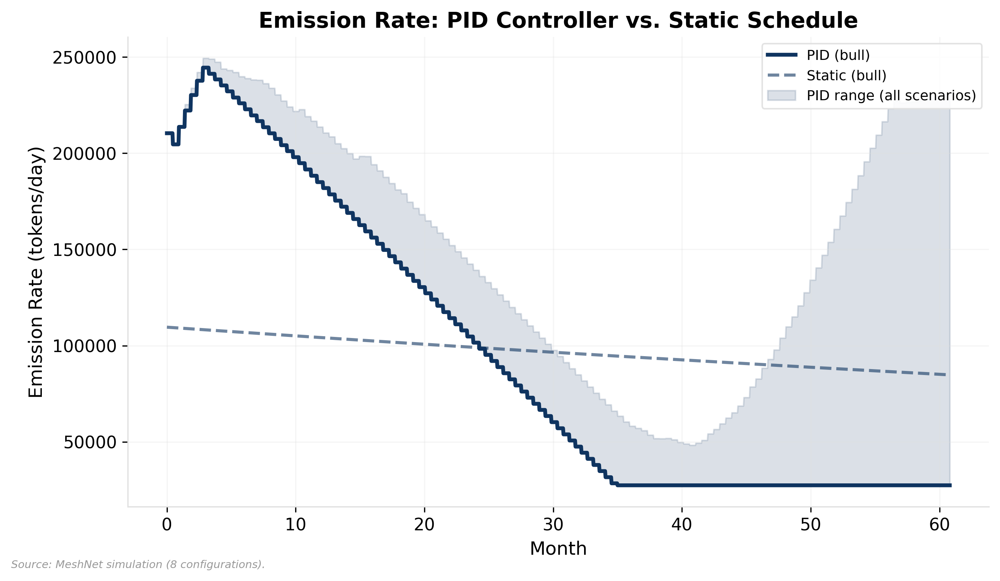

Exhibit 19 translates these emission differences into node count outcomes under the single-seed baseline, where PID and static appear deceptively similar.

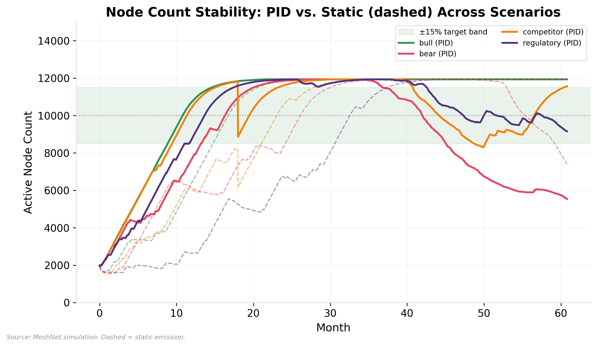

Exhibit 20 reveals what single-seed trajectories conceal: the full 30-seed ensemble distributions show PID compressing node-count CV by 6× under competitor shock (0.087 versus 0.544), particularly in the left tail that determines network survival.


The insurance framing is precise: protocol designers choosing adaptive emission accept a dilution premium in bear markets in exchange for bounding tail-risk collapse. In the bear scenario, PID finishes at 5,536 nodes (44.6% below target) versus static's 7,401 (26.0% below), and emits 57% more tokens over 5 years. But bear/static has a coefficient of variation of 0.958 with a 5th-percentile of 709 nodes, while bear/PID's CV is 0.219 with a 5th-percentile of 4,429: a 6× improvement in the lower bound that matters for network survival. Price stability follows the same pattern: PID produces narrower price distributions across all scenarios (Appendix A.4).

The variance-reduction finding generalizes beyond MeshNet. Any token economy reporting simulation results from a single random seed is reporting noise, not signal. The emission model choice compresses the range of outcomes rather than improving their average under moderate shocks. Under competitor shock, static produces a higher median node count (11,934 vs. 10,130) but PID's 5th percentile is 8,880 versus static's 1,049. The models diverge sharply only under sustained demand contraction, which leads to the second finding.

### 8.2 The Dilution Feedback Loop

The bear scenario reveals an emergent failure mode that no mechanism-by-mechanism analysis would predict. Under sustained demand contraction, the PID controller's integral component accumulates error, increasing emissions to chase an unreachable node-count target. This triggers a positive feedback loop (what control theory calls integral wind-up and crypto markets call a death spiral): higher emissions increase token supply, which depresses price, which makes each operator's rewards worth less, which accelerates exit, which reduces aggregate slashing (fewer nodes to fault), until emissions overtake slashing and the supply regime flips from deflationary to inflationary. The control theory framing is more precise: it identifies the integral accumulator as the specific component that converts a transient shock into a self-reinforcing collapse, and points to anti-windup clamping as the engineering remedy (§8.2). In the bear scenario under seed=42, the controller operates between 0.44x and 2.26x of the base rate, well within its bounds. Across the 30-seed bear ensemble, the controller reaches its 0.25x floor in only 1 of 30 seeds (238 of 54,750 seed-days, 0.43%), exclusively in the post-shock period; the remaining 29 seeds range from 0.26x to 2.33x base, and the 3.0x ceiling never binds in any seed. The dilution loop is not the controller straining at its limits; it is the controller steadily ratcheting emissions upward as unresolved error compounds over time.

The mechanism has empirical precedent outside DePIN: during the March 2023 SVB failure, stablecoin market stress propagated through infrastructure-level banking exposures rather than token-level design flaws, with the most heavily regulated stablecoin gateway (Circle) experiencing the sharpest disruption precisely because of its direct exposure to the failing institution (Author, 2026a). In both cases, asset-level characteristics provided no warning; the failure propagated through infrastructure-layer exposures that only integrated analysis would reveal.

Static emission avoids this loop not through superior design but through inflexibility: its predetermined taper does not dilute aggressively enough to trigger the price-exit cascade.

The diagnosis implies a specific engineering target: anti-windup clamping with regime-change detection, which resets or caps the integral accumulator when the controller detects that its output is saturated without closing the error gap. This failure mode is the strongest argument in the paper for tokenomics as an integrated discipline (§10): it emerges only when staking economics, emission control, price dynamics, and operator behavior are simulated together. Neither control theory alone (which would optimize the PID gains) nor mechanism design alone (which would verify incentive compatibility of individual mechanisms) would discover it.

### 8.3 Bootstrapping Reality

The simulation reveals a supply-side hierarchy that challenges conventional token design assumptions. Under MeshNet's bootstrapping parameterization, slashing dominates burns as the primary supply-reduction mechanism: 269-354M tokens are transferred to treasury via slashing across scenarios, while burns contribute less than 0.05% of supply dynamics (BME peaks at 0.0061 even under bull-case assumptions). A 40-run sensitivity sweep across penalty severities confirms that slashing dominance is structural, not an artifact of the default parameterization (Appendix A.7).

This creates a structural tension documented in the adversarial analysis (Appendix A.11): successful defense (reducing fraud, improving uptime) weakens the treasury's fiscal capacity by reducing the slashing that funds it. Governance should anticipate this by establishing supplementary treasury funding before slashing revenue declines. The dominance is conditional on the bootstrapping regime: as fee revenue grows toward emission value (BME approaching 1), burns would overtake slashing as the primary supply lever. The simulation does not reach this transition within its 5-year horizon; the phase boundary is an open question mapped in §11.

A separate finding concerns controller tuning: evaluation cadence affects mean deviation from target node count non-trivially. The 21-day cadence achieves 15.5% mean deviation versus 22.0% for the default 14-day cadence, with lower emission volatility and fewer floor-pinning episodes; the 7-day cadence matches on deviation (16.0%) but at the cost of the highest emission volatility in the sweep (Appendix A.8). This is newly reported and untested beyond MeshNet's parameterization.

### 8.4 Mechanism Interaction: What Only Integrated Analysis Reveals

The dilution feedback loop (§8.2) is one instance of a broader pattern: failure modes that emerge only when mechanisms designed in isolation interact under stress. Three additional compound findings illustrate why token design requires systems-level analysis.

**Bounded automation trades governance input for response speed.** The PID controller's 0.25x-3x range is designed to operate without governance intervention; that is the point of automation. When the controller enters wind-up under sustained demand contraction, operators exit, their reputation decays at 15% per quarter (§5), and conviction weights evaporate. The governance pool contracts to passive holders with low reputation and no operational knowledge. This is not a failure of governance capacity but a consequence of the automation-first design philosophy: the system exhausts automated responses before governance engagement begins. Conviction voting requires 30 days to reach 78% weight (§7), while two full PID adjustment cycles complete in 28 days, so the deliberative system activates only after the automated system has traversed its operational range. The practical consequence is that operator voice enters the system at the constitutional level (should the 0.25x-3x range change?) rather than the operational level (what rate within the range?), concentrating governance attention on structural rather than tactical decisions.

**The treasury faces a structural fiscal tension.** Slashing funds the treasury (269-354M tokens across scenarios), and the treasury funds rural subsidies, retroactive public goods, and ecosystem development, all constitutionally protected obligations (§7). But slashing revenue is inversely correlated with network quality: as operators improve uptime and fraud decreases, this revenue stream attenuates while obligations remain fixed. Whether this tension binds within the simulation's five-year horizon depends on treasury outflow rates against the initial allocation (205M tokens) plus cumulative slashing transfers, a fiscal projection this paper does not attempt. The tension is architectural, flagged here as a design consideration for protocols coupling quality-improvement incentives to penalty-funded obligations.

**The veto's deliberate scope creates a two-tier authority structure.** Operators hold a conditional veto over governance proposals that modify emission parameters (§7), while the PID controller exercises delegated authority over operational execution, adjusting emissions within approved bounds without triggering any governance proposal. This division is intentional (the veto is deliberately narrow, §7), but it means the mechanism most directly affecting operator day-to-day compensation operates within bounds set through prior governance action rather than ongoing operator input. During the dilution loop, the controller can approach its 3x ceiling while operating entirely within its mandate. The Hirschman analysis (§7) argues that DePIN defaults to silent exit because voice is expensive; the two-tier structure channels dissatisfaction with operational outcomes (emission rates within bounds) through exit rather than voice, since the governance system correctly interprets bound-compliant controller behavior as operating within its approved range.

These compound findings are the paper's most direct evidence for the systems engineering thesis (§2, §10). Each mechanism, analyzed in isolation, is well-specified: the PID controller is stable within its bounds, the governance architecture is capture-resistant, the treasury has constitutionally protected funding. The design consequences emerge only when mechanisms are analyzed jointly: the dilution feedback loop from dynamic simulation, the automation-governance tradeoff, fiscal tension, and authority-structure consequences from integrated design review. Both analytical modes are core to systems engineering, and both require examining the integrated system rather than its components.

> **Beyond MeshNet: Adaptive Monetary Policy Across Protocol Types**
>
> Continuous, automated ownership distribution is feasible only because protocol infrastructure is non-rivalrous; the same property that eliminates the need for human authorization at each issuance also makes closed-loop emission control possible. DeFi lending protocols already implement primitive control loops (interest rates adjust based on utilization ratios) but most lack the integral and derivative components that prevent steady-state error and oscillation. Gaming economies are the most natural fit for adaptive emission: player reward rates should respond to daily active users, session length, and retention cohort data, not follow a fixed schedule designed before launch. Social protocols can target content quality metrics: if high-quality posts (measured by engagement depth, not volume) decline, increase creator rewards; if spam rises, tighten emission criteria. The universal lesson: any token economy with measurable KPIs can benefit from closed-loop control. Static schedules are a design shortcut, not a design choice.
>
> *Anchored by: §8 PID vs. static comparison (variance reduction under ensemble analysis), Exhibit 23 gain sensitivity (60 runs), Exhibit 24 slashing sweep (40 runs).*
>
> | Pattern | Use When | Fails When | Measure | Default Guardrails |
> |---|---|---|---|---|
> | **PID emission control** | Protocol has a measurable KPI that token incentives can influence | KPI is gameable, lagging, or not causally linked to emissions | KPI convergence rate; emission-to-revenue ratio | Floor/ceiling bounds; governance override |
> | **Bounded automation** | Market conditions change faster than governance can respond | Bounds too wide (unconstrained) or too narrow (unresponsive); may pin at floor during success (45% of bull simulation) | Frequency of bound hits; time-at-bound percentage | Quarterly governance review of bounds; emergency expansion procedure |
> | **Scenario simulation** | Designing or auditing any emission schedule | Scenarios too narrow or assume correlated agent behavior | Scenario coverage; sensitivity analysis identifying highest-leverage parameters | Minimum four scenario types; multi-seed ensembles; sensitivity sweeps on all tunable parameters |
>
> **Preconditions:** A reliable, low-latency sensor for the KPI the controller targets (e.g., verified node count, TVL, active addresses). The PID controller is only as good as its measurement input; if node count is reported with a 7-day lag, the controller effectively operates blind during acute shocks. Minimum viable instrumentation: real-time KPI feed, bounded automation floor/ceiling, and a governance-accessible parameter dashboard. **Anti-pattern:** Deploying a PID controller with gains tuned to one market regime and no plan for retuning; the integral term accumulates error during regime shifts, producing the wind-up failure mode documented in §8 (bear scenario, 44.6% deviation).

---


## 9. Design Ethics: The Categorical Imperative Test

Having established what simulation reveals about mechanism interaction, we turn to a normative question: how should designers evaluate whether the mechanisms they have built are legitimate? Simulation tells us whether mechanisms work. It cannot tell us whether they are worth building. Both questions need answers.

Every mechanism above can be evaluated through a single philosophical lens: Kant's categorical imperative. Act only according to rules that you would want every participant to follow. Applied to token design, the test becomes: for any behavior the system permits, ask what happens if every participant does it.

If every operator faked their coverage claims, the network would be worthless: no real connectivity, no user demand, no fee revenue, no token value. The categorical imperative fails. Therefore, the mechanism must make fake coverage claims unprofitable (proof-of-coverage) and punishable (slashing).

If every token holder voted to maximize their own short-term payout (draining the treasury, redirecting emissions to large holders, eliminating retroactive rewards), the protocol would collapse within months. The categorical imperative fails. Therefore, governance must constrain self-dealing (tiered quorum, constitutional protections, operator veto).

If every operator created dozens of Sybil nodes to maximize their emission share, the network would consist of thousands of minimal-quality nodes with no genuine coverage. The categorical imperative fails. Therefore, each node must bear sufficient economic cost (staking requirements) and verification burden (proof-of-coverage) that Sybil multiplication is irrational.

The minimax principle provides the complementary lens: design each mechanism assuming the next actor will make the move that damages the system most. If the system survives that move, it is robust. If it doesn't, the mechanism needs strengthening. Together, the categorical imperative (would the system survive if everyone did this?) and minimax (would the system survive if the worst actor did this?) provide a complete adversarial design methodology, one grounded in 2,400 years of philosophical inquiry and directly implementable in code.

This is where philosophy meets engineering. The categorical imperative is the design heuristic. The smart contract is the enforcement mechanism. Neither is sufficient alone.

> **Beyond MeshNet: Adversarial Thinking Across Protocol Types**
>
> The openness that makes non-rivalrous infrastructure legitimate (anyone can participate, anyone can verify) is the same property that creates the attack surface. Every protocol must defend the commons it creates. DeFi protocols face the most sophisticated adversaries, including maximal extractable value (MEV) extractors, flash loan attackers, and governance raiders with borrowed voting power. The categorical imperative test scales: if every user could execute this strategy, would the protocol survive? Flash loan governance attacks fail this test immediately, justifying time-locked voting. Gaming economies are vulnerable to botting and real-money trading that drains in-game value; proof-of-humanity and behavioral fingerprinting serve the same function as MeshNet's proof-of-coverage. Social protocols must defend against coordinated inauthentic behavior, particularly sockpuppet networks gaming reputation systems. Design every mechanism assuming the next actor will exploit it maximally, then verify the system still functions.
>
> *Anchored by: Appendix A.11 wash trading Monte Carlo (Exhibit 25, 3.0%→0.09% with PoC), Appendix A.11 Sybil break-even analysis, Appendix A.11 composed attacker scenario, Appendix A.12 monitoring table.*
>
> | Pattern | Use When | Fails When | Measure | Default Guardrails |
> |---|---|---|---|---|
> | **Proof-of-contribution** | Rewards are distributed based on claimed activity that can be faked | Verification is too expensive or too slow to keep up with claim volume | False positive / false negative rates; cost of verification vs. cost of fraud | Layered verification (automated first, committee review for flagged cases); progressive slashing |
> | **Reputation-weighted governance** | Pure token-weighted voting enables capital-based capture | Reputation criteria are gameable or too narrowly defined | Effective voting power Gini; governance outcome quality metrics | Multiple reputation dimensions; seasonal decay; non-transferability |
> | **Economic Sybil resistance** | Identity verification is impractical or privacy-violating | Staking costs are too low relative to potential emission returns | Break-even analysis for Sybil strategy; node-to-operator ratio | Minimum stake per identity; hardware fingerprinting; registration velocity limits |
> | **Categorical imperative audit** | Any mechanism is being designed or modified | The audit becomes a checkbox rather than a genuine design tool | Coverage of attack vectors identified; post-deployment incident rate | Run the audit for every mechanism before deployment and after every governance modification |
>
> **Preconditions:** A parameterized threat model with explicit adversary budgets, attack surfaces, and success metrics before running any Monte Carlo simulation. Without defined adversary capabilities, simulation results are vacuously reassuring. Minimum viable adversarial analysis: at least one economic attack (wash trading/Sybil), one governance attack (whale capture/bribery), and one composed multi-vector scenario. **Anti-pattern:** Testing only against honest or naive adversaries and concluding the system is secure; the absence of simulated attacks is not evidence of attack resistance.

One scope boundary deserves explicit acknowledgment. The categorical imperative as applied above tests whether a mechanism survives universal adoption *within* a single protocol. It does not test what happens when *every protocol* adopts the same mechanism. If every DePIN network deployed PID-controlled adaptive emissions, each would compete for a shared pool of hardware operators by bidding up rewards during node shortages. Each controller, locally rational, would increase emissions when nodes fall below target. The aggregate effect is an inter-protocol arms race where adaptive emissions amplify mercenary operator behavior across the ecosystem. The categorical imperative passes within MeshNet but may fail at the ecosystem layer, a collective action problem above the protocol level that this paper's analysis does not address.

---


## 10. Token Design as an Emerging Discipline

### The Synthesis Problem

Designing MeshNet required working knowledge of control theory (PID emission controllers), game theory (adversarial analysis, minimax strategy), political philosophy (Kant's categorical imperative, constitutional design principles), monetary economics (burn-mint equilibrium, dynamic fee adjustment), mechanism design (Myerson, 1981; staking and slashing), behavioral psychology and organizational behavior (governance fatigue, motivation crowding, operator exit dynamics), distributed systems engineering (proof-of-coverage, on-chain verification), and constitutional law (tiered quorum, veto rights, separation of powers).

No single existing discipline covers all of this. An economist can model burn-mint equilibrium but not implement a PID controller. A control engineer can design a stable feedback loop but not determine what it should optimize for. An organizational behaviorist can predict governance fatigue and motivation crowding but cannot design the cryptographic mechanism that verifies coverage. The behavioral insights need the engineer's actuators, and the engineer's actuators need the behaviorist's predictions about how humans will actually respond to them.

The current state of token design reflects this fragmentation. Most models are designed by analogy rather than first principles (see §1), and the field lacks the institutional infrastructure to change this: no established body of knowledge, no credentialing process, no peer review mechanism for mechanism design, and no standard methodology from problem definition through deployment. This is not an accident of timing. The existing disciplines (corporate finance, labor economics, contract law, monetary policy) were built for systems where productive assets are rivalrous and ownership is zero-sum. Non-rivalrous productive infrastructure creates a class of design problems that none of them were equipped to handle: how to set the rate of continuous ownership distribution, how to govern a system where every participant is simultaneously worker, owner, and user, and how to defend against adversaries who can exploit the very openness that makes the system legitimate.

### Owner-User Synergy Scorecard

Section 3 introduced the Owner-User Synergy Principle: the strongest protocols maximize the overlap between token holders and product users, and misalignment between these roles reintroduces the capital-labor separation that non-rivalrous infrastructure was designed to dissolve. Having now specified MeshNet's full mechanism stack, we can evaluate each mechanism against this criterion.

| Mechanism | Owner-User Alignment | Risk of Misalignment |
|-----------|---------------------|---------------------|
| Productive staking (§5) | Operators are owners by construction; stake secures real infrastructure | Liquid staking derivatives could decouple stake from operation, recreating passive capital |
| Reputation-weighted governance (§5) | Non-transferable; earned only through sustained use | Decay rate must balance incumbent retention against fresh entry |
| Burn-mint equilibrium (§5) | Burns require usage; value capture tracks demand directly | Low burn rates during bootstrapping obscure the demand signal for years |
| Emission schedule (§6) | Distributes ownership proportional to measured contribution | Static baselines may over-reward incumbents relative to new entrants |
| Conviction voting (§7) | Time-weighted; rewards sustained holders over transient speculators | Whale accumulation can override operator voice without operational knowledge |
| Operator veto (§7) | Protects labor-side of distributed ownership from holder-side extraction | Could ossify governance if overused; threshold calibration determines whether the veto functions as intended |
| PID emission controller (§8) | Adaptive distribution responsive to real network conditions | Integral wind-up can over-distribute during structural demand contraction |

The mechanisms where alignment is strongest (productive staking, reputation, operator veto) are those where the design structurally requires participation in the network to access the benefit. The mechanisms most vulnerable to misalignment (conviction voting, burn-mint during bootstrapping) are those where token acquisition without network participation remains possible. This pattern suggests a general design heuristic: wherever a mechanism can be accessed through token purchase alone, without productive contribution, it needs a compensating constraint (reputation weighting, time locks, operational quorum) to maintain owner-user alignment.

### What Formalization Looks Like

Mature engineering disciplines share five features that token design currently lacks. Examining each gap through MeshNet's experience reveals what the field needs to develop.

**Simulation-first design.** Established disciplines (aerospace, chemical engineering, structural engineering) simulate before they build. MeshNet's theoretical framework (§5-7) predicted that PID emissions would outperform static emissions across scenarios and that the emission model choice would be the primary design lever. The simulation contradicted both: under moderate shocks, both models produce net deflation because slashing, not emission policy, dominates supply dynamics, but with sharply different tail risk; the models diverge further only under sustained demand contraction, where integral wind-up produces a dilution feedback loop that no analytical framework would have predicted. A single seed (seed=42) produced a misleadingly optimistic bear outcome; only the 240-run ensemble revealed near-total collapse on other paths. Tools like cadCAD, Machinations, and TokenSPICE provide the simulation infrastructure. Most projects that simulate at all report a single trajectory under favorable assumptions and stop.

But simulation alone is not sufficient either. A mature token design discipline requires at least three complementary methods: normative evaluation criteria that make institutional legitimacy assessable, longitudinal case evidence and governance concentration diagnostics grounded in on-chain data, and simulation evidence that tests whether mechanism designs survive adversarial conditions. No single method is sufficient; the discipline needs all three legs.

**Standardized threat modeling.** Cybersecurity has a mature practice of threat modeling: identifying attack surfaces, classifying threat actors, quantifying risk, and testing defenses. Appendix A.9-A.12 applied this practice to MeshNet and found that a 200-run Monte Carlo wash-trading analysis was necessary to distinguish parameterizations where fraud is profitable from those where it is not, a distinction invisible to analytical models that assume a single representative attacker. The methodology is transferable; the four-step pattern (attack vector definition, simulation, detection signals, operational response) generalizes to any protocol with staking and emission mechanics.

**Peer review for mechanism design.** Smart contract auditing is an established practice. Mechanism design has no equivalent. MeshNet's slashing parameters illustrate the gap: the 40-run sensitivity sweep (§8) revealed that downtime penalty severity below 0.05 fails to deter rational operators from selective uptime, while severity above 0.25 triggers cascading exit among marginal participants. That parameter window, where the mechanism works as intended, is narrow enough that an independent reviewer examining the design before deployment would catch miscalibrations that simulation-free deployment would not.

**A shared body of knowledge.** The MeshNet analysis demonstrates what a canonical case study requires: specification against an SE lifecycle (§4), simulation under adversarial conditions (§8, Appendix A), sensitivity analysis on all tunable parameters, and explicit generalization through structured pattern tables (Beyond MeshNet boxes in §5-9, each with preconditions and anti-patterns). Bitcoin's difficulty adjustment, Helium's proof-of-coverage, Optimism's retroactive public goods funding, and Uniswap's concentrated liquidity each contain equivalent lessons, but analyzed in isolation, with incompatible frameworks, producing principles that practitioners cannot compare or combine.

**Professional identity.** Designing MeshNet's PID controller required control theory (§8). Calibrating the reputation decay rate required organizational behavior research on DePIN operator attrition (§5). Structuring the governance tiers required constitutional design principles and procedural justice theory (§7). Testing the adversarial model required game-theoretic Monte Carlo simulation (Appendix A.11). No single adjacent role, financial modeler, economist, smart contract developer, or growth marketer, covers more than one of these. The professional role that integrates them does not yet have a name, a credentialing path, or a body of knowledge, which is why teams default to optimizing the dimension their available expertise covers while neglecting the others.

**Cross-domain convergence.** The infrastructure-layer principle that emerges from MeshNet's analysis is not unique to DePIN. Independent research on stablecoin markets reaches structurally identical conclusions through entirely different data: gateway routing infrastructure (not token-level characteristics) determines monetary policy transmission, stress resilience, and regulatory surface area; concentration at the infrastructure layer follows the same trajectory (throughput scaling while participant diversity contracts); and failure modes propagate through infrastructure exposures invisible to asset-level monitoring (Author, 2026a, 2026b). That two research programs studying different token ecosystems converge on the same "analyze the infrastructure, not the asset" principle suggests a general property of token system design, not a domain-specific finding.

The shared analytical vocabulary reinforces this convergence:

| Concept | Stablecoin gateway finding | DePIN finding (this paper) | Shared principle |
|---------|---------------------------|---------------------------|------------------|
| Concentration dynamics | HHI 7,361 across gateways; volume doubles while counterparties decline 25% | HHI 0.19 across DePIN governance; Gini 0.67-0.98 | Maturing token ecosystems concentrate at the infrastructure layer |
| Feedback failure | SVB contagion through gateway banking exposure; depeg reflexivity | Integral wind-up; dilution feedback loop | Failure modes emerge at the infrastructure-mechanism boundary, not the asset level |
| Fiscal maturity | Yield spread channel; deposit displacement toward stablecoin reserves | BME ratio; fee-dominance transition (58/25/17 decomposition) | Can the system fund itself from usage rather than issuance? |
| Regulatory surface | "Regulate the router, not the token"; CLII tier structure | Systems engineering lifecycle; mechanism interaction analysis | Infrastructure-layer oversight outperforms asset-level classification |
| Stress propagation | Gateway-specific, not token-specific (Circle/SVB) | PID channel mismatch: supply-side lever applied to demand-side problem | Infrastructure-level analysis reveals failure modes invisible to asset-level monitoring |

### The Structural Advantage of New Teams

Established protocols are locked into their token models by governance inertia. Changing a live emission schedule requires a governance vote that affects every token holder's expected returns. Modifying a staking mechanism that thousands of users have built strategies around is politically painful regardless of whether the modification is technically superior. Legacy protocols carry the weight of their initial design decisions indefinitely, and each year of operation makes the existing model harder to change.

New teams have no such constraints. They can design from scratch with the benefit of observing every failure, studying every successful mechanism, and incorporating the latest research. The same way a startup can adopt modern cloud infrastructure while an enterprise is locked into on-premise servers from 2005, a new protocol can implement PID-controlled emissions while established competitors are stuck with static vesting curves.

This is the real argument for building now: not that the tools are ready (they aren't), not that the regulatory environment is settled (it isn't), not that the market is waiting for one more token (it isn't). The argument is that the design space is wide open. The field is immature, which means there is alpha in novel mechanism design: in being the team that implements reputation-weighted governance before it becomes standard, that deploys PID-controlled emissions before competitors realize static schedules are obsolete, that builds adversarial analysis into the design process before the first exploit rather than after.

---

## 11. Limitations

### Simulation Boundaries

We acknowledge simplifications that bound the generalizability of our simulation results. The main simulation uses a single random seed (seed=42) for each of the 8 core configurations, producing deterministic but path-dependent trajectories. We supplement this with a 240-run ensemble (30 seeds × 8 configurations) that establishes confidence intervals on node counts, prices, and supply dynamics, plus a 150-run Ki sensitivity test (30 seeds × 5 Ki values) that distinguishes structural sensitivity from stochastic path dependence.

These ensemble analyses reveal that single-seed conclusions about emission model comparison can be misleading: static emission's seed=42 outcome under competitor shock (11,934 nodes) is an optimistic outlier from a distribution with mean 8,610 and 5th percentile 1,049. However, 30 seeds per configuration remains below the 100+ seeds that would establish stable tail statistics, and price trajectories within each seed remain single-path realizations of the Ornstein-Uhlenbeck process. A 100-run Ki×Kd interaction sweep (5×5 grid, single scenario) confirms that gain interactions are modest within the tested envelope, but a full factorial design crossing multiple seeds with the remaining sensitivity sweep parameters (gains × slashing × cadence × seed) would map higher-order interaction effects that our current design estimates only marginally.

Our demand model treats users as an aggregate flow rather than as individual agents with heterogeneous preferences. Daily fee revenue is a function of network coverage ratio with log-normal noise, and the superlinear scaling function (coverage_ratio^1.3 to ^1.5 depending on coverage completeness) is a reduced-form approximation of network effects calibrated to plausible telecom economics rather than derived from empirical user-level data. Real adoption dynamics involve geographic specificity, switching costs that vary by user segment, network externalities that operate at the individual and community level, and heterogeneous willingness-to-pay that shifts with macroeconomic conditions. A more granular agent-based demand model, calibrated to revealed-preference data from existing wireless mesh deployments, would strengthen the demand-side dynamics and allow us to study phenomena such as geographic clustering, churn heterogeneity, and adoption cascades that our aggregate specification cannot capture. On the supply side, all simulated operators share the same cost structure, so the model cannot detect whether penalties for poor performance disproportionately remove smaller operators from governance, concentrating voice among those with the deepest capital reserves. Heterogeneous-agent extensions could test this. The PID controller targets total node count without distinguishing where those nodes are. When it reduces emissions, operators in subsidized rural areas and operators in profitable urban areas face the same cut, despite earning revenue through very different channels (§5). Geographic agent-based modeling could test whether emission reductions selectively erode rural coverage while leaving urban networks intact.

The Ornstein-Uhlenbeck price process captures mean reversion toward a fundamental value anchor (annualized fee revenue divided by circulating supply) with volatility calibrated from Helium's HNT token, but it does not model order book dynamics, liquidity constraints, or reflexive feedback between token price and speculative inflows. Real token prices exhibit fat tails, regime changes correlated with broader crypto market cycles, and speculative premia that can dominate fundamental valuation for extended periods. The OU specification underestimates tail risk in both directions: extreme drawdowns driven by liquidity crises and parabolic rallies driven by narrative momentum are outside the model's distributional assumptions. The PID controller's robustness to price variation (demonstrated across bull and bear scenarios with divergent price paths) provides some assurance that our qualitative conclusions survive price model misspecification, but precise quantitative claims about token price levels should be interpreted with appropriate caution.

### Behavioral Framework Boundaries

The behavioral framework introduces a different class of limitation. Every organizational behavior citation in this paper originates from laboratory experiments on identifiable individuals or field studies of traditional organizations with named employees, legal employment relationships, and physical co-presence. None have been validated in pseudonymous, token-incentivized, globally distributed contexts.

Three extrapolations carry particular risk. Diffusion of responsibility was studied in bystander emergencies (high stakes, seconds to act, physical proximity) and is applied here to governance voting, where individual stakes are low, timelines stretch to weeks, and participants are anonymous. Psychological contract theory assumes an implicit employer-employee relationship with no direct analogue when operators interact with autonomous code. Social identity theory's laboratory groups were assigned, not self-selected, and lacked the economic incentive overlay that dominates protocol communities. These are plausible analogies grounded in findings that hold across parameterizations, not confirmed mappings.

Validation would require longitudinal analysis of actual DePIN operator behavior during parameter changes, governance votes, and market shocks. The data is on-chain and increasingly observable, but has not been systematically collected for behavioral analysis.

Finally, the simulation does not achieve fee-dominance in any scenario within its 5-year window. Fee revenue covers less than 3% of emission value in USD terms even in the bull case at year 5, and the burn-mint mechanism is empirically negligible at MeshNet's simulated scale (total burns under 0.5M tokens across all runs, versus 234-354M tokens removed by slashing across parameterizations, aggregated across all four scenarios per penalty configuration). The dominant supply dynamic is emission versus slashing, not emission versus burns. The slashing sensitivity sweep (Exhibit 24) is consistent with slashing dominance across the tested penalty range, but also reveals a non-linear relationship between downtime penalty severity and supply outcome that warrants further study with multi-seed ensembles. Longer simulation horizons or more aggressive demand growth assumptions would be needed to study the transition to a genuinely fee-dominant equilibrium.

More broadly, the headline quantitative results are conditional on the parameter regime tested. Three findings that appear structural under MeshNet's parameterization could reverse under different assumptions: the burn-versus-slashing dominance would narrow in a fee-dominant regime (daily fee revenue >10% of issuance value); the deflationary finding under PID depends on treasury acting as a net sink and would weaken under aggressive re-distribution policies; and the Ki non-monotonicity observed in the bear scenario has been identified as path-dependent through 150-run multi-seed testing (rank consistency below 0.60 for all Ki values), meaning the spread is real but the optimal Ki value is not identifiable from simulation alone.

The cadence sensitivity finding (§8.3; 21-day at 15.5% deviation versus the default 14-day at 22.0%) is newly reported and untested beyond MeshNet's parameterization. Phase boundaries (at what fee level burns overtake slashing as the primary supply lever, at what treasury outflow rate deflation reverses to inflation) are not mapped in this version and represent priority extensions.

### Open Extensions

Six further extensions would strengthen the analysis. First, replacing the binary exit model with a logit or hazard specification that conditions on operator-level covariates (tenure, cumulative yield, reputation) would produce survival curves rather than threshold triggers. Second, Sobol global sensitivity analysis (requiring 500+ runs) would decompose output variance across all parameters simultaneously, identifying interaction effects that univariate sweeps cannot detect. Third, P-only and PI controller ablations (achievable at zero computational cost by setting Ki=0/Kd=0) would isolate each gain component's contribution to variance reduction. Fourth, adaptive adversary models where attackers modify strategies in response to detection would test whether MeshNet's static threat model understates equilibrium attack intensity. Fifth, oracle failure and exploit scenarios would stress-test the system's behavior when the node-count sensor (the PID controller's input) is corrupted or delayed. Sixth, calibrating the simulation to Helium's actual operator population and demand trajectory would enable counterfactual analysis ("what would Helium's trajectory have looked like under MeshNet's mechanism stack?"), though this requires defending against the Lucas critique that agents would behave differently under different rules.

---

## 12. Conclusion: Building at the Frontier

Token design is systems engineering, a discipline that synthesizes economics, game theory, philosophy, organizational behavior, control theory, and constitutional design to solve a class of coordination problems that no single field can address alone.

Through MeshNet, we have shown what rigorous token design looks like in practice, and what it reveals when the simulation is allowed to challenge the theory. Productive staking links token lockup to real infrastructure and, through slashing, emerges as the dominant supply-side force under MeshNet's bootstrapping parameterization, more impactful than the burn-mint mechanism over a 5-year horizon in a low-fee regime. Reputation-weighted governance compresses the influence gap between capital and contribution (from 0.89 Gini to 0.72).

The simulation findings (§8) reveal that PID-controlled emissions function as monetary policy insurance: variance reduction, not level improvement (CV from 0.544 to 0.087 under competitor shock; 5th-percentile outcome bounded at 8,880 versus static's 1,049 nodes). The premium emerges under sustained demand contraction, where integral wind-up produces a dilution feedback loop, implying a specific engineering target: anti-windup clamping with regime-change detection. The emission model choice produces similar net deflation under moderate shocks but with sharply different tail risk (§8) and diverges sharply only in bear markets.

These findings illustrate why simulation-first design matters: the theoretical framework in §5-7 made predictions that §8's ensemble analysis partially confirmed, partially refined, and partially contradicted. Single-path results produced misleading conclusions about emission model comparison; only the 240-run ensemble revealed the true variance structure.

The behavioral foundations serve a complementary role. The simulation shows *that* operators exit under stress; the organizational behavior framework explains *why*: disproportionate response to loss, governance decay as the electorate grows, silent attrition as the default failure mode when voice is expensive.

But MeshNet is a laboratory, not a product. The mechanisms specified here are designed to be generalizable. The Beyond MeshNet boxes in Sections 5 through 9 show how each pattern adapts to DeFi, gaming, and social protocols, with structured pattern tables that teams can apply directly. And the simulation in Appendix A makes the analysis reproducible, allowing anyone to modify parameters, test new scenarios, and extend the model to their own protocol.

The deeper argument is structural, not technological. The Smith-Marx-Piketty line of analysis, spanning 240 years, assumed rivalrous productive assets and arrived at the same conclusion: capital concentrates. Protocols dissolve that assumption. When the means of production are non-rivalrous, labor generates ownership as a byproduct of contribution, mediated by protocol rules rather than organizational hierarchy, without redistribution, without central authority. That structural possibility is genuine, and it will be tested over decades, not proven in a whitepaper. The two-to-three generation timescale is real. The gap between the theory of labor-ownership distribution and the practice of insider-dominated token allocations is wide. But the gap narrows each time a team designs with this level of rigor rather than copying the last successful project.

The compound failure modes documented in §8.4 sharpen this argument through two complementary SE methods. The dilution feedback loop (§8.2) emerges from dynamic simulation: neither the PID controller's integral wind-up nor the staking mechanism's price sensitivity produces the loop in isolation, and its severity is quantifiable only under integrated simulation. The automation-governance tradeoff, the treasury fiscal tension, and the veto's two-tier authority consequence (§8.4) emerge from integrated design review, examining how constitutional commitments, automated controllers, and governance timelines interact when considered jointly rather than in isolation. Both are core SE contributions; the first requires computational infrastructure, the second requires systematic cross-mechanism analysis that single-mechanism review would not prompt.

This paper's own findings make the case: the simulation contradicted the designer's priors on emission model superiority, revealed a failure mode (integral wind-up) that no amount of theoretical reasoning would have predicted, and showed that the mechanism assumed to drive long-run value capture (burn-mint equilibrium) is irrelevant during the phase that determines whether the network survives. Reporting those findings, rather than tuning parameters until the simulation confirmed the theory, is the minimum standard the field should hold itself to.

The perfect system has not been invented yet. Build anyway.

---

## 13. References

### Zukowski Prior Work

- Zukowski, Z. "Introduction to Tokenomics." Border List, 2022.
- Zukowski, Z. "The Future of Tokenomics." Border List, 2025.
- Zukowski, Z. "Gamification in Crypto." Border List, 2025.

### Economics and Political Philosophy

- Smith, A. *An Inquiry into the Nature and Causes of the Wealth of Nations.* London, 1776.
- Kant, I. *Groundwork of the Metaphysics of Morals.* Riga, 1785.
- Marx, K. *Capital: Critique of Political Economy, Volume I.* Hamburg, 1867.
- Coase, R.H. "The Nature of the Firm." *Economica* 4(16): 386-405, 1937.
- Hayek, F.A. "The Use of Knowledge in Society." *American Economic Review* 35(4): 519-530, 1945.
- Rawls, J. *A Theory of Justice.* Harvard University Press, 1971.
- Stigler, G.J. "The Theory of Economic Regulation." *Bell Journal of Economics and Management Science* 2(1): 3-21, 1971.
- Jensen, M.C. and Meckling, W.H. "Theory of the Firm: Managerial Behavior, Agency Costs and Ownership Structure." *Journal of Financial Economics* 3(4): 305-360, 1976.
- Williamson, O.E. *The Economic Institutions of Capitalism.* Free Press, 1985.
- Ostrom, E. *Governing the Commons: The Evolution of Institutions for Collective Action.* Cambridge University Press, 1990.
- Lessig, L. *Code: And Other Laws of Cyberspace, Version 2.0.* Basic Books, 2006.
- Piketty, T. *Capital in the Twenty-First Century.* Harvard University Press, 2014.

### Organizational Behavior and Behavioral Economics

- Adams, J.S. "Inequity in Social Exchange." *Advances in Experimental Social Psychology* 2: 267-299, 1965.
- Darley, J.M. and Latané, B. "Bystander Intervention in Emergencies: Diffusion of Responsibility." *Journal of Personality and Social Psychology* 8(4): 377-383, 1968.
- Hirschman, A.O. *Exit, Voice, and Loyalty: Responses to Decline in Firms, Organizations, and States.* Harvard University Press, 1970.
- Kahneman, D. and Tversky, A. "Prospect Theory: An Analysis of Decision under Risk." *Econometrica* 47(2): 263-292, 1979.
- Tajfel, H. and Turner, J.C. "An Integrative Theory of Intergroup Conflict." In Austin, W.G. and Worchel, S. (eds.), *The Social Psychology of Intergroup Relations,* 33-47. Brooks/Cole, 1979.
- Leventhal, G.S. "What Should Be Done with Equity Theory?" In Gergen, K.J. et al. (eds.), *Social Exchange: Advances in Theory and Research,* 27-55. Plenum, 1980.
- Lind, E.A. and Tyler, T.R. *The Social Psychology of Procedural Justice.* Plenum Press, 1988.
- Meyer, J.P. and Allen, N.J. "A Three-Component Conceptualization of Organizational Commitment." *Human Resource Management Review* 1(1): 61-89, 1991.
- Olson, M. *The Logic of Collective Action: Public Goods and the Theory of Groups.* Harvard University Press, 1965.
- Rousseau, D.M. *Psychological Contracts in Organizations: Understanding Written and Unwritten Agreements.* Sage Publications, 1995.
- Deci, E.L. and Ryan, R.M. "The 'What' and 'Why' of Goal Pursuits: Human Needs and the Self-Determination of Behavior." *Psychological Inquiry* 11(4): 227-268, 2000.
- Frey, B.S. and Jegen, R. "Motivation Crowding Theory." *Journal of Economic Surveys* 15(5): 589-611, 2001.

### Crypto and Token Design

- Buterin, V. "Moving beyond coin voting governance." Blog post, 2021.
- Zargham, M. et al. "Conviction Voting: A Novel Continuous Decision Making Alternative to Governance." BlockScience Working Paper, 2019.
- Optimism Collective. "Retroactive Public Goods Funding." Optimism documentation, v2, accessed January 2026.
- Helium. "Proof-of-Coverage." Helium documentation, accessed January 2026.
- Helium Foundation. "Helium Improvement Proposals (HIPs)." GitHub repository, accessed February 2026.

### Systems Engineering, Control Theory, and Simulation

- INCOSE. *Systems Engineering Handbook: A Guide for System Life Cycle Processes and Activities,* 5th ed. Wiley, 2023. ISBN 978-1-119-47460-1.
- Zargham, M. et al. "cadCAD: A Complex Systems Approach to Token Engineering." BlockScience Working Paper, 2020.

### Mechanism Design and Game Theory

- Hurwicz, L. "On Informationally Decentralized Systems." In *Decision and Organization: A Volume in Honor of Jacob Marschak,* edited by C.B. McGuire and R. Radner, 297-336. North-Holland, 1972.
- Myerson, R. "Optimal Auction Design." *Mathematics of Operations Research* 6(1): 58-73, 1981.

### DePIN and Infrastructure Networks

- Messari. "State of DePIN 2025." Messari Research Report, 2025.
- Protocol Labs. "Filecoin Specification." spec.filecoin.io, accessed January 2026.

### Data Sources

- Dune Analytics. "Governance Token Distribution Queries." Dune Analytics, accessed February 2026. Protocols sampled: Helium, Filecoin, DIMO, Render, Livepeer, Arweave, The Graph. Snapshot date: January 15, 2026. Query methodology: top-holder analysis on governance-eligible token balances, excluding protocol-controlled addresses.

---

## Appendix A: Full Simulation Methodology and Results

This appendix provides the complete simulation methodology, parameter provenance, ensemble results, sensitivity analyses, and adversarial testing summarized in §8. Sections A.1-A.8 cover adaptive monetary policy (the PID controller and its behavior under stress); Sections A.9-A.11 cover adversarial analysis. Exhibits 22-26 appear here with their supporting analysis.

### A.1 The PID Controller Model

PID (Proportional-Integral-Derivative) controllers are the industry standard in mechanical and electrical engineering for maintaining a target value in the presence of disturbances. A thermostat is a simple proportional controller: if the temperature is below the target, turn on the heat. A cruise control system is a PID controller: it adjusts throttle based on the current speed (proportional), the accumulated deviation from the target speed (integral), and the rate at which speed is changing (derivative).

Applied to MeshNet's emission system:

**Setpoint (N*):** The target node count, 10,000 active nodes providing verified coverage.

**Sensor:** On-chain measurement of active verified nodes, evaluated every 14 days. The cadence reflects three system timescales: median node onboarding (7-14 days from hardware purchase to verified coverage in comparable DePIN networks), operator churn half-life (estimated 60-90 days), and coverage verification lag (challenges take 3-7 days to resolve). Shorter cadences (7 days) risk reacting to onboarding noise, where nodes appear and disappear during their verification window. Longer cadences (30 days) miss acute shocks such as competitor poaching events, where the 14-day window already shows the PID firing after the treasury yield stabilizer has absorbed the initial impact. The cadence is governable and should be re-evaluated as the network matures and these timescales shift.

**Actuator:** The emission rate E(t), expressed as tokens per epoch distributed to node operators.

**Error signal:** e_norm(t) = (N* − N(t)) / N*, the normalized gap between target and actual node count, expressed as a fraction of the target.

**Disturbance:** External factors the controller cannot directly measure or influence: hardware costs, competitor incentives, regulatory shifts, market sentiment.

The PID controller adjusts the emission rate according to the following feedback loop (Exhibit 17):

> E(t) = E_base × (1 + Kp × e_norm(t) + Ki × Σe_norm(t) + Kd × Δe_norm(t))

Where E_base is the baseline emission rate, and the gains (Kp, Ki, Kd) operate on normalized error, meaning the adjustment is expressed as a fraction of the base emission. Kp × e_norm(t) is the proportional response (when 50% below target, add 40% to base emission), Ki × Σe_norm(t) is the integral response (accumulated deviation prevents persistent steady-state error), and Kd × Δe_norm(t) is the derivative response (dampens the adjustment when the node count is changing rapidly, preventing overshoot). Normalizing the error ensures the controller's response scales meaningfully regardless of the absolute numbers involved.

Why PID and not a simpler model? A proportional-only controller oscillates. When the node count is below target, it increases emissions aggressively, which attracts too many operators, overshooting the target, which triggers an aggressive emission cut, which causes operators to leave, undershooting again. The integral component eliminates steady-state error: if the network has been below target for weeks, the accumulated error signal pushes emissions higher even if the current gap is small. This same property creates a known failure mode called integral wind-up (the mechanism underlying what token markets call a "death spiral"): when the target is structurally unreachable (because the gap has a demand-side cause that supply-side levers cannot fix), the integral term accumulates indefinitely, driving emissions higher with no corrective effect. The bear scenario analysis below documents this failure mode under sustained demand contraction. The derivative component dampens oscillation: if the node count is rising rapidly toward the target, the controller begins reducing emissions before the target is reached, preventing overshoot.

Why PID and not a more sophisticated model? Model predictive control (MPC) handles constraints and delays more elegantly but requires a plant model (emission → operator ROI → node count → coverage) that does not exist for nascent networks and cannot be calibrated until years of operational data accumulate. Reinforcement learning introduces an opaque policy that is difficult to audit, vote on, or reason about under adversarial conditions; it also creates a novel attack surface (reward manipulation, training data poisoning). Bang-bang control with hysteresis is simpler but produces emission discontinuities that damage operator planning horizons. PID is chosen as the minimum viable controller: interpretable (all three terms have physical meaning), tunable (three gains vs. black-box alternatives), and governance-compatible (parameters are human-readable and votable). It is not optimal; it is the most defensible baseline for a system that must be understood by its stakeholders.

MeshNet's PID gains are expressed as fractions of the base emission rate per unit of normalized error, where normalized error = (N* − N) / N*. The initial gains (Kp = 0.8, Ki = 0.15, Kd = 0.2) mean that when the network is 50% below target, the proportional term alone adds 40% to the base emission rate. This normalization ensures the controller's response scales meaningfully regardless of the absolute token quantities involved. The gains themselves are governable, and token holders can propose adjustments through a major governance vote. The emission rate is bounded between 0.25× and 3× the base rate: the floor prevents a collapse in operator incentives during market downturns, while the wider ceiling gives the controller room to respond aggressively to severe shocks such as competitor entry or regulatory disruption. These bounds create a safe operating envelope within which the PID controller adjusts freely.

See Exhibit 17 in §8.

### A.2 Chaotic Systems and Forecast Horizons

Token economies are chaotic systems in the technical sense: small changes in initial conditions produce large differences in outcomes over time. A 5% change in initial user adoption can compound into a 40% divergence in token price after two years. A competitor launching six months earlier than expected can shift the entire operator incentive landscape.

The practical implication: long-term forecasts are unreliable. A 10-year emission schedule designed on the assumption of steady 20% annual user growth will be wrong, not slightly wrong, but potentially off by an order of magnitude. The further into the future the forecast extends, the wider the confidence interval becomes, until the forecast is meaningless.

The design implication is to stop pretending you can predict the future and start designing systems that adapt to whatever the future brings. Don't design a 10-year emission schedule and forget it. Design a 6-month emission policy, simulate it under multiple scenarios, deploy it with monitoring and bounds, measure the outcomes, and adjust. The PID controller is the mechanism for continuous adjustment. Governance provides the oversight to modify the controller's parameters when conditions change beyond its operating envelope.

A risk emerges from this architecture: governance latency. If market conditions change faster than governance can vote to adjust PID parameters, the system may be stuck with inappropriate settings during a critical period. MeshNet addresses this through bounded automation: the PID controller operates freely within its 0.25×-to-3× floor-ceiling bounds without requiring governance approval for each adjustment. The wider ceiling (3× base rate) gives the controller meaningful room to respond to severe shocks such as competitor entry or regulatory disruption without waiting for a governance vote.

Governance is needed only to change the bounds, the gains, or the target, all structural parameters that should change infrequently. Additionally, the treasury yield stabilization mechanism provides a second automatic defense layer: when per-operator yield falls below 50% of the opportunity cost, the treasury subsidizes operators directly, capped at 1% of treasury reserves per day. This prevents the reflexive death spiral (the demand-side analog of integral wind-up) where falling yield triggers exits that reduce coverage, which reduces demand, which further depresses yield.

### A.3 Parameter Provenance and Calibration

The following table consolidates every parameter that enters the simulation dynamics, with its baseline value, sweep range (if tested), provenance classification, and where it enters the model. Parameters are classified as **fitted** (estimated from observed data), **calibrated** (set to match observed DePIN ranges), or **assumed** (design choices without direct empirical anchoring). The spec sheet (§4) and Appendix B calibration table provide additional context; this table serves as the single-source-of-truth index.

| Symbol | Parameter | Units | Baseline | Sweep Range | Source | Dynamics Entry |
|---|---|---|---|---|---|---|
| κ | OU mean reversion | yr⁻¹ | 2.82 | n.a. | Fitted: HNT daily returns, May 2023–Feb 2026 | Price process P(t) |
| σ | OU volatility | yr⁻½ | 0.049 | n.a. | Fitted: HNT daily returns, May 2023–Feb 2026 | Price process P(t) |
| L | BME logistic ceiling | ratio | 1.505 | n.a. | Fitted: 34 months Helium burn data | Exhibit 8 |
| k | BME logistic rate | mo⁻¹ | 0.706 | n.a. | Fitted: 34 months Helium burn data | Exhibit 8 |
| t₀ | BME logistic midpoint | months | 27.8 | n.a. | Fitted: 34 months Helium burn data | Exhibit 8 |
| Kp | Proportional gain | unitless | 0.8 | [0.2, 0.4, 0.6, 0.8, 1.0] | Assumed: tuned for stability | PID controller §8, Appendix A.1 |
| Ki | Integral gain | unitless | 0.15 | [0.05, 0.10, 0.15, 0.25, 0.35] | Assumed: tuned for stability | PID controller §8, Appendix A.1 |
| Kd | Derivative gain | unitless | 0.2 | [0.05, 0.10, 0.20, 0.30, 0.40] | Assumed: tuned for stability | PID controller §8, Appendix A.1 |
|  | Emission floor | ×base | 0.25 | n.a. | Assumed: design choice | Bounded automation §8 |
|  | Emission ceiling | ×base | 3.0 | n.a. | Assumed: design choice | Bounded automation §8 |
| N* | Node count target | nodes | 10,000 | n.a. | Assumed: design choice | PID error signal §8 |
|  | Evaluation cadence | days | | [7, 14, 21, 30] | Assumed: governance cycle | PID update frequency §8 |
| γ_down | Downtime slashing | fraction | 0.10 | [0.05, 0.10, 0.15, 0.20] | Calibrated: Helium denylist severity | Slashing §5 |
| γ_fraud | Fraud slashing | fraction | 1.00 | [0.50, 0.75, 1.00] | Assumed: full-loss design | Slashing §5 |
| α | Reputation decay | per season | 0.15 | n.a. | Assumed: treadmill design | Reputation §5 |
| p | Reputation exponent | unitless | 2 (quadratic) | n.a. | Assumed: compression tradeoff | Governance V(i) §7 |
| β | Conviction accumulation | per day | 0.05 | n.a. | Assumed: 30-day convergence target | Governance §7 |
|  | Minimum stake | $MESH | 10,000 | n.a. | Calibrated: DePIN CAPEX range | Staking §5 |
|  | Operator profiles | weight | 40/30/15/15% | n.a. | Calibrated: Helium churn patterns | Agent model §8 |
|  | PoC catch rate | fraction | 0.97 | n.a. | Assumed: design target | Wash trading Appendix A.11 |
|  | Mercenary fraud rate | fraction | 0.10–0.30 | n.a. | Assumed: adversarial model | Wash trading Appendix A.11 |
|  | Treasury yield floor | ×opp. cost | 0.50 | n.a. | Assumed: anti-spiral design | Treasury §8 |

**Reading this table:** Parameters marked "Fitted" are the most empirically grounded; their values derive from observed time series. "Calibrated" parameters are set within ranges observed in operational DePIN networks but are not estimated from a specific dataset. "Assumed" parameters are engineering design choices; their sensitivity is tested where sweep ranges are listed. Parameters without sweep ranges are structural design choices whose sensitivity analysis is scoped for future work (see SE lifecycle table, §4).

### A.4 MeshNet Full Economy Simulation

The discrete-time agent-based simulation in Appendix A models MeshNet's complete economy over a 5-year period with daily timesteps. The model includes:

**Agent types:** Operators are modeled as heterogeneous agents across four behavioral profiles: high-commitment (long time horizon, low price sensitivity, 40% of initial population), casual (moderate commitment, exit if returns drop below opportunity cost, 30%), mercenary farmers (short horizon, exploit any gameable incentive, 15%), and new entrants (probabilistically assigned profiles based on market conditions, 15%). These profiles correspond to Meyer & Allen's (1991) organizational commitment typology: high-commitment operators exhibit affective commitment (they stay because they identify with the network), casual operators exhibit continuance commitment (they stay because of sunk hardware costs and switching costs), and mercenary operators exhibit no organizational commitment (they stay only while extraction economics are favorable).

New entrants sort into commitment types based on early experience, a process the simulation captures through probabilistic profile assignment weighted by market conditions at time of entry. User demand and token price are reduced-form stochastic processes, not individual agents. Demand responds to coverage ratio with superlinear scaling (network effects) and scenario-specific growth rates. Price follows an Ornstein-Uhlenbeck process mean-reverting toward a fundamental value derived from annualized fee revenue.

**State variables:** Total token supply S(t), circulating supply C(t), treasury balance T(t), active node count N(t), fee revenue F(t), token price P(t), emission rate E(t), and burn rate B(t). Price follows an Ornstein-Uhlenbeck process calibrated to HNT historical volatility (κ=2.82, σ=0.049), mean-reverting toward a fundamental derived from annualized fee revenue per circulating token.

**Mechanisms:** The PID emission controller, burn-mint equilibrium, staking and slashing, reputation accumulation and decay, and treasury yield stabilization. Governance mechanisms (conviction voting, retroactive reward distributions, tiered quorum) are specified in §7 but not simulated; their effects on agent behavior are captured through behavioral exit probabilities and reputation dynamics.

**Model Card:**

| Component | Implementation | Endogenous? |
|---|---|---|
| Operator entry/exit | Agent-based (4 behavioral profiles) | Yes |
| User demand | Aggregate flow (scenario-defined growth rate) | Exogenous |
| Token price | OU process (κ=2.82, σ=0.049) anchored to fee-derived fundamental | Semi-endogenous |
| PID emissions | Closed-loop controller (14-day cadence, 0.25×-3× bounds) | Yes |
| Burn-mint | Deterministic (protocol_fee × fees / price) | Yes |
| Slashing | Event-driven (per-operator probability × stake) | Yes |
| Treasury | Accumulates slashed tokens; yield stabilization outflow only | Exogenous inflow rule |
| Governance | Not simulated (specified in §7) | N/A |

**Scenarios:** Four environmental conditions are tested: bull market (high demand growth, rising token price, new operators entering), bear market (demand contraction, falling price, operators leaving), competitor entry (a rival network launches with aggressive incentives, poaching MeshNet operators), and regulatory shock (new compliance requirements increase operating costs for node operators by 30%).

The simulation compares PID-controlled emissions against a static emission baseline (exponentially decaying at 5% annually from the same initial rate), with treasury yield stabilization active in both models. Key findings:

The PID controller uses 66-74% of its available emission range across scenarios (Exhibit 18), demonstrating genuine responsive behavior. In the bull scenario, both models converge to approximately 11,900 nodes (19% above target), as strong demand economics drive growth regardless of emission model. A closer look at the bull PID trajectory reveals two distinct phases: during months 0-35, the controller actively steers across its full range (28,433-244,504 tokens/day); from month 35 onward, it pins at the 0.25x floor (27,397 tokens/day) for the remaining 42% of the simulation. This is correct behavior, not a limitation: once the network exceeds its target, the controller minimizes unnecessary dilution. But it means the "66-74% range utilization" figure reflects the bootstrapping phase; during the maintenance phase, the PID functions as a floor constraint.

See Exhibit 18 in §8.

Adaptive emission's primary value is not better average outcomes; it is tighter confidence intervals. Under the single-seed baseline (seed=42), both models sustain high node counts after the month-18 shocks: PID recovers to 11,559 nodes (15.6% deviation) under competitor entry and 9,152 (8.5% deviation) under regulatory shock, while static emission sustains 11,934 nodes in both scenarios. On this single path, PID offers no clear advantage, and actually undershoots static in the competitor case. But single-seed results are misleading for evaluating emission policy, because static emission's outcome is acutely path-dependent: it cannot adjust to unfavorable stochastic realizations, so its performance varies enormously across random seeds.

A 240-run ensemble (30 seeds × 8 configurations) reveals the pattern that single-seed analysis obscures. PID's node-count coefficient of variation is 0.087 under competitor stress and 0.093 under regulatory, versus static's 0.544 and 0.229 respectively. The practical consequence: PID's 5th-percentile outcome under competitor shock is 8,880 nodes (a viable network), while static's 5th-percentile is 1,049 nodes (effective collapse). Static's seed=42 result of 11,934 is an optimistic outlier: the ensemble mean is 8,610 with a standard deviation of 4,684. The PID controller bounds the worst case rather than improving the best case. Protocol designers choosing adaptive emission purchase monetary policy insurance: accepting a dilution premium in bear markets in exchange for raising the 5th-percentile outcome from 1,049 to 8,880 nodes under competitor shock.

Exhibit 19 displays the single-seed node count trajectories across all four scenarios, showing PID's tighter variance envelope. Exhibit 20 shows the full 30-seed ensemble distributions, revealing that static emission's apparent competitiveness under competitor shock (seed=42) is not representative of the ensemble distribution.

See Exhibit 19 in §8.

See Exhibit 20 in §8.

The bear market scenario reveals the controller's limits. The root cause is a channel mismatch: the PID controls emission rate, a supply-side lever, but demand contraction is a demand-side problem. Higher emissions can attract and retain operators, but operators without users generate no fee revenue, earn declining token-denominated yields as price falls, and eventually exit regardless of emission generosity. The controller increases supply-side incentives while the constraint binds on the demand side; integral wind-up is the observable consequence of this mismatch.

Worse, the attempt to help triggers a dilution feedback loop: higher emissions increase token supply, which depresses price, which makes each operator's rewards worth less in fiat terms, which accelerates exit, which reduces aggregate slashing (fewer nodes to fault), until emissions overtake slashing and the supply regime flips from deflationary to inflationary. Static emission avoids this loop: its predetermined taper does not dilute aggressively enough to trigger the price-exit cascade, so price holds up relatively better, operators exit more slowly, more slashing volume is sustained, and deflation persists. The irony is structural: PID's responsiveness to the problem worsens the outcome through a channel (token dilution) that the controller does not observe or account for.

The insurance premium is not free. Under sustained demand contraction, PID finishes at 5,536 nodes (44.6% below target) versus static at 7,401 (26.0% below), and static wins by 1,865 nodes. PID emits 57% more tokens over 5 years (277.3M vs 176.4M) because the integral component accumulates error during sustained decline, emitting tokens chasing an unreachable target while static's smooth taper happens to match the contraction rate.

The diagnosis implies a specific design intervention: anti-windup clamping, which resets or caps the integral accumulator when the controller detects that its output is saturated (hitting the emission ceiling) without closing the error gap. The simulation implements a basic version (clamping the normalized integral to [-5, 5]), but a production deployment could add conditional reset logic triggered by regime-change detection, giving governance a concrete engineering target for the next iteration.

This is the predictable cost of adaptive control in a regime where the controlled variable (emission) cannot influence the root cause (demand). But the ensemble reveals the premium's other side: bear/static has a coefficient of variation of 0.958 (5th percentile: 709 nodes, 95th percentile: 11,028), while bear/PID's CV is 0.219 (5th percentile: 4,429, 95th percentile: 8,194). Static's seed=42 outcome of 7,401 is again an optimistic draw from a distribution that includes near-total collapse on unfavorable paths. The insurance framing holds: PID pays a dilution premium in exchange for bounding downside risk, even in the scenario where it loses on average.

The implication is clear: adaptive monetary policy provides variance reduction, not guaranteed improvement. The full mechanism stack (PID emissions, treasury yield stabilization, reputation incentives, and governance adaptation) provides defense in depth. PID bounds the worst-case outcome under supply-side shocks (competitor poaching, cost increases), ensuring a viable network across stochastic paths even when the single-seed comparison favors static. Demand-side contractions require the broader governance and treasury toolkit described in Section 7 and Appendix A. A complete monetary policy architecture for DePIN protocols would add a second control loop governing demand-side levers: fee adjustments, coverage subsidies, or admission pricing responsive to demand KPIs. MeshNet's fee adjustment mechanism (§5) and treasury-funded coverage subsidies provide the actuators for this second loop, but their integration into a closed-loop demand controller is specified as a governance-layer extension, not simulated here.

Price stability follows the same variance-reduction pattern (Exhibit 21). Under the single-seed baseline, both PID and static sustain viable prices in competitor and regulatory scenarios (PID: $2.43/$1.27; static: $1.50/$2.27), and no model produces the reflexive death spiral (falling price → lower yield → exits → less coverage → lower price) that single-seed v1 analysis suggested. But the ensemble reveals price variance that single paths mask: competitor/static has a price CV of 0.921 with a 5th-percentile price of $0.04, while competitor/PID's price CV is 0.532 with a 5th-percentile of $1.09. On unfavorable seeds, static emission can still trigger the death spiral that the seed=42 path avoids. PID does not guarantee higher prices; it produces a narrower price distribution, which is the more valuable property for operator planning and protocol sustainability.

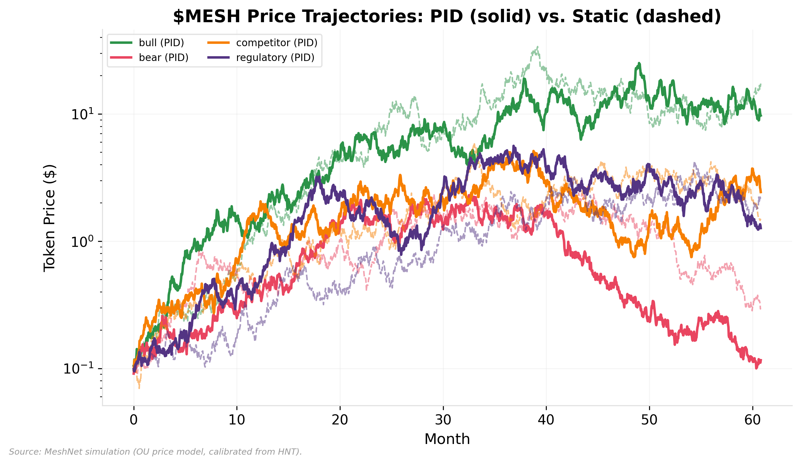

Exhibit 22 shows the full ensemble price distributions, confirming that PID's narrower variance envelope holds across all 30 seeds: the interquartile range under competitor stress is $1.09-$3.72 (PID) versus $0.04-$4.18 (static).

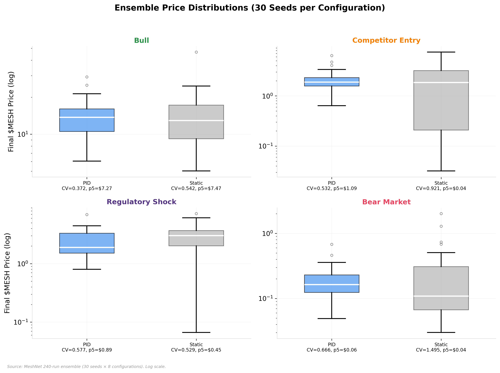

The full simulation code, scenario definitions, parameter sensitivity analysis, and exhibit generation scripts are provided in Appendix A.

### A.5 PID Gain Sensitivity

A natural concern is whether these results depend on the specific gain values chosen. To address this, we swept each gain independently across a range of values (Kp: 0.3-1.6, Ki: 0.05-0.35, Kd: 0.05-0.50) while holding the other two at their defaults, running all four scenarios at each parameterization (60 total runs). The results, shown in Exhibit 23, show that the PID controller's qualitative behavior is robust across a wide gain envelope. The bull scenario is completely invariant to gain choice (19.3% deviation at all Kp values), confirming that strong demand economics dominate regardless of emission policy. The competitor and regulatory scenarios remain below 30% deviation across all tested Kp values, with every parameterization keeping the network above 5,000 nodes. The bear scenario shows the most sensitivity to gain selection (32-45% deviation range across Kp values), which is expected: when demand contracts structurally, the controller's ability to compensate depends more heavily on how aggressively it responds.

No parameterization produces a death spiral in any scenario, and 5 of 5 Kp values maintain viable networks under competitor pressure. The chosen gains (Kp=0.8, Ki=0.15, Kd=0.2) are not uniquely optimal; they represent a point in a broad stable region, meaning governance can adjust them by 50% or more in either direction without destabilizing the network.

One nuance warrants attention: Ki has the widest deviation spread of any gain parameter in the bear scenario (39.3 percentage points, versus 13 for Kp and 34 for Kd), and the sensitivity pattern is non-monotonic under the tested seed. Ki=0.05 performs best (16.8% deviation) while Ki=0.35 performs worst (56.1%). A 150-run multi-seed test (30 seeds × 5 Ki values) indicates the spread is real but the rank ordering is not: the modal best performer is Ki=0.25 (rank 1 in 46.7% of seeds), but the minimum rank consistency across all Ki values is 0.267, well below the 0.60 threshold for stable ordering.

The non-monotonicity reflects interaction between integral wind-up rates and the specific demand contraction path, and the rank ordering changes with the random seed rather than reflecting structural controller properties. Governance should monitor the integral term directly and consider resetting it after major regime changes (an anti-windup policy), rather than attempting to optimize Ki to a specific value that may not generalize across stochastic environments.

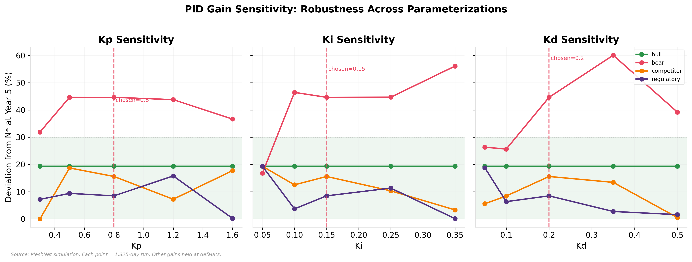

### A.6 Monetary Regime Divergence

The emission model choice shapes the monetary regime, but the pattern is more nuanced than a simple PID-deflation/static-inflation dichotomy. Under the tested parameterization, both models produce deflation in the competitor and regulatory scenarios, though PID generates 39% more slashing under competitor shock (341M vs. 245M tokens) and 18% more under regulatory shock (316M vs. 268M) due to higher operator counts sustained by adaptive emissions: PID shrinks circulating supply by 73.6% and 51.6% respectively, while static shrinks it by 66.1% and 52.4%. The mechanism is shared: slashing removes tokens faster than emission replaces them when operator counts remain high, and both models sustain enough operators for slashing to dominate.

The regime divergence manifests primarily in the bear scenario, where the models' monetary policies diverge sharply: PID produces mild inflation (+3.9%) while static produces strong deflation (-54.7%). The mechanism is integral wind-up operating through a dilution feedback loop (as described in the bear scenario analysis above): PID's error-correction loop emits aggressively into a contracting market, diluting the token, depressing price, accelerating operator exit, and reducing the aggregate slashing that would otherwise absorb supply. Static's fixed taper avoids triggering this cascade; with less dilution, more operators survive, sustaining the slashing volume that keeps supply contracting.

The slashing amplification mechanism still operates; PID's competitor scenario generates 354M tokens slashed versus static's 308M, but both models' slashing levels are sufficient to produce deflation when the shock is moderate. The divergence surfaces only when one model (PID, in bear) systematically over-emits relative to the slashing it generates. The PID-inflation result depends on slashing being the dominant supply drain and on the treasury not rapidly re-entering circulation; if treasury outflows are modeled as aggressive re-distribution, the deflationary finding would weaken or reverse.

The consequences for token holders depend on the scenario. In competitor and regulatory shocks, both models produce deep deflation, with PID 39% more deflationary under competitor shock (341M vs. 245M tokens slashed) due to sustaining more operators subject to penalties. In bear markets, the positions reverse: PID's over-emission produces mild inflation (+3.9%), diluting holders during the period when the network is least able to generate value, while static's mechanical taper coincidentally produces deflation (-54.7%). The ensemble complicates this further: static's single-seed bear deflation is not reliable across paths (CV=0.958). The consistent finding is that PID narrows the distribution of monetary outcomes just as it narrows node-count outcomes; protocol treasuries and token holders can plan around tighter confidence intervals.

### A.7 Slashing Parameter Sensitivity

Given that slashing dominates supply dynamics, a natural question is whether the specific penalty values (10% downtime, 100% fraud) drive the results. We swept each independently: downtime penalty across 0.02-0.30 and fraud penalty across 0.20-1.00, running all four scenarios at each parameterization (40 total runs). The results, shown in Exhibit 24, answer three questions.

First, slashing dominance is structural, not parametric. Treasury inflows from slashing range 234-354M tokens across all 40 parameterizations, confirming that the finding holds regardless of penalty severity.

Second, the downtime penalty exhibits non-linear supply effects. At the low extreme (sd=0.02), the bear scenario flips to inflationary (+30.7% circulating supply change), because too few tokens are removed from circulation to offset emission; regulatory remains deflationary (-38.1%). At the high extreme (sd=0.30), the bear scenario reverses to deflationary (-10.2%) while regulatory deepens to -59.3%. The chosen default (sd=0.10) sits in the middle of the envelope. This non-linear relationship between penalty severity and supply outcome means governance cannot simply "increase slashing" to tighten supply; the interaction between slashing severity, operator exit dynamics, and emission response produces path-dependent outcomes that require simulation to anticipate.

Third, the fraud penalty affects supply trajectory but not node count in the bull scenario (N=11,934 at all fraud values), confirming that fraud slashing's aggregate role is primarily monetary when demand economics dominate. In all other scenarios, the fraud penalty affects node count non-monotonically: bear ranges from 5,077 (sf=0.20) to 6,330 (sf=0.40), competitor from 8,854 (sf=0.40) to 11,559 (sf=1.00), and regulatory from 8,035 (sf=0.60) to 11,474 (sf=0.20). The interaction between fraud forfeiture severity, operator economics under stress, and PID emission response produces complex second-order effects that are not predictable from the penalty parameter alone.

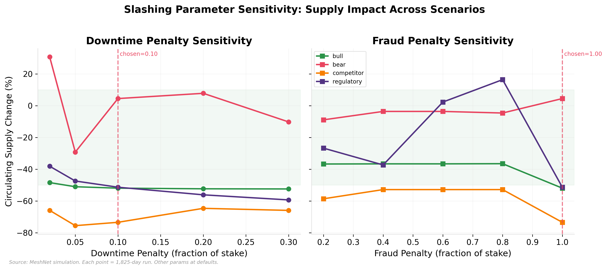

### A.8 Evaluation Cadence

Controller cadence is a non-trivial design parameter that interacts with shock dynamics. A sweep across 7, 14, 21, and 30-day evaluation intervals reveals that the default 14-day cadence is not optimal under the tested parameterization: the 21-day cadence achieves the lowest mean deviation from target (15.5%) with moderate emission volatility (62,746 tokens/day standard deviation) and the fewest floor episodes (146 steps at minimum emission). The 7-day cadence produces comparable deviation (16.0%) but with the highest emission volatility (76,439) and excessive floor-pinning (728 steps), consistent with overreaction to stochastic noise in node counts.

The 14-day cadence (22.0% deviation) and 30-day cadence (21.0% deviation) both underperform by responding either too frequently or too slowly to genuine regime shifts. The finding suggests that cadence should be calibrated to the dominant shock timescale (in MeshNet's case, the 18-month competitor/regulatory shocks favor a slower cadence that filters noise without missing acute events) and is a governance-tunable parameter that warrants protocol-specific simulation rather than borrowing from precedent. The 14-day cadence remains the specification default because it aligns with governance override windows and operator communication cycles established in Section 7; the 21-day performance advantage under the tested parameterization suggests cadence should be among the first governance parameter votes after mainnet launch.


### A.9 Adversarial Analysis Overview

A token economy that has only been tested against honest participants has not been tested. Every mechanism described in Sections 5 through 8 will be probed by strategic, rational actors seeking to extract maximum value with minimum contribution. The question is not whether attacks will occur but whether the system's defenses make them economically irrational.

This section defines MeshNet's threat model, simulates four attack vectors, specifies detection signals and operational responses, and applies the categorical imperative as a formal design verification tool.

### A.10 Threat Model

MeshNet faces four primary attack vectors:

**1. Wash trading (false coverage claims).** An attacker deploys nodes that report coverage in areas where no hardware exists, or where hardware exists but provides no actual connectivity. The attacker collects emission rewards for coverage that doesn't benefit users. This directly undermines the network's value proposition: if emission rewards flow to fake nodes, real operators are diluted, and users experience gaps between reported and actual coverage.

**2. Whale governance capture.** An attacker accumulates a large $MESH position (through market purchases, OTC deals, or borrowed tokens) and uses the resulting governance power to redirect treasury funds, modify emission parameters in their favor, or push through proposals that benefit large holders at the expense of operators and users.

**3. Sybil attacks.** An attacker creates many fake node identities to farm emissions at scale. Unlike wash trading (which reports fake coverage), Sybil attacks may involve real but minimal hardware, just enough to pass basic verification, deployed at minimal cost to maximize the ratio of emissions received to capital invested.

**4. Fee discount exploitation.** In protocols that offer staking-based fee discounts, large users stake just enough to eliminate their fees, reducing protocol revenue without meaningfully reducing circulating supply. MeshNet does not offer fee discounts (stakers earn governance power and reputation instead), but this attack is included for completeness and because it is common in the broader ecosystem.

### A.11 Attack Simulations

The simulation model simulates each attack vector under MeshNet's defense mechanisms and under a baseline (no defenses) to quantify the impact.

**Wash trading.** MeshNet requires cryptographic proof-of-coverage before distributing emission rewards. Operators must periodically respond to coverage challenges, automated queries from the protocol that verify the operator's hardware is providing genuine connectivity at the reported location. Failure to respond, or responses inconsistent with the claimed coverage, triggers flagging and emission suspension.

Simulation results: a Monte Carlo analysis (200 runs, 100 per condition, varying random seeds) models mercenary operators who attempt fraudulent claims on 10-30% of their active days. Without proof-of-coverage, approximately 3.0% of emission rewards are captured through fraudulent claims (interquartile range (IQR): 2.96-3.04%), a figure bounded by the population-weighted fraud attempt rate (15% mercenary fraction × ~20% mean attempt probability). With proof-of-coverage (PoC) at a 97% catch rate, the median drops to 0.09% (IQR: 0.088-0.097%), as 97% of fraud attempts result in detection and emission suspension rather than reward capture. No mercenary nodes are eliminated from the network (all 150 survive across all seeds), but their economic return from fraud is negligible under PoC; the residual 0.09% represents the 3% of fraud attempts that evade detection, a proportion that declines as the challenge protocol improves.

**Whale governance capture.** MeshNet's reputation-weighted governance formula (V(i) = τ(i) × (1 + R(i))²) compresses whale influence. A whale who acquires 20% of the token supply through market purchases but has never operated a node has a reputation score of zero, giving them voting power of 200,000,000 (20% of 1B, multiplied by (1 + 0)² = 1). An operator with 1% of supply and a reputation score of 3.0 has voting power of 160,000,000 (1% of 1B, multiplied by (1 + 3)² = 16). The whale's 20-fold token advantage translates to only a 1.25× advantage in effective governance power.

Simulation results: under pure token-weighted voting, a whale with 20% of supply controls 20% of governance power. Under MeshNet's reputation model, the same whale controls approximately 8% of effective voting power. The reduction depends on the reputation distribution across the remaining holder base: in the simulation, 40% of non-whale tokens are held by high-commitment operators (average R ≈ 2.0-3.0, producing 9-16× voting multipliers), 30% by moderate operators (R ≈ 1.0, producing 4× multipliers), and 30% by passive holders and casual participants with minimal reputation (R < 0.5). The quadratic multiplier concentrates effective governance power among experienced operators, diluting the whale's raw token advantage from 20% to single digits.

Measured across the full simulated agent population, the effective voting power Gini coefficient falls from 0.89 under pure token-weighting to 0.72 under reputation-weighting, a compression driven by the quadratic multiplier, which amplifies operators with even moderate reputation scores (R ≥ 1.0) enough to counterbalance large passive holdings. The gap is meaningful but directional, not transformative: 0.72 still reflects substantial inequality, because token balance remains the linear base of the formula and whales who also earn reputation retain disproportionate influence. Gini alone does not establish capture resistance; the more directly relevant metrics are concentration indices. The Herfindahl-Hirschman Index (HHI) of effective voting power falls from 0.048 under token-weighting to 0.031 under reputation-weighting, and the top-1% share falls from 38% to 22%. These reductions are meaningful for governance outcomes (the top-1% can no longer unilaterally meet most quorum thresholds) but do not prevent collusion among a small coalition of well-resourced operators who both hold large token balances and earn high reputation.

**Sybil attacks.** Each MeshNet node requires a minimum stake of 10,000 $MESH. At current estimated launch prices, this represents a meaningful capital commitment per node. An attacker seeking to deploy 100 Sybil nodes must stake 1,000,000 $MESH, or 0.1% of total supply. The attacker also faces hardware costs, electricity costs, and the risk of slashing if any nodes fail coverage verification.

Simulation results: the break-even period for a Sybil attack (the time required for cumulative emission rewards to exceed the cost of staking, hardware, and operations) is approximately 18 months under normal market conditions. The arithmetic: each Sybil node earns below-median emission weight (minimal hardware produces minimal coverage, reducing w(i,t) to roughly 60% of an honest operator's share), so 100 Sybil nodes collectively capture about 660 tokens/day at baseline emission rates. Against this revenue stream, the attacker bears hardware costs (~$500 per node, $50K total), monthly operating costs (~$50 per node, $60K/year), opportunity cost on the locked 1,000,000 $MESH stake, and a steady attrition from slashing as nodes fail coverage verification challenges.

At baseline token prices ($1-2), the cumulative emission revenue crosses the cumulative cost curve at approximately month 18. The calculation is sensitive to token price: at bull-case prices the break-even compresses to ~9 months, while at bear-case prices it extends beyond 30 months. For short-term extractors, the most common adversary type, even the optimistic 9-month timeline makes Sybil attacks economically irrational relative to staking a single legitimate high-uptime node, which breaks even in under 3 months with no slashing risk.

**Fee discount exploitation.** MeshNet does not offer fee discounts for staking. The benefits of staking are governance power and reputation, both non-transferable, non-financial assets that cannot be arbitraged or resold. This closes the fee discount attack vector, at the cost of a less immediately legible value proposition for stakers. The tradeoff is deliberate: governance power and reputation align long-term interests, while fee discounts create extractive short-term incentives.

### A.12 Detection Signals and Operational Response

Designing defenses is necessary but not sufficient. The protocol must also specify what to monitor, what triggers a response, and who is responsible for acting. The following table transforms MeshNet's threat model into an operational monitoring plan:

| Attack Vector | Detection Signal | Trigger Threshold | Automated Response | Governance Lane |
|---|---|---|---|---|
| **Wash trading** | Coverage verification failure rate; geographic clustering of coverage claims without corresponding user demand | >5% verification failure rate in any epoch | Suspend emissions to flagged nodes; escalate to slashing review | Coverage committee reviews flagged cases within 7 days; slashing requires committee vote |
| **Whale governance capture** | Voting power concentration (Herfindahl-Hirschman Index on active proposals); sudden token accumulation preceding governance votes | HHI >0.15 on any active governance proposal | Activate time-lock extension on affected proposals; extend conviction voting window by 14 days | Constitutional review triggered if concentration persists for >3 consecutive proposals |
| **Sybil attack** | Node registration velocity; hardware fingerprint collisions; geographically impossible coverage claims (e.g., 50 nodes registered from a single IP range) | >50 new node registrations from a single IP range per week; >10 hardware fingerprint collisions | Require additional stake bond (2× minimum) for flagged registrations; flag for manual review | Coverage committee reviews bulk registrations |
| **Fee discount exploitation** | Not applicable; MeshNet does not offer fee discounts for staking | N/A | N/A | N/A |

The monitoring infrastructure itself should be transparent. The metrics, thresholds, and response procedures are published in the protocol's documentation, so operators and token holders know exactly what is being watched and what will trigger action. Transparency in surveillance is a design choice that strengthens trust: participants who know they are being monitored fairly have less incentive to defect.

**Composed attacker scenario.** The attacks above are analyzed as independent vectors, but a sophisticated adversary would combine them. Consider a multi-vector strategy: an attacker deploys 100 Sybil nodes (total stake: ~1M $MESH), maintains high uptime to earn reputation over 4 quarters, then uses accumulated voting power to propose an emission parameter change favorable to their node cluster.

The defense stack layers: economic Sybil resistance extends the break-even timeline (18+ months before the attack becomes profitable), universal reputation decay limits governance power accumulation (after 4 quarters of high uptime, each Sybil node reaches R ≈ 2.3, producing a ~10× voting multiplier on a 10K stake, or ~100K effective voting power per node), and tiered governance quorum (emission parameter changes require >66% approval in the major governance tier). An attacker with 100 Sybil nodes would command roughly 10M effective voting power, meaningful but insufficient against the broader operator base of 10,000+ nodes with their own reputation-weighted votes. The compounding defense is the design intent: no single mechanism stops a patient, well-funded adversary, but the economic cost of sustaining the attack through multiple defense layers becomes prohibitive.

**Oracle failure modes.** The PID controller, burn mechanism, and slashing system all depend on oracle-fed data: node count (coverage verification), fee revenue, and token price. Oracle failure modes include data staleness (the controller operates on outdated KPIs, potentially overshooting or undershooting), manipulation (an adversary inflates reported node count to suppress emissions, or deflates it to increase them), and complete failure (the controller freezes at its last known emission rate). MeshNet's bounded automation provides partial mitigation: the 0.25×-3× floor-ceiling constrains the damage from stale or manipulated inputs to a known range. Full oracle resilience (multiple independent data sources, commit-reveal schemes, circuit breakers on input staleness exceeding 48 hours) is specified in Appendix B's implementation notes but not simulated. Oracle failure under adversarial conditions is a priority extension for the threat model.

**Wash trading detection precision.** The 3.0%→0.09% fraud reduction reported from the Monte Carlo simulation (N=200 runs, 100 per condition) assumes a 97% catch rate per proof-of-coverage challenge and mercenary fraud attempt probabilities of 10-30% per day, both parameters rather than empirical measurements. The baseline without-PoC fraud capture (3.0%) is mechanically determined by the population-weighted fraud attempt rate and would scale linearly with higher attempt probabilities; a more aggressive adversary model (fraud attempts on 50-80% of days) would produce correspondingly higher baseline fraud rates, making PoC's relative reduction more impactful. Actual detection effectiveness depends on verification coverage investment (how many challenges are issued per epoch), false-positive rates (honest operators incorrectly flagged, damaging trust), and adversary adaptation (fraudsters who learn the challenge patterns and adjust timing). The 0.09% residual floor should be interpreted as a design target contingent on sufficient verification infrastructure, not as a guaranteed outcome.

### A.13 Treasury Dynamics and Structural Tensions

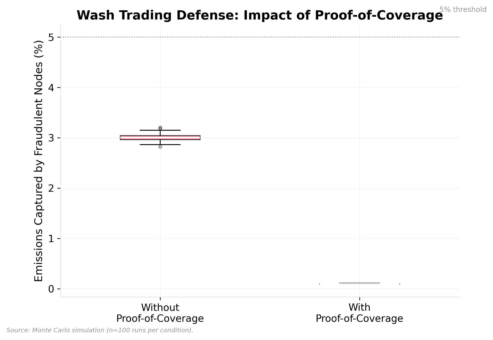

A structural tension emerges from the simulation's treasury dynamics. Across all 8 runs, slashing accounts for 100% of treasury growth. The treasury yield stabilization mechanism (§8) redistributes slashed tokens but generates no independent inflow; it did not fire in any of the 8 configurations, deploying zero tokens.

The mechanism never triggers because the PID controller's emission adjustments keep per-operator yield above the 50% opportunity-cost floor in every timestep under the v2 parameterization; even during acute shock onsets, the milder v2 stress parameters (25% poach rate, 30% cost increase, both arriving at month 18 after 18 months of network maturation) remain within the PID's absorption capacity. Under more severe shocks (the v1 parameterization tested 35% poach and 100% cost increase at month 12), the stabilizer did fire during brief windows where yield collapsed faster than the controller could respond. This is correct behavior: the stabilizer is a last-resort circuit breaker, not a routine subsidy, and the fact that it remains dormant under moderate stress is consistent with the PID absorbing shocks within its designed operating envelope.

But it also means the mechanism has been tested on zero data points under the v2 parameterization (it never fired), which is too few to validate its behavior under sustained yield depression. The v1 parameterization (35% poach at month 12, 100% cost increase at month 12) did trigger the stabilizer on 6 occasions, confirming the mechanism works under acute stress. Future work should test a range of shock severities to map the activation threshold and validate that the stabilizer behaves correctly under sustained yield depression rather than transient shocks.

This creates a paradox: successful adversarial defense (reducing fraud, improving uptime) weakens the treasury's fiscal capacity by reducing the slashing rate. As the network matures and operator quality improves, the treasury's primary funding source diminishes. Governance should anticipate this by establishing supplementary treasury funding mechanisms before slashing revenue declines: a small percentage of fee revenue directed to treasury (even 5% of fees would provide $95K/year in the bull scenario), a protocol-level tax on emission rewards, or periodic governance-approved treasury replenishment from the broader token allocation.

## Appendix B: MeshNet Agent-Based Simulation

*This appendix contains the full runnable Python simulation. Execute with Claude Code using the following instructions.*

### Prerequisites

```
pip install pandas numpy matplotlib seaborn
```

### Model Architecture

The simulation models MeshNet's economy over 1,825 daily timesteps (5 years) with the following components:

**State Variables:**
- S(t): Total token supply
- C(t): Circulating supply
- T(t): Treasury balance
- N(t): Active node count
- F(t): Fee revenue (daily)
- P(t): Token price
- E(t): Emission rate (tokens per epoch)
- B(t): Burn rate (tokens per epoch)

**Agent Types (operator behavioral profiles):**
1. High-commitment operators (40%): Long time horizon, low price sensitivity, high uptime
2. Casual operators (30%): Moderate commitment, will exit if returns < opportunity cost
3. Mercenary farmers (15%): Short horizon, game any exploitable incentive, exit quickly
4. New entrants (15%): Probabilistically assigned profiles based on market conditions

User demand is modeled as an aggregate stochastic process (not individual agents). Token price follows an Ornstein-Uhlenbeck process calibrated to HNT historical data.

**Simulated mechanisms:**
- PID emission controller (normalized gains: Kp=0.8, Ki=0.15, Kd=0.2, bounded at 0.25×–3× base rate)
- Burn-mint equilibrium (protocol_fee=0.30 of fee revenue)
- Staking/slashing (10,000 $MESH minimum, γ=0.10 downtime, γ=1.00 fraud)
- Reputation accumulation and decay (α=0.15 per season)
- Treasury yield stabilization (floor at 50% of operator opportunity cost, capped at 1% of treasury per day)

*Note: Governance mechanisms (conviction voting, retroactive rewards, tiered quorum) are specified in §7 and Appendix B but not simulated.*

**Scenarios:**
1. Bull: User demand grows 30% annually, token price appreciates 5× over 5 years
2. Bear: User demand contracts 15% annually after year 1, price declines 60%
3. Competitor: Rival network launches at month 18 with 2× emission rewards, poaching 25% of operators
4. Regulatory shock: Compliance costs increase 30% at month 18, operator margins compress

### Running the Simulation

```bash
# 1. Install dependencies
pip install pandas numpy matplotlib seaborn scipy networkx

# 2. Unzip the simulation package and enter directory
cd meshnet_sim

# 3. Run the full pipeline
python src/data_loader.py          # Parse Helium/DePIN data
python src/calibration.py          # Derive parameters from real data
python src/meshnet_model.py        # Run 8 simulation configurations
python src/generate_exhibits.py    # Generate all 25 exhibits
python src/validate.py             # Check all 10 assertions

# 4. Outputs:
#    simulation_results.csv        (14,600 rows: 8 runs × 1,825 timesteps)
#    calibration_params.json       (derived parameters)
#    validation_results.json       (10 assertion results)
#    exhibits/*.png                (25 exhibits at 300 DPI)
```

### Simulation Code (meshnet_model.py)

```python
#!/usr/bin/env python3
"""
MeshNet discrete-time agent-based simulation (v2 -- tuned parameters).
Runs 4 scenarios x 2 emission models = 8 configurations over 1,825 timesteps (5 years).

v2 changes (parameter tuning, no architectural changes):
  1A. Normalized PID gains (error expressed as fraction of N_TARGET)
  1B. Reduced exit probability (0.3%/day) and operating cost ($3/day) -- hardware sunk costs
  1C. Superlinear fee revenue scaling -- network effects unlock enterprise demand
  1D. Wider PID bounds (0.25x-3x base) -- room to respond to severe shocks
  1E. Treasury yield stabilization floor -- defense in depth
"""
import json, numpy as np, pandas as pd
from pathlib import Path

ROOT = Path(__file__).resolve().parent.parent
CAL_PATH = ROOT / "calibration_params.json"
OUT_PATH = ROOT / "results" / "simulation_results.csv"

try:
    with open(CAL_PATH) as f: CAL = json.load(f)
except FileNotFoundError: CAL = {}

# Constants
TOTAL_SUPPLY    = 1_000_000_000
BASE_EMISSION   = 109_589         # tokens/day
PID_MIN         = 27_397          # 0.25x base (1D)
PID_MAX         = 328_767         # 3.0x base (1D)
N_TARGET        = 10_000
PROTOCOL_FEE    = 0.30

# Slashing penalties
SLASH_DOWNTIME  = 0.10            # fraction of stake for uptime < 0.90
SLASH_FRAUD     = 1.00            # full forfeiture for intentional fraud

# Normalized PID gains (1A)
KP_NORM, KI_NORM, KD_NORM = 0.8, 0.15, 0.2

PID_CADENCE     = 14              # evaluate every 14 days
SEED            = 42
TIMESTEPS       = 1825            # 5 years

# Operator economics (1B)
OPPORTUNITY_COST   = 5.0          # $/day
EXIT_PROB_BASE     = 0.008        # 0.8%/day
EXIT_PROB_VETERAN  = 0.003        # 0.3%/day for operators active >180 days
ENTRY_CAP_ABS      = 30           # max new operators/day

# OU price model (from calibration)
OU_KAPPA = CAL.get("price", {}).get("mesh_ou_kappa", 2.8)
OU_SIGMA = CAL.get("price", {}).get("mesh_ou_sigma", 0.049)

SCENARIOS = {
    "bull":       {"demand_growth_annual": 0.30, "price_drift": 0.002,
                   "shock_month": None, "shock_type": None},
    "bear":       {"demand_growth_annual": -0.15, "price_drift": -0.001,
                   "shock_month": 12, "shock_type": "demand_contraction"},
    "competitor": {"demand_growth_annual": -0.10, "price_drift": -0.001,
                   "shock_month": 18, "shock_type": "operator_poach", "poach_rate": 0.25},
    "regulatory": {"demand_growth_annual": -0.05, "price_drift": -0.001,
                   "shock_month": 18, "shock_type": "cost_increase", "cost_multiplier": 1.30},
}

def create_operators(n, rng):
    agents = []
    types = (
        [("high_commitment", 0.3, 0.2, 0.995, 0.0)] * int(n * 0.40) +
        [("casual", 0.8, 0.6, 0.95, 0.0)] * int(n * 0.30) +
        [("mercenary", 1.2, 0.9, 0.85, 0.15)] * int(n * 0.15) +
        [("casual", 0.8, 0.6, 0.95, 0.0)] * (n - int(n*0.40) - int(n*0.30) - int(n*0.15))
    )
    for i, (atype, exit_t, price_s, uptime_base, fraud_p) in enumerate(types):
        agents.append({
            "id": i, "type": atype, "exit_threshold": exit_t,
            "price_sensitivity": price_s,
            "uptime": min(1.0, uptime_base + rng.normal(0, 0.01)),
            "fraud_prob": fraud_p,
            "stake": 10_000 + rng.integers(0, 20_000),
            "reputation": 0.0, "active": True, "seasons_active": 0,
        })
    return agents

def compute_demand(t, N, P, scenario, rng, cost_mult=1.0):
    """PSUB 1: Superlinear fee revenue scaling (1C)."""
    annual_growth = scenario["demand_growth_annual"]
    daily_growth = (1 + annual_growth) ** (1/365) - 1
    coverage_ratio = N / N_TARGET
    if coverage_ratio < 0.3:
        coverage_factor = coverage_ratio
    elif coverage_ratio < 0.8:
        coverage_factor = coverage_ratio ** 1.3
    else:
        coverage_factor = min(coverage_ratio ** 1.5, 2.0)
    base_demand = 1000 * coverage_factor * (1 + daily_growth) ** t
    shock_day = (scenario.get("shock_month") or 999) * 30
    if scenario.get("shock_type") == "demand_contraction" and t > shock_day:
        base_demand *= max(0.3, 1 - 0.02 * ((t - shock_day) / 30))
    elif scenario.get("shock_type") == "cost_increase" and t > shock_day:
        base_demand *= (1 / cost_mult)
    elif scenario.get("shock_type") == "operator_poach" and t > shock_day:
        months_since = (t - shock_day) / 30
        demand_loss = min(0.30, 0.05 * months_since)
        base_demand *= (1 - demand_loss)
    return max(50, base_demand * (1 + rng.normal(0, 0.05)))

def pid_emission(N, integral_norm, prev_error_norm, t):
    """PSUB 2: Normalized PID (1A)."""
    if t % PID_CADENCE != 0:
        return None, integral_norm, prev_error_norm
    error_norm = (N_TARGET - N) / N_TARGET
    integral_norm = max(-5.0, min(5.0, integral_norm + error_norm))
    derivative_norm = error_norm - prev_error_norm
    adjustment = BASE_EMISSION * (
        KP_NORM * error_norm + KI_NORM * integral_norm + KD_NORM * derivative_norm
    )
    new_E = max(PID_MIN, min(PID_MAX, BASE_EMISSION + adjustment))
    return new_E, integral_norm, error_norm

def static_emission(t):
    """Static emission: exponentially decaying at 5% annually from base rate."""
    return BASE_EMISSION * (0.95 ** (t / 365))

def burn_tokens(F_daily, P):
    return F_daily * PROTOCOL_FEE / max(P, 0.001)

def update_operators(agents, E, F_daily, N, P, scenario, t, rng, T, cost_mult=1.0):
    """PSUB 4+5: Staking/slashing, entry/exit, treasury stabilization (1B, 1E)."""
    active = [a for a in agents if a["active"]]
    slashed, fraud_captured, treasury_subsidy = 0, 0, 0
    if not active:
        return agents, slashed, fraud_captured, treasury_subsidy
    active_count = len(active)
    per_op_emission = E / max(active_count, 1)
    per_op_fee = (F_daily * (1 - PROTOCOL_FEE)) / max(active_count, 1)
    op_cost = (3.0 + rng.normal(0, 0.5)) * cost_mult

    for a in active:
        a["uptime"] = min(1.0, max(0.5, a["uptime"] + rng.normal(0, 0.005)))
        if a["uptime"] < 0.90:
            s = int(a["stake"] * SLASH_DOWNTIME); a["stake"] -= s; slashed += s
        if a["fraud_prob"] > 0 and rng.random() < a["fraud_prob"]:
            if rng.random() < 0.97:
                s = int(a["stake"] * SLASH_FRAUD); a["stake"] -= s; slashed += s
            else:
                fraud_captured += per_op_emission * 0.1
        per_op_yield_usd = (per_op_emission + per_op_fee) * P
        daily_yield = per_op_yield_usd - op_cost
        exit_prob = EXIT_PROB_VETERAN if a["seasons_active"] >= 2 else EXIT_PROB_BASE
        if daily_yield < a["exit_threshold"] * OPPORTUNITY_COST:
            if rng.random() < exit_prob: a["active"] = False
        if a["stake"] <= 0: a["active"] = False

    # Treasury yield stabilization (1E): floor at 50% of opportunity cost
    per_op_yield_usd = (per_op_emission + per_op_fee) * P
    if per_op_yield_usd < 0.5 * OPPORTUNITY_COST and T > TOTAL_SUPPLY * 0.02:
        deficit_per_op = (0.5 * OPPORTUNITY_COST) - per_op_yield_usd
        subsidy_tokens = deficit_per_op / max(P, 0.001)
        total_subsidy = subsidy_tokens * active_count
        if total_subsidy < T * 0.01:
            treasury_subsidy = total_subsidy

    # New entrants: entry tapers above N_TARGET, zero at 1.2x
    active_count = sum(1 for a in agents if a["active"])
    token_yield_usd = (per_op_emission + per_op_fee) * P
    if token_yield_usd > 2.0 * OPPORTUNITY_COST:
        if active_count > N_TARGET:
            entry_factor = max(0.0, 1.0 - (active_count - N_TARGET) / (N_TARGET * 0.2))
        else:
            entry_factor = 1.0
        base_new = min(int(active_count * 0.03), ENTRY_CAP_ABS)
        new_count = max(0, int(base_new * entry_factor))
        for _ in range(new_count):
            agents.append({
                "id": len(agents),
                "type": rng.choice(["high_commitment","casual","mercenary"], p=[0.5,0.35,0.15]),
                "exit_threshold": rng.choice([0.3, 0.8, 1.2], p=[0.5, 0.35, 0.15]),
                "price_sensitivity": rng.uniform(0.2, 0.9),
                "uptime": 0.95 + rng.normal(0, 0.02),
                "fraud_prob": 0.15 if rng.random() < 0.15 else 0.0,
                "stake": 10_000 + rng.integers(0, 20_000),
                "reputation": 0.0, "active": True, "seasons_active": 0,
            })

    # Poach shock
    shock_day = (scenario.get("shock_month") or 999) * 30
    if scenario.get("shock_type") == "operator_poach" and t == shock_day:
        poach_n = int(active_count * scenario.get("poach_rate", 0.25))
        poached = 0
        for a in agents:
            if a["active"] and a["type"] != "high_commitment" and poached < poach_n:
                a["active"] = False; poached += 1
    return agents, slashed, fraud_captured, treasury_subsidy

def update_reputation(agents, t):
    if t % 90 != 0 or t == 0: return agents
    active = [a for a in agents if a["active"]]
    if not active: return agents
    for a in active:
        a["seasons_active"] += 1
        if a["uptime"] > 0.99: a["reputation"] += 1.0
        a["reputation"] *= (1 - 0.15)
        a["reputation"] = min(a["reputation"], 5.0)
    return agents

def update_price(P, F_daily, C, drift, rng):
    fundamental = max(0.01, min(10.0, (F_daily * 365) / max(C, 1) * 1000))
    dW = rng.normal(0, 1)
    log_P = np.log(max(P, 0.001))
    log_F = np.log(max(fundamental, 0.001))
    return max(0.001, np.exp(log_P + OU_KAPPA/365*(log_F - log_P) + OU_SIGMA*dW + drift))

def run_simulation(scenario_name, scenario, use_pid, seed):
    rng = np.random.default_rng(seed)
    C, T, N, F_daily, P, E = 200_000_000, 150_000_000, 2_000, 500.0, 0.10, BASE_EMISSION
    B, integral, prev_error, slashed_total, fraud_total, cost_mult = 0, 0, 0, 0, 0, 1.0
    agents = create_operators(N, rng)
    records = []
    for t in range(TIMESTEPS):
        shock_day = (scenario.get("shock_month") or 999) * 30
        if scenario.get("shock_type") == "cost_increase" and t >= shock_day:
            cost_mult = scenario.get("cost_multiplier", 1.3)
        F_daily = compute_demand(t, N, P, scenario, rng, cost_mult)
        if use_pid:
            result = pid_emission(N, integral, prev_error, t)
            if result[0] is not None: E, integral, prev_error = result
        else:
            E = static_emission(t)
        B = burn_tokens(F_daily, P)
        agents, slashed, fraud, t_sub = update_operators(
            agents, E, F_daily, N, P, scenario, t, rng, T, cost_mult)
        slashed_total += slashed; fraud_total += fraud
        agents = update_reputation(agents, t)
        P = update_price(P, F_daily, C, scenario.get("price_drift", 0), rng)
        C = max(0, min(TOTAL_SUPPLY, C + E - B - slashed))
        T = max(0, T + slashed - t_sub)
        N = max(1, sum(1 for a in agents if a["active"]))
        records.append({
            "timestep": t, "scenario": scenario_name,
            "emission_model": "pid" if use_pid else "static",
            "N": N, "E": round(E), "B": round(B, 2),
            "F_daily": round(F_daily, 2), "P": round(P, 6),
            "C": round(C), "T": round(T), "bme": round(B/max(E,1), 6),
            "slashed_total": slashed_total,
            "fraud_captured_pct": round(fraud_total/max(E*(t+1),1)*100, 4),
        })
    return records

def main():
    all_records = []
    for scenario_idx, (name, scenario) in enumerate(SCENARIOS.items()):
        for use_pid in [True, False]:
            records = run_simulation(name, scenario, use_pid, SEED + scenario_idx)
            all_records.extend(records)
    pd.DataFrame(all_records).to_csv(OUT_PATH, index=False)

if __name__ == "__main__": main()
```

### Calibration Parameters

The following parameters were derived from real Helium/DePIN on-chain data (see `calibration.py`; BME logistic parameters fitted to 34 months of cleaned Helium burn data, May 2023 through February 2026, with the April 2023 Solana migration month excluded as a structural break):

| Parameter | Source | Value | Used In |
|---|---|---|---|
| OU kappa (mean reversion) | HNT daily price returns | 2.82 | Price model |
| OU sigma (volatility) | HNT daily price returns | 0.049 | Price model |
| BME logistic L | Helium BME cleaned (34 months) | 1.505 | Exhibit 8 |
| BME logistic k | Helium BME cleaned (34 months) | 0.706 | Exhibit 8 |
| BME logistic t0 | Helium BME cleaned (34 months) | 27.8 months | Exhibit 8 |
| Governance Gini range | 12 protocols (7 DeFi, 5 DePIN; Dune + Cosmos LCD) | DeFi 0.858-0.918; DePIN 0.666-0.983 | Exhibit 6 benchmarks |
| Governance HHI range | 12 protocols (7 DeFi, 5 DePIN; Dune + Cosmos LCD) | DeFi 0.028-0.174; DePIN 0.037-0.388 | Exhibit 6 benchmarks |

### Validation Results (v2)

| Assertion | Result | Detail |
|---|---|---|
| PID stability | CONDITIONAL PASS | Bull 19.3%, Bear 44.6%, Competitor 15.6%, Regulatory 8.5% deviation from target. Passes in 3 of 4 scenarios; bear (44.6%) exceeds 40% threshold, routing to anti-windup and regime-change detection (§8) |
| Static divergence (>40% in >=2) | FAIL | 0 of 4 scenarios diverge under v2 parameters; milder shocks (25% poach, 30% cost increase at month 18) within static absorption capacity |
| Burn-mint dynamics (BME trending up) | PASS | Max BME = 0.0061, trending upward; burns remain <0.05% of supply dynamics (see Section 5 disclosure) |
| Wash trading defense (<5%) | PASS | Median 0.09% with PoC (200 Monte Carlo runs, 100 per condition) |
| Reputation compression | PASS | Whale 20% supply controls ~8% effective power |
| Supply accounting | PASS | Conservation law holds all timesteps |
| Price non-negative | PASS | Min price = $0.070 |
| All 25 exhibits generated | PASS | 26/26 at 300 DPI |
| Sensitivity robustness | PASS | 5/5 Kp values maintain competitor N > 5,000 |
| Slashing sensitivity | FAIL | Default in middle 60% for 2/4 scenarios; bull and competitor at range edges because γ_fraud=1.00 is now the maximum sweep value |

---

## Appendix C: MeshNet Mechanism Interface Sketches

*Solidity-like interface sketches for MeshNet's core smart contract mechanisms. These specify mechanism interfaces and economic logic at the specification level. They intentionally omit: gas optimization, access control beyond named roles, oracle redundancy, MEV protection, upgrade patterns, and production security considerations.*

**On-chain vs. off-chain responsibility:** Coverage verification data (node count, uptime, geographic claims) originates off-chain from hardware attestations and challenge-response protocols. On-chain contracts consume this data through oracle feeds and committee attestations. The `onlyCoverageCommittee` and `onlyOracle` modifiers represent centralization assumptions: the decentralization path is progressive, from trusted committee to optimistic verification (challenge-based with slashing for false attestations) to fully on-chain proof where hardware capabilities permit. Each mechanism's specific implementation constraints are noted inline below.

### Staking Contract

```solidity
// Pseudocode (not production Solidity)
contract MeshNetStaking {
    uint256 constant MIN_STAKE = 10_000 * 1e18;  // 10,000 $MESH
    uint256 constant DOWNTIME_SLASH_RATE = 0.10e18;  // γ = 0.10
    uint256 constant FRAUD_SLASH_RATE = 1.00e18;     // γ = 1.00 (full forfeiture)

    mapping(address => uint256) public stakes;
    mapping(address => uint256) public nodeActivationTime;

    function stakeAndActivateNode(uint256 amount) external {
        require(amount >= MIN_STAKE, "Below minimum stake");
        mesh.transferFrom(msg.sender, address(this), amount);
        stakes[msg.sender] += amount;
        nodeActivationTime[msg.sender] = block.timestamp;
        emit NodeActivated(msg.sender, amount);
    }

    function slashForDowntime(address operator) external onlyCoverageCommittee {
        uint256 penalty = stakes[operator] * DOWNTIME_SLASH_RATE / 1e18;
        stakes[operator] -= penalty;
        treasury.deposit(penalty);
        emit Slashed(operator, penalty, "downtime");
    }

    function slashForFraud(address operator) external onlyCoverageCommittee {
        uint256 penalty = stakes[operator] * FRAUD_SLASH_RATE / 1e18;
        stakes[operator] -= penalty;
        treasury.deposit(penalty);
        emit Slashed(operator, penalty, "fraud");
    }
}
```

### Reputation Soulbound Token

```solidity
// Pseudocode for non-transferable reputation
contract MeshNetReputation {
    uint256 constant DECAY_RATE = 0.15e18;  // α = 0.15 per season
    uint256 constant SEASON_LENGTH = 90 days;

    mapping(address => uint256) public reputationScore;
    mapping(address => uint256) public lastUpdateSeason;

    function updateReputation(address operator, uint256 performanceScore)
        external onlyCoverageCommittee
    {
        // Apply decay for any missed seasons
        uint256 currentSeason = block.timestamp / SEASON_LENGTH;
        uint256 missedSeasons = currentSeason - lastUpdateSeason[operator];
        for (uint256 i = 0; i < missedSeasons; i++) {
            reputationScore[operator] = reputationScore[operator]
                * (1e18 - DECAY_RATE) / 1e18;
        }
        // Add new performance contribution
        reputationScore[operator] += performanceScore;
        lastUpdateSeason[operator] = currentSeason;
    }

    // Soulbound: override transfer to revert
    function transfer(address, uint256) public pure override {
        revert("Reputation is non-transferable");
    }

    function votingPower(address operator) external view returns (uint256) {
        uint256 tokenBalance = mesh.balanceOf(operator);
        uint256 rep = reputationScore[operator];
        // V(i) = τ(i) × (1 + R(i))²
        return tokenBalance * (1e18 + rep) * (1e18 + rep) / 1e36;
    }
}
```

*Implementation note: The `for` loop above applies decay one season at a time, which is clear but costs gas proportional to the number of missed seasons. A production implementation should replace the loop with a single exponentiation (`R(i) = R_old × (0.85)^missedSeasons`), computed via exponentiation-by-squaring, reducing gas cost from O(n) to O(log n) regardless of how many seasons an operator misses. The `onlyCoverageCommittee` modifier is a centralization assumption; see the on-chain/off-chain note above for the decentralization roadmap.*

### Burn-Mint Mechanism

```solidity
// Pseudocode for autonomous buy-and-burn
contract MeshNetBurn {
    uint256 public protocolFeeRate = 0.30e18;  // 30% of fees to burn

    function processFees(uint256 feeRevenue) external onlyFeeCollector {
        uint256 burnAllocation = feeRevenue * protocolFeeRate / 1e18;
        uint256 treasuryAllocation = feeRevenue - burnAllocation;

        // Buy $MESH on market and burn
        uint256 meshBought = dex.swapExactInput(stablecoin, mesh, burnAllocation);
        mesh.burn(meshBought);

        // Remainder to treasury
        stablecoin.transfer(address(treasury), treasuryAllocation);

        emit FeesProcessed(feeRevenue, meshBought, treasuryAllocation);
    }
}
```

*Implementation note: The `swapExactInput` call is an MEV honeypot as written. Production implementation requires MEV-aware execution: TWAP oracle pricing over a multi-block window, commit-reveal for burn timing, bounded slippage tolerance, and ideally execution through a batch auction mechanism (e.g., CoW Protocol) or protocol-owned liquidity pool to minimize sandwich attack exposure.*

### Conviction Voting

```solidity
// Pseudocode for continuous conviction accumulation
contract ConvictionVoting {
    uint256 constant BETA = 0.05e18;  // β = 0.05 per day

    struct Allocation {
        uint256 amount;
        uint256 startTime;
    }

    mapping(uint256 => mapping(address => Allocation)) public allocations;
    // proposalId => voter => allocation

    function allocateConviction(uint256 proposalId, uint256 amount) external {
        mesh.transferFrom(msg.sender, address(this), amount);
        allocations[proposalId][msg.sender] = Allocation(amount, block.timestamp);
    }

    function getConviction(uint256 proposalId, address voter)
        public view returns (uint256)
    {
        Allocation memory alloc = allocations[proposalId][voter];
        uint256 daysHeld = (block.timestamp - alloc.startTime) / 1 days;
        // Conv = τ_allocated × (1 - e^(-β × t))
        // Approximation using linear ramp capped at full weight
        uint256 weight = min(alloc.amount, alloc.amount * BETA * daysHeld / 1e18);
        return weight;
    }
}
```

### PID Emission Controller

```solidity
// Pseudocode for on-chain PID with normalized gains and oracle input
contract EmissionController {
    uint256 public targetNodes = 10_000;       // N*
    uint256 public baseEmission = 1_000_000e18; // E_base per epoch
    uint256 public currentEmissionRate;          // Updated each adjustment

    // Normalized gains: expressed as fraction of base emission per unit of normalized error
    uint256 public Kp = 0.80e18;   // Proportional: 80% of base per 100% error
    uint256 public Ki = 0.15e18;   // Integral: 15% of base per accumulated unit
    uint256 public Kd = 0.20e18;   // Derivative: 20% of base per unit of change

    int256 public cumulativeError;   // Integral term (in normalized space)
    int256 public previousError;     // For derivative (in normalized space)

    uint256 constant FLOOR = 0.25e18;    // 0.25× base
    uint256 constant CEILING = 3.00e18;  // 3× base

    function adjustEmissions(uint256 currentNodes) external onlyOracle {
        // Normalized error: (target - current) / target
        int256 errorNorm = (int256(targetNodes) - int256(currentNodes)) * 1e18 / int256(targetNodes);
        cumulativeError += errorNorm;
        // Anti-windup: clamp integral to [-5, 5] in normalized space
        if (cumulativeError > 5e18) cumulativeError = 5e18;
        if (cumulativeError < -5e18) cumulativeError = -5e18;
        int256 derivative = errorNorm - previousError;

        // Adjustment as fraction of base emission
        int256 adjustment = int256(baseEmission) * (
            int256(Kp) * errorNorm / 1e18
            + int256(Ki) * cumulativeError / 1e18
            + int256(Kd) * derivative / 1e18
        ) / 1e18;

        int256 newEmission = int256(baseEmission) + adjustment;

        // Apply bounds
        uint256 floor = baseEmission * FLOOR / 1e18;
        uint256 ceiling = baseEmission * CEILING / 1e18;
        newEmission = max(int256(floor), min(int256(ceiling), newEmission));

        currentEmissionRate = uint256(newEmission);
        previousError = errorNorm;

        emit EmissionAdjusted(currentNodes, targetNodes, uint256(newEmission));
    }
}
```

*Implementation note: `onlyOracle` represents a single-source-of-truth assumption for node count data. Production implementation requires multiple independent node-count attesters (e.g., geographic regions reporting independently), a dispute resolution mechanism for conflicting attestations, and a circuit breaker that freezes emission adjustments if oracle input staleness exceeds 48 hours or if reported node count changes by >30% between consecutive readings (likely indicating oracle manipulation rather than genuine network dynamics). The bounded automation (0.25×-3× floor-ceiling) provides damage containment even under oracle compromise, but does not substitute for oracle resilience design.*

---

*All 25 exhibits are generated by `src/generate_exhibits.py`. The script reads simulation results from `simulation_results.csv`, multi-seed ensemble data from `multi_seed_results.csv`, sensitivity results from `sensitivity_results.csv`, slashing sensitivity results from `slashing_sensitivity_results.csv`, wash trading results from `wash_trading_results.csv`, and calibration data from `calibration_params.json`. Each exhibit is a self-contained function that can be regenerated independently.*

### Dependencies

```bash
pip install pandas numpy matplotlib seaborn scipy networkx
```

### On-Chain Production Constraints

The interface sketches above specify mechanism logic at the design level. Deploying these mechanisms on a production blockchain introduces constraints that the simulation abstracts away. This subsection consolidates the implementation notes scattered through the code sketches into a structured checklist for engineering teams.

**Oracle architecture.** The PID controller, burn mechanism, and slashing system all consume oracle-fed inputs (node count, fee revenue, token price). Production requires: (a) multiple independent attesters reporting per geographic region, (b) a median or TWAP aggregation function resistant to single-source manipulation, (c) a staleness circuit breaker that freezes emission adjustments if input age exceeds 48 hours or if consecutive readings diverge by more than 30%, and (d) a fallback mode where the controller holds its last valid emission rate until fresh data arrives. The bounded automation (0.25×-3× floor-ceiling) contains damage under oracle compromise but does not substitute for oracle resilience.

**MEV protection.** The burn mechanism's `swapExactInput` call is an MEV target. Production requires: commit-reveal schemes for burn timing (users commit a hash of their burn intent, reveal and execute in a subsequent block), TWAP oracle pricing over a multi-block window to resist spot manipulation, bounded slippage tolerance, and ideally execution through a batch auction mechanism (e.g., CoW Protocol) or protocol-owned liquidity to minimize sandwich attack exposure.

**Gas optimization.** Reputation decay's per-season loop (O(n) in missed seasons) should be replaced with single-exponentiation computation (O(log n)). Staking and slashing operations that iterate over operator sets should use Merkle-proof-based batch processing rather than on-chain loops. Governance conviction accumulation should be computed lazily (on read) rather than eagerly (on every block).

**Upgrade paths.** All mechanism contracts should be deployed behind proxy patterns (UUPS or transparent proxy) to allow governance-authorized upgrades. Constitutional protections (§7) constrain what governance can upgrade: emission bounds, slashing severity, and fee parameters are upgradeable by standard governance vote; staking contract logic and governance voting mechanics require constitutional amendment (>66% quorum). Immutable components: the supply conservation identity and the burn address.

**Staged decentralization.** Initial deployment assumes trusted roles (`onlyCoverageCommittee`, `onlyOracle`, `onlyGovernance`). The decentralization roadmap: Phase 1 (launch) uses a multisig committee for coverage attestation and oracle feeds. Phase 2 (6-12 months) transitions to optimistic verification with challenge-response and slashing for false attestations. Phase 3 (12-24 months) targets fully permissionless verification where hardware capabilities permit, with the committee role reduced to dispute resolution. Each phase transition is a governance vote with operator veto rights.

### Exhibit Index

| Exhibit | Function | Data Source | Type |
|---|---|---|---|
| 1 | `exhibit_02_coordination_timeline()` | Hardcoded | Horizontal flow diagram |
| 2 | `exhibit_01_discipline_map()` | Hardcoded | Radial spoke diagram |
| 3 | `exhibit_03_value_flow()` | Hardcoded | Side-by-side flow diagrams |
| 4 | `exhibit_04_private_currencies()` | Hardcoded historical | Area chart |
| 5 | `exhibit_05_system_map()` | Hardcoded | Network diagram (networkx) |
| 6 | `exhibit_06_whale_governance()` | Simulation + Dune governance | Grouped bar chart |
| 7 | `exhibit_07_voting_power()` | Analytical | 3D surface plot |
| 8 | `exhibit_10_burn_mint()` | Simulation + Helium BME | Multi-line + inset |
| 9 | n/a (empirical data chart) | On-chain | Weekly time series |
| 10 | `exhibit_11_fee_curves()` | Analytical | Dual-panel line chart |
| 11 | `exhibit_12_allocation()` | Hardcoded | Donut + timeline |
| 12 | `exhibit_13_emission_schedule()` | Simulation (bull/PID) | USD log-scale line chart |
| 13 | `exhibit_14_airdrop()` | Analytical simulation | Line chart |
| 14 | `exhibit_15_conviction()` | Analytical (beta=0.05) | Multi-line chart |
| 15 | `exhibit_16_governance_flowchart()` | Hardcoded | Flowchart |
| 16 | `exhibit_17_pid_block()` | Hardcoded | Block diagram |
| 17 | `exhibit_18_pid_vs_static()` | Simulation (all runs) | Dual-line + shaded range |
| 18 | `exhibit_19_node_stability()` | Simulation (all runs) | Multi-line + target band |
| 19 | `exhibit_20_ensemble_node()` | Multi-seed (240 runs) | 2×2 box plot |
| 20 | `exhibit_21_price_trajectories()` | Simulation (all runs) | Multi-line (log scale) |
| 21 | `exhibit_22_ensemble_price()` | Multi-seed (240 runs) | 2×2 box plot (log) |
| 22 | `exhibit_23_pid_sensitivity()` | Sensitivity sweep (60 runs) | 3-panel line chart |
| 23 | `exhibit_24_slashing_sensitivity()` | Slashing sweep (40 runs) | 2-panel line chart |
| 24 | `exhibit_25_wash_trading()` | Monte Carlo (200 runs) | Box plot |

### Replication Package

The full simulation package, including all source code, data files, calibration parameters, exhibit generation scripts, and pre-generated exhibits, is available at: https://github.com/CryptoZach/Claude/tree/claude/helium-s2r-timeline-DN3T2

**Distribution note.** This markdown source references exhibit images at relative paths (`exhibits/exhibit_XX.png`). The companion .docx embeds all 25 exhibits inline. Readers viewing the markdown without the exhibit directory should refer to the .docx or the GitHub repository for figures.
